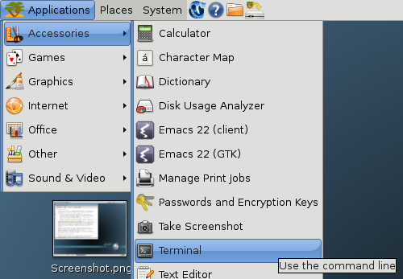
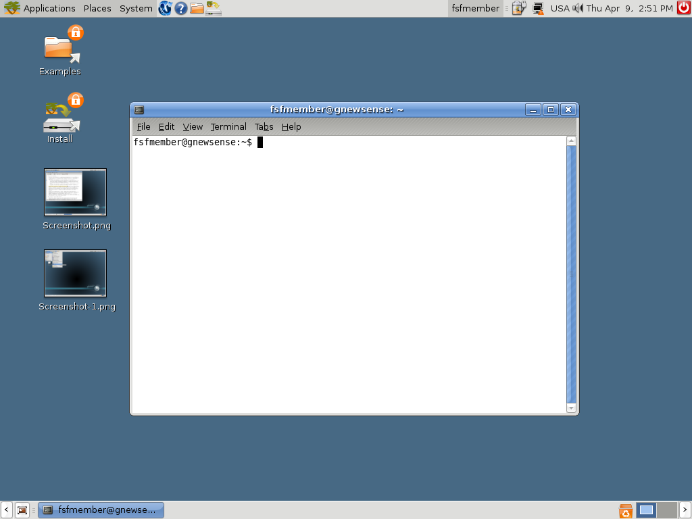
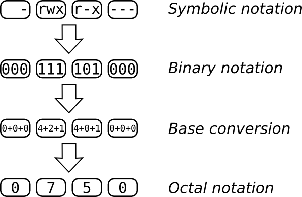
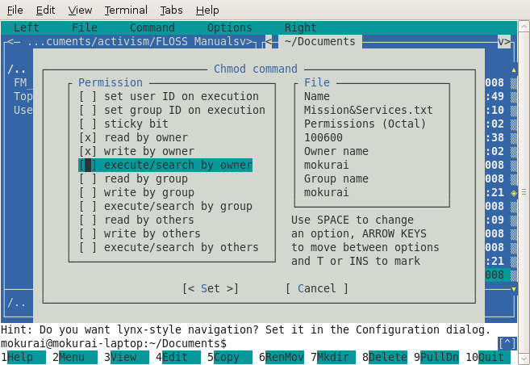

## Introduction

This book is an introduction to using the shell with a focus on
empowering GNU/Linux newbies.  This page has an outline.

The book itself
is being written at:

It is meant to be fun and encourage the reader to play, so it is not
organized in a formal manner (for instance, discussing all
metacharacters in one place). Instead, features are introduced in the
context of useful tasks. Rarely used features are not discussed.

The main topic is the GNU/Linux Bash shell, but useful features of the
Korn shell and zsh may be introduced in advanced chapters. The C family
of shells and non-Unix shells are beyond the scope of the book.

It assumes the reader is familiar with graphical interfaces, and refers
to one or more free desktop environments where discussions of GUIs are
necessary.

::: {#main-content}
# Getting Started

Modern computing is highly interactive, and using the command line is
just another form of interaction.  Most people use the computer through
its desktop or graphical interface, interacting at a rapid pace.  They
click on an object, drag and drop it, double-click another to open it,
alter it, etc.

Although interactions happen so fast you don't think about it, each
click or keystroke is a command to the computer, which it reacts to.
Using the command line is the same thing, but more deliberate.  You type
a command and press the **Return** or **Enter** key.  For instance, in
my terminal I type:

    date

And the computer replies with:

    Thu Mar 12 17:15:09 EDT 2009

That's pretty computerish.  In later chapters we'll explain how to
request the date and time in a more congenial format. We'll also
explain how working in different countries and with different languages
changes the output.  The idea is that you've just had an interaction.

## The Command Line Can Do Much Better

The *date* command, as seen so far, compares poorly with the alternative
of glancing at a calendar or clock.  The main problem is not the
unappetizing appearance of the output, mentioned already, but the
inability to do anything of value with the output.  For instance, if
I'm looking at the date in order to insert it into a document I'm
writing or update an event on my online calendar, I have to do some
retyping.  The command line can do much better.

After you learn basic commands and some nifty ways to save yourself
time, you'll find out more in this book about feeding the output of
commands into other commands, automating activities, and saving commands
for later use.

## What Do We Mean By a Command?

At the beginning of this chapter we used the word "command" very
generally to refer to any way of telling the computer what to do.  But
in the context of this book, a command has a very specific meaning.
It's a file on your computer that can be executed, or in some cases an
action that is built into the shell program. Except for the *built-in
commands*, the computer runs each command by finding the file that bears
its name and executing that file. We'll give you more details as they
become useful.

## Ways to Enter Commands

To follow along on this book, you need to open a command-line
interpreter (called a *shell* or *terminal* in GNU/Linux) on your
computer.  Pre-graphical computer screens presented people with this
interpreter as soon as they logged in.  Nowadays almost everybody except
professional system administrators uses a graphical interface, although
the pre-graphical one is still easier and quicker to use for many
purposes.   So we'll show you how to pull up a shell.

## Finding a Terminal

You can get a terminal interface from the desktop, but it may be easier
to leave the desktop and use the original text-only terminal. To do
that, use the `<ctrl><alt><F1>` key combination. You get a nearly
blank screen with an invitation to log in. Give it your username and
password. You can go to other terminals with `<alt><F2>` and so on,
and set up sessions with different (or the same) users for whatever
tasks you want to do. At any time, switch from one to another by using
the `<alt><F#>` keystroke for the one you want. One of these, probably
F7 or F8, will get you back to the desktop. In the text terminals you
can use the mouse (assuming your system has gpm running) to select a
word, line or range of lines.  You can then paste that somewhere else in
that terminal or any other terminal.

GNU/Linux distributions come with different graphical user interfaces
(*GUI* ) offering different aesthetics and semantic metaphors.  Those running
on top of the operating system are known as *desktop environments*.
GNOME, KDE and Xfce are among the most widely used ones.  Virtually
every desktop environment provides a program that mimics the old
text-only terminals that computers used to offer as interfaces.  On your
desktop, try looking through the menus of applications for a program
called Terminal.  Often it's on a menu named something such as
"Accessories", which is not really fair because once you read this
book you'll be spending a lot of time in the terminal every day.

In GNOME you choose `Applications -> Accessories -> Terminal`.



In KDE you choose `K Menu -> System -> Terminal`; in Xfce you choose
`Xfce Menu -> System -> Terminal`.
Wherever it's located, you can almost certainly find a terminal
program.

When you run the terminal program, it just shows a blank window;
there's not much in the way of help.  You're expected to know what to
do--and we'll show you.

The following figure shows the Terminal window opened on the desktop in
GNOME.

 

## Running an Individual Command

Many graphical interfaces also provide a small dialog box called
something like "Run command".  It presents a small text area where you
can type in a command and press the **Return** or **Enter** key.

{height="187"
width="520"}

To invoke this dialog box, try typing the **Alt** + **F2** key
combination, or searching through the menus of applications.  You can
use this box as a shortcut to quickly start up a terminal program, as
long as you know the name of a terminal program installed on your
computer.  If you are working on an unfamiliar computer and don't even
know the name of the default terminal program, try typing `xterm` to
start up a no-frills terminal program (no fancy menus allowing choice of
color themes or fonts).  If you desperately need these fancy menus,

-   in GNOME the default terminal program should be `gnome-terminal`;
-   in KDE it should be `konsole`;
-   in Xfce you'd try with `Terminal` or with version specific terminal
    names: for example in Xfce 4 you should find `xfce4-terminal`.

## How We Show Commands and Output in This Book

There's a common convention in books about the command-line. When you
start up a terminal, you see a little message indicating that the
terminal is ready to accept your command. This message is called a
*prompt*, and it may be as simple as:

    $

After you type your command and press the **Return** or **Enter** key,
the terminal displays the command's output (if there is any) followed
by another prompt. So my earlier interaction would be shown in the book
like this:

    $ date
    Thu Mar 12 17:15:09 EDT 2009
    $

You have to know how to interpret examples like the preceding one. All
you type here is *date*. Then press the **Return** key. The word *date*
in the example is printed in bold to indicate that it's something you
type. The rest is output on the terminal.
:::

::: {#main-content}
# The Parts of a Command

The first word you type on a line is the command you wish to run.  In
the "Getting Started" section we saw a call to the `date` command,
which returned the current date and time.

## Arguments

Another command we could use is `echo`, which displays the specified
information back to the user.  This isn't very useful if we don't
actually specify information to display.  Fortunately, we can add more
information to a command to modify its behavior; this information
consists of *arguments* .  Luckily, the `echo` command doesn't argue
back; it just repeats what we ask it:

    $ echo foo
    foo

In this case, the argument was **foo**, but there is no need to limit
the number of arguments to one. Every word of the text entered,
excluding the first word, will be considered an additional argument
passed to the command. If we wanted `echo` to respond with multiple
words, such as **`foo bar`**, we could give it multiple arguments:

    $ echo foo bar
    foo bar

Arguments are normally separated by "white space" (blanks and tabs --
things that show up white on paper).  It doesn't matter how many spaces
you type, so long as there is at least one. For instance, if you type:

    $ echo foo              bar
    foo bar

with a lot of spaces between the two arguments, the "extra" spaces are
ignored, and the output shows the two arguments separated by a single
space.  To tell the command line that the spaces are part of a single
argument, you have to delimit in some way that argument.  You can do it
by *quoting* the entire content of the argument inside double-quote
(`"`) characters:

    $ echo "foo              bar"
    foo              bar

As we'll see later, there is more than a way to quote text, and those
ways may (or may not) differ in the result, depending on the content of
the quoted text.

## Options

Revisiting the `date` command, suppose you actually wanted the UTC
date/time information displayed.  For this, `date` provides the
**`--utc`** option.  Notice the two initial hyphens.  These indicate
arguments that a command checks when it starts and that control its
behavior.  The `date` command checks specially for the **`--utc`**
option and says, "OK, I know you're asking for UTC time".  This is
different from arguments we invented, as when we issued `echo` with the
arguments **`foo bar`**.

Other than the dashes preceding the word, **`--utc`** is entered just
like an argument:

    $ date --utc
    Tue Mar 24 18:12:44 UTC 2009

Usually, you can shorten these options to a shorter value such as
**`date -u`** (the shorter version often has only one hyphen).  Short
options are quicker to type (use them when you are typing at the shell),
whereas long options are easier to read (use them in scripts).

Now let's say we wanted to look at yesterday's date instead of
today's.  For this we would want to specify the **`--date`** argument
(or shortly **`-d`**), which takes an argument of its own. The argument
for an option is simply the word following that option. In this case,
the command would be `date --date yesterday`.

Since options are just arguments, you can combine options together to
create more sophisticated behaviour.  For instance, to combine the
previous two options and get  yesterday's date in UTC you would type:

    $ date --date yesterday -u
    Mon Mar 23 18:16:58 UTC 2009

As you see, there are options that expect to be followed by an argument
(`-d`, `--date`) and others that don't take any one (`-u`, `--utc`).
Passing a little bit more complex argument to the `--date` option allows
you to obtain some interesting information, for example whether this
year is a leap year (in which the last day of February is 29).  You need
to known what day immediately precedes the 1st of March:

    $ date --date "1march yesterday" -u
    Sat Feb 28 00:00:00 UTC 2009

The question you posed to `date` is: if today were the 1st of March of
the current year, what date would it be yesterday?  So no, 2009 is not a
leap year.  It may be useful to get the weekday of a given date, say the
2009 New Year's Eve:

    $ date -d 31dec +%A
    Thursday

which is the same as:

    $ date --date 31december2009 +%A
    Thursday

In this case we passed to `date` the option `-d` (`--date`) followed by
the New Year's Eve date, and then a special argument (that is specific
to the `date` command). ⁞ Commands may once in a while have strange
esoteric arguments...  The `date` command can accept a *format*
argument starting with a plus (`+`).  The format `%A` asks to print the
weekday name of the given date (while `%a` would have asked to print the
abbreviated weekday: try it!).  For now don't worry about these
hermetic details: we'll see how to obtain help from the command line in
learning command details.  Let's only nibble a more savory morsel that
combines the `echo` and `date` commands:

    $ echo "This New Year's Eve falls on a $( date -d 31dec +%A )"
    This New Year's Eve falls on a Thursday

## Repeating and editing commands

Use the **Up-arrow** key to retrieve a command you issued before.  You
can move up and down using arrow keys to get earlier and later
commands.  The **Left-arrow** and **Right-arrow** keys let you move
around inside a single command.  Combined with the **Backspace** key,
these let you change parts of the command and turn it into a new one.
Each time you press the **Enter** key, you submit the modified command
to the terminal and it runs exactly as if you had typed it from scratch.
:::

::: {#main-content}
# Moving Around

Anyone who has used a graphical interface has moved between folders. A
typical view of folders appears in Figure 1, where someone has opened a
home directory, then a folder named "my-stuff" under that, and a
folder named "music" under that.

*Figure 1 : Folders*

When you use the command line, folders are called directories. That's
just an older term used commonly in computing to refer to collections of
things. (Try making an icon that suggests "directory"). Anything you
do in a folder on the desktop is reflected in the directory when you're
on the command line, and vice versa. The desktop and the command line
provide different ways of viewing a directory/folder, and each has
advantages and disadvantages.

Files contain your information--whether pictures, text, music,
spreadsheet data, or something else--while the directories are
containers for files. Directories can also store other directories.
You'll be much more comfortable with the command line once you can move
around directories, view them, create and remove them, and so on.

Directories are organized, in turn, into filesystems. Your hard disk has
one type of filesystem, a CD-ROM or DVD has another, a USB mass storage
device has yet another, and so on. That's why a CD-ROM, DVD, or USB
device shows up as something special on the desktop when you insert it.
Luckily, you don't have to worry much about the differences because
both the desktop and the terminal can hide the differences. But
sometimes in this book we'll talk about the information a filesystem
has about your files.

The "first" directory is called the root and is represented by the
name / (just a forward slash).  You can think of all the directories and
files on the system as a tree that grows upside-down from this root
(Figure 2):

{height="557"
width="600"}

*Figure 2 : Root Directory*

## Absolute and relative paths

Every file and directory in the system has an "address" called its
absolute path or sometimes just its path.  It describes the route you
have to follow starting from the root that would take you to that
particular file or directory.

For example, suppose you like the vim editor that we'll introduce in a
later chapter, and are told you can start it by running the command
`/usr/bin/vim`. This point underlines what we said in an earlier
chapter: commands are just executable files. So the vim editor is a file
with the path */usr/bin/vim*, and if you run that command `/usr/bin/vim`
you will execute the editor. As you can see from these examples, the
slash / is also used as a separator between directories.

Can you find */usr/bin/vim* in Figure 2? The pathname can be interpreted
as follows:

1.  Start at the root (/) directory.
2.  Move from / down to a directory named *usr*.

```{=html}
<!-- -->
```
1.  Move from *usr* down to a directory named *bin*.
2.  *vim* is located in that directory.

> *You are just getting used to the command line, and it may feel odd to
> be typing while reading this book. If you feel any confusion in this
> section, try scribbling the directory tree in Figure 2 on paper. Draw
> arrows on the paper as you run the commands in this section, to help
> orient you to where you are.*

Note that you can't tell whether something is a file or a directory
just by looking at its path.

When you work with the command line you will be always working "in" a
directory.  You can find the path of this directory using the command
`pwd` (print working directory), like this:

    $ pwd
    /home/ben

You can see that `pwd` prints an absolute path.  If you want to switch
your working directory you can use the command `cd` (change directory)
followed by an argument which points to the target directory:

    $ cd /

You just changed your working directory to the root of the filesystem!
If you want to return to the previous directory, you can enter the
command:

    $ cd /home/ben

As an alternative, you can "work your way" back to */home/ben* using
relative paths.  They are called that because they are specified "in
relation" to your current working directory.  If you go back to the
root directory, you could enter the following commands:

    $ cd /
    $ cd home
    $ cd ben
    $ pwd
    /home/ben

The first command changes your current working directory to the root.
The second changes to *home*, relative to /, making your current working
directory */home*.  The third command changes it to *ben*, relative to
*/home*, landing you in */home/ben*.

## Good to be back home

Every user in the system has a directory assigned to him or her, called
the home directory.  No matter what your current working directory is,
you can quickly return to your home directory like this:

    $ cd

That is, enter the `cd` command without any arguments.

All your files and preferences are stored in your home directory (or its
subdirectories). Every user of your system with a login account gets her
own home directory. Home directories are usually named the same as
users' login names, and are usually found in */home*, although a few
systems have them in */usr/home*. When you start your terminal, it will
place you in your home directory.

There's a special shortcut to refer to your home directory, namely the
symbol \~ (usually called a tilde, and found near the very left top of
most keyboards). You can use it as part of more complex path
expressions, and it will always refer to your home directory. For
example, *~/Desktop* refers to the directory called *Desktop* that
usually exists within your home directory.

## The . and .. directories

The entries . and .. are special and they exist in every directory, even
the root directory itself (/). The first one is a shorthand for "this
directory" while the latter is a shorthand for "the parent directory
of this directory."  You can use them as a relative path, and you can
try and see what happens when you do this:

    $ pwd
    /usr/bin
    $ cd .
    $ pwd
    /usr/bin

If *vim* is in */usr/bin*, at this point you could run it by typing the
relative path:

    $ ./vim

Continuing from the previous example, you can do this:

    $ cd ..
    $ pwd
    /usr

Since they are actual entries in the filesystem, you can use them as
part of more complex paths, for example:

    $ cd /usr/bin
    $ pwd
    /usr/bin
    $ cd ../lib
    $ pwd
    /usr/lib
    $ cd ../..
    $ pwd
    /
    $ cd home
    $ pwd
    /home
    $ cd ../usr/bin
    $ pwd
    /usr/bin

The parent directory of the root directory, /.., is root itself.

Try moving around your computer on the command line and you will soon
get used to it!
:::

::: {#main-content}
# Basic commands

By now you have some basic knowledge about directories and files and you
can interact with the command line interface.  We can learn some of the
commands you'll be using many times each day.

### ls

The first thing you likely need to know before you can start creating
and making changes to files is *what's already there?*  With a
graphical interface you'd do this by opening a folder and inspecting
its contents. From the command line you use the program `ls` instead to
list a folder's contents.

    $ ls
    Desktop  Documents  Music  Photos

By default, `ls` will use a very compact output format. Many terminals
show the files and subdirectories in different colors that represent
different file types.  Regular files don't have special coloring
applied to their names.  Some file types, like JPEG or PNG images, or
tar and ZIP files, are usually colored differently, and the same is true
for programs that you can run and for directories.  Try `ls` for
yourself and compare the icons and emblems your graphical file manager
uses with the colors that ls applies on the command line.  If the output
isn't colored, you can call `ls` with the option `--color`:

    $ ls --color

### man, info & apropos

You can learn about options and arguments using another program called
`man` (`man` is short for manual) like this:

    $ man ls

Here, `man` is being asked to bring up the manual page for `ls`. You can
use the arrow keys to scroll up and down in the screen that appears and
you can close it using the **q** key (for quit).

An alternative to obtain a comprehensive user documentation for a given
program is to invoke `info` instead of `man`:

    $ info ls

This is particularly effective to learn how to use complex GNU
programs.  You can also browse the `info` documentation inside the
editor Emacs, which greatly improves its readability.  But you should be
ready to take your first step into the larger world of Emacs.  You may
do so by invoking:

    $ emacs -f info-standalone

that should display the Info main menu inside Emacs (if this does not
work, try invoking `emacs` without arguments and then type **Alt + x
info**, i.e. by depressing the **Alt** key, then pressing the **x** key,
then releasing both keys and finally typing **info** followed by the
**Return** or **Enter** key).  If you type then **m ls**, the
interactive Info documentation for `ls` will be loaded inside Emacs.  In
the standalone mode, the **q** key will quit the documentation, as usual
with `man` and `info`.

Ok, now you know how to learn about using programs yourself.  If you
don't know what something is or how to use it, the first place to look
is its `man`ual and `info`rmation pages.  If you don't know the name of
what you want to do, the `apropos` command can help.  Let's say you
want to rename files but you don't know what command does that.  Try
`apropos` with some word that is related to what you want, like this:

    $ apropos rename
    ...
    mv (1)               - move (rename) files
    prename (1)          - renames multiple files
    rename (2)           - change the name or location of a file
    ...

Here, `apropos` searches the manual pages that `man` knows about and
prints commands it thinks are related to renaming.  On your computer
this command might (and probably will) display more information but
it's very likely to include the entries shown.

Note how the program names include a number besides them.  That number
is called their *section*, and most programs that you can use from the
command line will be in section 1.  You can pass `apropos` an option to
display results from section 1 manuals only, like this:

    $ apropos -s 1 rename
    ...
    mv (1)               - move (rename) files
    prename (1)          - renames multiple files
    ...

At this stage, the section number isn't terribly important.  Just know
that section 1 manual pages are the ones that apply to programs you use
on the command line.  To see a list of the other sections, look up the
manual page for man using `man man`.

### mv

Looking at the results from `apropos`, that `mv` program looks
interesting.  You can use it like this:

    $ mv oldname newname

Depending on your system configuration, you may not be warned when
renaming a file will overwrite an existing file whose name happens to be
`newname`.  So, as a safe-guard, always use `-i' option when issuing
`mv` like this:

    $ mv -i oldname newname

Just as the description provided by `apropos` suggests, this program
moves files.  If the last argument happens to be an *existing*
directory, `mv` will move the file to that directory instead of renaming
it. Because of this, you can provide `mv` more than two arguments:

    $ mv one_file another_file a_third_file ~/stuff

If *~/stuff* exists, then `mv` will move the files there.  If it
doesn't exist, it will produce an error message, like this:

    $ mv one_file another_file a_third_file stuff
    mv: target 'stuff' is not a directory

### mkdir

How do you create a directory, anyway?  Use the `mkdir` command:

    $ mkdir ~/stuff

And how do you remove it?  With the `rmdir` command:

    $ rmdir ~/stuff

If you wish to create a subdirectory (say the directory *bar*) inside
another directory (say the directory *foo*) but you are not sure whether
this one exists or not, you can ensure to create the subdirectory *and*
(if needed) its parent directory without raising errors by typing:

    $ mkdir -p ~/foo/bar

This will work even for nested sub-sub-...-directories.

If the directory you wish to remove is not empty, `rmdir` will produce
an error message and will not remove it.  If you want to remove a
directory that contains files, you have to empty it first.  To see how
this is done, we will need to create a directory and put some files in
it first.  These files we can remove safely later.  Let's start by
creating a directory called *practice* in your home and change the
current working directory there:

    $ mkdir ~/practice
    $ cd ~/practice

### cp, rm & rmdir

Now let's copy some files there using the program `cp`.  We are going
to use some files that are very likely to exist on your computer, so the
following commands should work for you:

    $ cp /etc/fstab /etc/hosts /etc/issue /etc/motd .
    $ ls
    fstab  hosts  issue  motd

Don't forget the dot at the end of the line!  Remember it means "this
directory" and being the last argument passed to `cp` after a list of
files, it represents the directory in which to copy them.  If that list
is very long, you'd better learn using *globbing* (expanding file name
patterns containing wildcard characters into sets of existing file
names) or some other tricky ways to avoid wasting your time in typing
file names.  One trick can help when dealing with the copy of an entire
directory content.  Passing to `cp` the option `-R` you can recursively
copy all the files and subdirectories from a given directory to the
destination:

    $ cp -R . ~/foo
    $ ls ~/foo
    bar  fstab  hosts  issue  motd
    $ cp -R . ~/foo/bar
    $ ls -R ~/
    ~/foo:
    bar  fstab  hosts  issue  motd

    ~/foo/bar:
    fstab  hosts  issue  motd

In this case the current directory has no subdirectories so only files
were copied.  As you can see, the option `-R` can be passed even to `ls`
to list recursively the content of a given directory and of its
subdirectories.

Now, if you go back to your home and try to remove the directory called
*practice*, `rmdir` will produce an error message:

    $ cd ..
    $ rmdir practice
    rmdir: failed to remove 'practice': Directory not empty

You can use the program `rm` to remove the files first, like this:

    $ rm practice/fstab practice/hosts practice/issue practice/motd

And now you can try removing the directory again:

    $ rmdir practice

And now it works, without showing any output.

But what happens if your directories have directories inside that also
have files, you could be there for weeks making sure each folder is
empty!  The `rm` command solves this problem through the amazing option
`-R`, which as usual stands for "recursive".  In the following
example, the command fails because *foo* is not a plain file:

    $ rm ~/foo/
    rm: cannot remove `~/foo/`: Is a directory

So maybe you try `rmdir`, but that fails because *foo* has something
else under it:

    $ rmdir ~/foo
    rmdir: ~/foo: Directory not empty

So you use `rm -R`, which succeeds and does not produce a message.

    $ rm -R ~/foo/

So when you have a big directory, you don't have to go and empty every
subdirectory.

But be warned that `-R` is a very powerful argument and you may lose
data you wanted to keep!

### **cat & less**

You don't need an editor to view the contents of a file.  What you need
is just to display it.  The `cat` program fits the bill here:

    $ cat myspeech.txt
    Friends, Romans, Countrymen! Lend me your ears!

Here, `cat` just opens the file *myspeech.txt* and prints the entire
file to your screen, as fast as it can.   However if the file is really
long, the contents will go by very quickly, and when `cat` is done, all
you will see are the last few lines of the file.  To just view the
contents of a long file (or any text file) you can use the `less`
program:

    $ less myspeech.txt

Just as with using `man`, use the arrow keys to navigate, and press
**q** to quit.
:::

::: {#main-content}
# More about redirection

How do pipes work? They use three communication channels provided to
every executing command.

**stdin** (standard input) by default is what we type on the keyboard.
We can use "<" with a filename to make a program take input from a
file.

**stdout** (standard output) by default is printed on your computer
screen. We can use ">" with a filename to send that to a file,
overwriting whatever is there, or we can use ">>" to append standard
output to the end of the file.

**stderr** (standard error)  is an alternative kind of output. Programs
use it to send error messages. This can be useful because you might want
to see error messages on the terminal even if you redirect output to a
file. Here's an example:

    $ ls *.bak > listfile
    ls: *.bak: No such file or directory

Here, we wanted a list of all files ending in *.bak*. But no such files
exist in this directory. If `ls` sent its error message to standard
output (which in this case has been directed to a file), we wouldn't
know that there is a problem without looking at the content of
*listfile*. But because `ls` sent its message to standard error, we see
it. The error message starts with the name of the program (`ls`)
followed by a colon and the actual message.

A pipe simply redirects the standard output of the first program to the
standard input of the second:

    $ ls *.bak | more

Sometimes, we want to direct the output of a command to a file, but we
also want to see the output as the program runs. The `tee` command does
just that:

    $ ls -lR / | tee allMyFiles

provides a complete, detailed list of your file system, saved to
*allMyFiles*. This takes some time to run; `tee` saves you from staring
at a lifeless screen, wondering whether any thing's happening.

Each program can open a lot of files, and each has a number called a
*file descriptor* that is meaningful only within that program. The first
three numbers are always reserved for the file descriptors we just
described.

  --------- ----
   stdin     0
   stdout    1
   stderr    2
  --------- ----

## Redirecting stderr

When we redirect stdin as we did above, error messages still go to the
screen.  For example

    $ ls /nosuchplace > /dev/null
    ls: /nosuchplace: No such file or directory
    $

To redirect stderr we have to use the more general form of redirection,
which uses the file numbers mentioned in the previous section, and looks
like this.

    $ ls /nosuchplace 2>/tmp/errors
    $

This sends the error message sent to file number 2 (*stderr*) into the
file */tmp/errors*.

Now we can introduce a more complex redirection, which redirects
standard output and standard error to the same file:

    $ ls *.bak > listfile 2>&1

The & in that command has nothing to do with putting a command in the
background. The & here must directly follow the > character, and it
sends file number 2 onto file number 1.

Or in the case of a pipe, put this before the pipe:

    $ ls *.bak 2>&1 | more

## Adding more descriptors

Sometimes it is convenient to keep other files open and add to them in
dribs and drabs. You can do this with redirection and `exec`.

    $ exec 3>/tmp/thirdfile
    $ exec 4>/tmp/fourthfile
    $ echo drib >&3
    $ echo drab >&4
    $ echo another drib >&3
    $ echo another drab >&4
    $ exec 3>&-
    $ exec 4>&-

The first two lines open connections to two more file descriptors, 3 and
4.  We can then echo text onto them, redirect programs into them, etc.
using `>&3` or `>&4`.  Finally, we close them with the `3>&-` and `4>&-`
syntax.
:::

::: {#main-content}
# All That Typing...

So, all this typing has got to stop being fun at some point.
Fortunately, the command line offers a number of ways to make your work
more efficient.

## Auto Completion

Every keyboard has a **Tab** key, and its a very useful thing to have in
the terminal. You might have used this keystroke before to indent words
in a word processor. You can still do this in GNU/Linux word processors,
but when you use **Tab** in the GNU/Linux terminal it becomes such a
time saver that when you master it you will be using it all the time.

Essentially, the **Tab** is an auto-complete command. If, for example, I
want to move the file 'dsjkdshdsdsjhds_ddsjw22.txt' somewhere with the
`mv` command I can either type out every letter of the stupid filename,
or I can type `mv` (for 'move') followed by the first few letters of
the filename and press **Tab**. The rest of the filename will be
automagically filled in. If the filename is not filled in it means that
there are several files (or directories) that start with those first few
letters I typed. To remedy this I could type a few more letters of the
filename and press **Tab** again, or to help me out I could press
**Tab** twice and it will give me a list of files that start with those
letters.

You can also use **Tab** to auto-complete command names.

**Tab** is your friend, use it a lot.

## Copy and Paste

Just because you are working on the command line doesn't mean you
can't use some of the conveniences you are used to in the GUI. While
cut and paste may work a little differently here from its behavior in
other operating systems, you'll soon find it very intuitive.

**Copying text** is as simple as highlighting the text you wish to copy
by holding down the left mouse button and highlighting the text as you
are probably already used to doing. Or, left-click 2 times to select a
word or 3 times to select a line.

**Pasting text** The highlighted text that you just copied is held in
the clipboard until you paste it where your cursor is by clicking the
middle (wheel) mouse button.

**Note :** if your mouse only has two buttons, pressing *both together*
will be recognized as a "middle button" press.

Anyway, it works like that in a non-graphical terminal. You may find
that it is not quite like this on the desktop. So it may be a good idea
to log in a text session. Use `<ctrl><alt><F1>` to get
out of the desktop.

Try it! Select the paragraph below with the left mouse button, open a
new virtual terminal, and paste the text with the middle mouse button.

     echo "This is pasted text."

After you see the text in the terminal, press the **Enter** key and the
`echo` command will repeat the text between the quotes on the command
line.

**Note :** If you are copying text from a web page, sometimes the
punctuation isn't handled properly. You might actually copy some unseen
formatting along with the text, which will break the syntax of the
command you are copying.

## History

It is also possible to use the up and down arrows on the keyboard to
navigate back and forwards through the history of the commands you have
typed. When you navigate to an earlier command this way, it is then just
necessary to press the **Return** or **Enter** key and the command will
be re-executed. You can edit it first to make it do something
different.
:::

::: {#main-content}
# The Superuser (Root)

Some parts of the computer system are thought to require special
protection (because they do). If somebody can change the basic `cat` or
`less` command, for instance, they could cause you to corrupt your own
files. So certain commands can be run and certain files can be accessed
only by a user logged in with special privileges called *superuser* or
*root* privileges.

In the days when computer systems cost hundreds of thousands of dollars
and were shared by hundreds of people, *root* was assigned to an actual
person (or a small group) who constituted a kind of priesthood. Nowadays
every owner of a PC can execute superuser commands (this is not always
true on mobile devices, though). There is still a user account on each
GNU/Linux system called *root*. This allows the system to make this user
the owner of sensitive system files.

The *root* user, incidentally, has nothing to do with the root directory
(the / directory) in the filesystem.

Superuser commands are powerful and must be used carefully, but their
use is quite common. For instance, whenever a desktop user installs
software, he or she must become superuser for a few minutes.

## The sudo Command

On many modern systems, whenever you want to enter a superuser command,
you just precede it with `sudo`:

    $ sudo rm -r /junk_directory

You are then prompted for your password, so nobody walking up casually
to your system could execute a dangerous command. The system keeps your
password around for a while, so you can enter further superuser commands
without the bother of re-entering the password.

Systems also provide a `su` command that logs you in as superuser and
gives you a new shell prompt. Not all systems allow users to use it,
though, because you can get carried away, start doing everyday work as
superuser --and suddenly realize you've trashed your system through a
typo. It is much safer to do your home system administration using
`sudo`.

If other people share your system and you want to give someone superuser
privileges, for this you need to know a little more about System
Administration.
:::

::: {#main-content}
# Redirection

Output redirection is one of the very powerful, and easily
misunderstood, parts of the shell. To decrease misunderstandings, we'll
keep to the basics.

The `>` operator (an "operator" is a symbol like `+`,`-`,`<`,`>` that
represents a specific action) is for redirecting output.  In a very
simple example, if you want to list the files in a directory, you type
`ls`.  That output goes to your screen.  If you want that list instead
to go to a file, however, you'd do something like this:

    $ ls > my-file-list

The file *my-file-list* now contains a list of all of the files,
directories, links and other things in the current working directory
with names that do not start with '.'. (Note that the shell creates,
if necessary, the files used for redirection before executing the
command, so the file *my-file-list* wil also be included in your list.)

The > operator is a "clobbering" operator -- if you are outputting
to an existing file, it will overwrite the old contents. Sometimes,
especially if you are keeping a logfile, what you want is the >>
operator.  It works the same way as the > operator, except that it
appends to the end of an existing file.  (If the file doesn't yet
exist, it creates it.)

There are other places you can redirect output to, like device special
files such as terminals, or */dev/null*, which is an infinitely big
empty bucket (or more accurately it just ignores all input).  If you
have a program that you know will produce voluminous output you don't
care about, you could do this:

    $ bigprogram > /dev/null

The program will execute normally, but you won't see its normal
output.  (You would, however, see any of its error output; more detail
below under File Descriptors).

The < operator is for redirecting input.  Most programs that would
expect input from your terminal are happy to accept it from another
source instead, such as an existing file.

For example, if you wish to email the contents of *myfile.txt* to joe
you could do this:

    $ mail joe < myfile.txt

The redirection operators are particularly relevant for jobs running in
the background.  When working with a graphical interface, you are
already familiar with the concept of switching windows by, for example,
minimizing the current window that is being engaged in playing musics
and restoring another window to resume browsing the Internet.  Such a
situation also happens when you are working with a command-line
interface.  However, instead of minimizing the command to play your
music files, you run it in background by appending an ampersand (&) at
the end of the command like this:

    $ ogg123 *.ogg &

Alas, any output it produces like announcing a new track along with its
title and description goes to your terminal as usual cluttering your
text-based Internet browser's screen.  So, you may want to avoid it.
Many programs have a silent mode to suppress the normal output.  Usually
this mode can be enabled using the options `-q` or `--quiet`, but this
is not a general convention and you should read the `man` or `info`
documentation before relying on these options.  If you want to be sure
avoiding any output irrespective of gentle program options, you can
easily do so by redirecting the output to a file.  For instance, the
following command places the output of `ogg123` into */dev/null* because
you do not care about any track announcement as long as the musics keep
playing and any error messages into *music_err* so that you can easily
find out why the musics suddenly stop playing.  This way, no output can
confuse you by appearing at the terminal and you can always have a look
at the result at a later time by doing something like `cat music_err`:

    $ ogg123 *.ogg >/dev/null 2>music_err &

A program running in the background cannot accept input from the
terminal.  So if you mistakenly put such a program in the background
(and don't redirect input from a file through the < operator), it will
get stuck waiting when it has to accept input.
:::

::: {#main-content}
# Cheaper by the dozen

After getting used to the command line, you will start looking for ways
to do more in less time.  One of the easiest ways to achieve that is to
work on multiple files at the same time, so that instead of:

    $ rm this
    $ rm that
    $ rm here
    $ rm there

you just remove all those files with one command. Many commands,
including `rm`, let you simply specify all the files you want to delete
as arguments in one go:

    $ rm this that here there

Still, there has to be a better way!

## Globbing

File globbing is the shell's way of dealing with multiple files with
the fewest characters possible.  The shell treats certain characters as
codes that you can use to specify groups of things you want the commands
to affect. These characters are commonly called "wildcards" because
they're like a card in a game that the players have designated to
represent anything you want.

### The "*" Wildcard

Imagine a directory of files:

    $ ls
    here  that  there  this

that you want to delete.  A tedious job can be turned simple by using
the * or asterisk wildcard.

    $ rm *

When used by itself, the asterisk wildcard refers to all the items in
the directory except for those with names starting with ".". We say
that the shell *expands* the wildcard. Knowing what's in the directory,
the shell substitutes those filenames for the asterisk and effectively
executes the following command:

    $ rm here that there this

You can combine * with other characters, however, to make it selective.

    $ rm t*
    $ ls
    here

What happened here? The shell looked at "t" first and then expanded
the asterisk to cover all the files that begin with "t".  If you had
requested "h*" instead, the shell would have removed any file that
started with an "h". Let's make the directory like it was and then
remove the "h" files:

    $ touch that there this
    $ rm h*
    $ ls
    that  there  this

The asterisk wildcard can be placed anywhere within a word. Let's
switch to an `ls` command because it's easier to see what's happening
with wildcards:

    $ ls th*re
    there

By switching from `rm` to `ls` we see an important aspect of wildcard:
you can use them with any command, because the shell interprets them
before it even invokes the command. In fact, you can't issue a command
*without* taking into account the behavior of wildcards, because
they're a feature of the shell.  (Luckily, you're not likely to ever
have to deal with a filename that contains a real asterisk.)

Multiple asterisks can also be used together. For instance, in this way
you can find filenames where the middle of a series is the same, but
they start and end differently. Let's try it on the original four
files:

    $ ls *i*
    this

People often use the asterisk to remove files that are all of one type.
For instance, if you've been working with a lot of photos and want to
clean up files ending in *.jpg* when you're finished, you can remove
all the ones in the current directly as follows:

    $ rm *.jpg

Suppose you have some files ending in  *.jpg* and some ending in
*.jpeg*. The asterisk still makes clean-up easy:

    $ ls *.jp*g

And suppose the JPEG files are scattered among several subdirectories.
You have directories named photos1, photos2, photos3, and so forth, each
containing JPEGs you want to remove. A wildcard can help you list all
the contents of those subdirectories:

    $ ls photos*
    photos1:
    centraal_station.jpg    nieuwe_kerk.jpg

    photos2:
    ica.jpeg                sanders_theater.jpeg

    photos3:
    bayeux_cathedral.jpeg   rouen_cathedral.jpeg    travel.odt

And you can specify a directory along with the filenames you remove:

    $ rm photos*/*.jp*g
    $ ls photos*
    photos1:

    photos2:

    photos3:
    travel.odt

Only the *travel.odt* file remains (because it doesn't match
".jp*g") as a record of all the trips you've taken.

There is, however, one limit to the asterisk wildcard.  By default, it
will not match any hidden files (those with filenames that start with a
dot, you need to `ls -a` to see these).

    $ ls -a
    .
    ..
    .hidden
    this
    that
    here
    there
    $ rm *
    $ ls -a
    .
    ..
    .hidden

If you want those hidden files deleted by a wildcard it is necessary to
append a dot to the front of the wildcard. Note that normal files (those
that are not hidden/do not start with a dot) will not be deleted when
you do this:

    $ ls -a
    .
    ..
    .hidden
    here
    $ rm .*
    $ ls -a
    .
    ..
    here

Finally, it's important to note that the asterisk can also match
nothing when appropriate, as seen in the following example:

    $ ls task*
    task  taskA  taskB  taskXY

 This is because the asterisk matches zero or more occurrences.  So, as
in this example, "task*" matches any filename that starts with
"task" even if it only consists of just "task".

**CAUTION:** When you use just an asterisk ("*") with **`rm`**, and
basically any other command, it is always a good idea to put an option
terminator ("--") before the wildcard like this:

    $ rm -- *

Take this case for example:

    $ ls

    -r    directory1    directory2    file1.txt
    $ rm *

Normally, **rm** will not remove sub-directories and their contents,
however, in this case everything in the directory will be removed even
the sub-directories. This is because the asterisk("*") is expanded to
"-r directory1 directory2 file1.txt". Although "-r" is a filename,
**`rm`** will confuse it as an option and think it has been told to
delete the directories and their contents as well. Using an the option
terminator ("--") will prevent **`rm`** from treating anything
following the terminator as an option. Therefore, generally it is a good
idea to always use an option terminator after typing a command and its
options, if there is any, to prevent the command from treating a
filename as an option.

### The "?" Wildcard

The "?" or question mark wildcard is very similar to the asterisk
wildcard.  The crucial difference is that the question mark wildcard
takes the place of only one character.

    $ ls task*
    task  taskA  taskB  taskXY
    $ ls task?
    taskA  taskB
    $ ls task??
    taskXY

As we've already seen, the asterisk matches all the files beginning
with "task". A single question mark matches files that have a single
character after "task". The double question mark requires exactly two
characters in that position.

### **The "[ ]" Wildcards**

The square brackets wildcards can get even more specific, denoting a
ranges of characters.The following `ls` command includes a `-1` (the
digit "one") option, which means "list one entry on each line." This
makes it easier to see how the files in this example differ.

    $ ls -1
    file_1
    file_2
    file_3
    file_a
    file_b
    file_c

By using the square brackets, you can remove specific files without
typing every name completely.

    $ rm file_[13ac]
    $ ls -1
    file_2
    file_b

Furthermore, within the square brackets, the order of the characters
doesn't matter.

Combining square brackets with a hyphen, you can also do ranges of
files. Let's start with a directory containing lots of files ending in
numbers:

    $ ls
    file_1
    file_2
    file_3
    ...
    file_9

At first it might be tempting to use the asterisk wildcard here.
However, what if we need to remove only files 2-6? We could list each
suffix in the brackets, but you would still have to type five numbers.
Fortunately, there is a much easier way.

    $ rm file_[2-6]

Now the only files left are files 1 and 7-9.  By using the dash between
a set of numerals in the square brackets, you make the shell expand the
pattern by creating a name with every number between the starting value
to the left of the dash and the end value to the right.

Ranges aren't just for numbers.  They can also use letters.

    $ ls -1
    file_a
    file_b
    file_c
    file_d
    $ rm file_[a-c]
    $ ls -1
    file_d

Both letters and ranges can be combined into the same instance of square
brackets.

    $ ls -1
    file_a
    file_b
    file_c
    file_1
    file_2
    $ rm file_[a-c12]
    $ ls

 Character groups can be inverted by prefixing them with the **^**
(caret) character:

    $ ls -1
    file_a
    file_b
    file_c
    file_d
    file_1
    file_2
    $ ls -1 file_[^c-z2-9]
    file_a
    file_b
    file_1

**CAUTION:** Ranges can, at times, be tricky things. For one, their
order can be affected by the current locale settings (in some locales
[A-C] could mean the same as [ABCabc], while in others it could be
equivalent to [ABC]). A good rule of thumb is to always know which
files you are working with. You can do this by simply substituting
**echo** or **ls** for whatever command you intend to run, such as:

    $ ls -1 file[A-b]
    fileA
    fileB
    filea
    fileb

This allows you to ensure the pattern matches the files you want to work
with.

## Brace Expansion

We've seen the ability to get a range of characters or letters that
fall in a single digit range (0-9 in our examples) but what about when
you need to match a range of files that uses double or even triple
digits?

    $ ls -1
    file_1
    file_2
    file_3
    ...
    file_78
    $ rm file_[1-20]
    $ ls -1
    file_3
    ...
    file_78

Since the brackets glob can only interpret single character ranges it
interprets, "1-20" not as a range but as the characters: "1", "-",
"2", and "0".   Causing only "file_1" and "file_2" to be deleted
because they are the only ones that match.  If you want to access ranges
larger than 0-9, you have to using Bash's brace expansion,
"{start..end}".

    $ rm file_{1..20}

In a brace range the double dot is the delimiter instead of a dash.

Braces can also be used when you need to get a series of files that have
a common pattern but subtle differences.  Such as with:

    $ ls
    file.txt
    file.pdf
    file.pl
    file.odf

If you just wanted to delete the *pdf*, *odf*, and *txt* files you could
specify a comma separated list of strings in a brace pair:

    $ rm file.{txt,pdf,odf}
    $ ls
    file.pl

## Globbing When No File Matches

Suppose you specify a wildcard and the shell can't find any matching
filename:

    $ ls -1
    file_a
    file_b
    file_c
    file_d
    $ rm file?
    rm: cannot remove `file?': No such file or directory

When there is no file to match a pattern, the shell passes the wildcard
to the program unexpanded.  That's why you get an error message from
the `rm` program, not from the shell.

## Disabling A Wildcard

Okay, we know the shell will pass a wildcard as an option to a program
when it can't find a file, but what do we do when we want to send a
character that also happens to be a wildcard to our program? Here's a
common example: we want to search a file for every occurrence of an
asterisk.

    $ ls
    2file
    *file
    *?****[a-b]

Now we happen to want *file, but we get:

    *file   2file

Why? Because the asterisk is a wildcard, the shell expanded it before
sending it to `ls`.  So after expansion, the command would look like:

    $ ls *file 2file

If we want `ls` to find an asterisk something different is in order.

The "\", or backslash, tells the shell to treat the following
character as a normal character and do no expansion.

    $ ls \*file
    *file

Because the asterisk is the next character after the backslash, the
shell sends the asterisk to `ls` unmodified.  In other words: the
backslash *escapes* the asterisk.

The backslash modifier works well when we have only one wildcard
character than we want to pass to a program, but what if we wanted to
pass a string like ***?****[a-b]** with lots of characters that
would normally be interpreted as wildcards?  If we used backslashes to
escape them, we'd have to mark every single character.  A short string
would end up turning into: `\*\*\*\?\*\*\*\*\[a-b\]*\*`.
Instead of doubling our amount of typing, we can use a pair of single
quotes.

    $ ls '*?****[a-b]'
    *?****[a-b]

Any string encased in single quotes will not be modified by the shell,
even when it\'s filled with wildcards.  However, you cannot type a
single quote within the single quotes like this:

    $ ls '*?***'*[a-b]'

So, if you happen to have a file whose name has some single quotes in it
like this:

    *?*'**'*[a-b]

There is no other way but to escape the single quotes individually like
this:

    $ ls '*?*'\''**'\''*[a-b]'

Simply to say, replace any occurence of a single quote in the filename
with '\'.

\
:::

::: {#main-content}
# Searching for Files

When you first get a computer, you tend to place files in just a couple
folders or directories. But as your list of files grows, you have to
create some subdirectories and spread the files around in order to keep
your sanity. Eventually, you forget where files are. \"Where did I store
those photos I took in Normandy?\"

You could run `ls -R`, as in the following section, and start running
your finger down the screen, but why? Computers are supposed to be about
automation. Let the computer figure out where the file is.

If you know your file is named \"somefile\", telling the computer what
to do is pretty easy.

    $ find . -name somefile -print
    ./files/somefile

The `find` command takes more arguments than the other commands we\'ve
seen so far, but if you use it for a while you\'ll find it becomes
natural.  Its first argument (the \'.\') tells find where to start
looking: the directory at the top of everything you\'re searching
through. In this case, we\'re telling `find` to start looking in
whatever directory we\'re in right now.

The `-name` argument tells it to look for a file named *somefile*.
Finally, the `-print` option tells the command to print out on our
screen the location of any file that matches the name it was given.

## **Wildcards with Find**

What if you don\'t remember the name of the file you\'re looking for?
You might only remember that it starts with \"some\".  Luckily, `find`
can handle that too.

    $ find . -name 'some*' -print
    ./dir1/subdir2/files/somefile_other
    ./some_other_file
    ./files/somefile

This time it found a few more files than you were after but it still
found the one you wanted.  As you can see, the `find` command can
process wildcards in much the same way the shell can.  Here you asked it
to look for anything that starts with the letters \"some\".

The \"\*\", \"?\", and \"\[ \]\" wildcards can all be used just as they
would be in the shell.  However, since `find` is using the wildcards you
have to make sure they remain unaltered by the shell.  To do this you
can surround the name you\'re searching for, and the wildcards it
contains, in single quotes.

## **Trimming The Search Path**

With just a name and a location, find will begin searching through every
directory below its starting point, looking for matches.  Depending on
how many subdirectories you have where you\'re searching, `find` can
take a lot of time to look in places you know don\'t contain the file.

It is possible, however, to control how far `find` sinks in the
directory tree.

    $ find . -maxdepth 1 -name 'some*' -print
    ./some_other_file

By using the `-maxdepth` argument we can tell `find` to go no lower than
the number of directories we specify.  A maxdepth of 1 says: don\'t
leave the starting directory. A maxdepth of 3 would allow `find` to
descend 3 directories from where it started, and so on.  It\'s important
to note that `-maxdepth` should immediately follow the start location,
or find will complain.

## **Using Criteria **

The `find` command can search for files based on any criteria the
filesystem know about files. For instance, you can search for files
based on:

-   When they were last modified or accessed (somebody read them)
-   How big they are\
-   Who owns them, or what group they are in
-   What permissions (read, write, execute) they have

```{=html}
<!-- -->
```
-   What type of file (directory, regular file) they are

and other criteria described in the manual page. Here we\'ll just show a
couple popular options.

The `-mtime` option shows the latest modification time. Suppose you just
can\'t remember anything about a file\'s name, but know that you created
or modified it within the past three days. You can find all the files in
your home directory that were created or modified within the past three
days through:

    $ find ~ -mtime -3 -print

Notice the minus sign before the 3, for \"less than.\" If you know you
created the file yesterday (between 24 and 48 hours ago), you can search
for an exact day:\

    $ find ~ -mtime 1 -print

 To find files that are more than 30 days old (caution: there will be a
lot of these), use a plus sign:

    $ find ~ -mtime +30 -print

Perhaps you want to remove old files that are large, before backing up a
directory. Combine `-mtime` with `-size` to find these files. The file
has to match all the criteria you specify in order to be printed.\

    $ find directory_to_backup  -mtime +30  -size +500k  -print

We\'ve specified +500k as our `-size` option. The plus sign means
\"greater than\" and \"500k\" means \"500 kilobytes in size\".\

## **Using Find To Run a Command on Multiple Files**

The find command can do much more powerful things than print filenames.
You can combine it with any other command you want, so that you can
remove files, move them around, look for text in them, and so on. On
those occasions, the `find` command with its `-exec` option is just what
you\'ll need.

Because the next example is long, it is divided onto two lines, with a
backslash at the end of the first so the shell keeps reading and keeps
the two lines as one command. The first line is the same as the command
to find old, large files in the previous section.

    $ find directory_to_backup  -mtime +30  -size +500k -print \
                  -exec rm {} \;

The `-exec` option is followed by an `rm` command, but there are two odd
items after it:

-   {} is a special convention in the `-exec` option that means \"the
    current file that was found\"
-   \\; is necessary to tell find what the end of the command is. A
    command can have any number of arguments. Think of `-exec` and \\;
    as surrounding the command you want to execute.

So we find each file, print the name through `-print` (which we don\'t
have to do, but we\'re curious to see what\'s being removed), and then
remove it in the `-exec` option.

Clearly, a tiny mistake in a find command could lead to major losses of
data when used with `-exec`. Test your commands on throw-away files
first!\

Using `cp` you can see how the bracket pairs can be specified multiple
times, allowing the file\'s name to be easily duplicated.

    $ find . -name 'file*' -exec cp {} {}.backup \;

Experiment and practice!\
:::

::: {#main-content}
# Piping hot commands

Pipes let programs work together by connecting the output from one to be
the input for another. The term \"output\" has a precise meaning here:
it is what the program writes to the standard output, via C program
statements such as printf or the equivalent, and normally it appears on
the terminal screen. And \"input\" is the standard input, usually coming
from the keyboard. Pipes are built using a vertical bar (\"\|\") as the
pipe symbol.

Say you help your eccentric Aunt Hortense manage her private book
collection. You have a file named *books* containing a list of her
holdings, one per line, in the format \"author:title\", something like
this:

    $ cat books
    Carroll, Lewis:Through the Looking-Glass
    Shakespeare, William:Hamlet
    Bartlett, John:Familiar Quotations
    Mill, John Stuart:On Nature
    London, Jack:John Barleycorn
    Bunyan, John:Pilgrim's Progress, The
    Defoe, Daniel:Robinson Crusoe
    Mill, John Stuart:System of Logic, A
    Milton, John:Paradise Lost
    Johnson, Samuel:Lives of the Poets
    Shakespeare, William:Julius Caesar
    Mill, John Stuart:On Liberty
    Bunyan, John:Saved by Grace

This is somewhat untidy, as they are in no particular order. But we can
use the `sort` command to straighten that out:

    $ sort books
    Bartlett, John:Familiar Quotations
    Bunyan, John:Pilgrim's Progress, The
    Bunyan, John:Saved by Grace
    Carroll, Lewis:Through the Looking-Glass
    Defoe, Daniel:Robinson Crusoe
    Johnson, Samuel:Lives of the Poets
    London, Jack:John Barleycorn
    Mill, John Stuart:On Liberty
    Mill, John Stuart:On Nature
    Mill, John Stuart:System of Logic, A
    Milton, John:Paradise Lost
    Shakespeare, William:Hamlet
    Shakespeare, William:Julius Caesar

Ah, now you have a list nicely sorted by author. How about getting a
list just of authors, without titles? You can do that with the `cut`
command:

    $ cut -d: -f1 books
    Carroll, Lewis
    Shakespeare, William
    Bartlett, John
    Mill, John Stuart
    London, Jack
    Bunyan, John
    Defoe, Daniel
    Mill, John Stuart
    Milton, John
    Johnson, Samuel
    Shakespeare, William
    Mill, John Stuart
    Bunyan, John

A little explanation here. The `-d` option chose a colon as the
delimiter (separator). This tells `cut` to break up each line wherever a
delimiter appears, and each separate part of the line is called a field.
In our format, the author\'s name appears as the first field, so we have
put a 1 with the `-f` option to tell `cut` that we want to see just that
field.

But you\'ll notice the list is unsorted again. Pipelines to the rescue!

    $ sort books | cut -d: -f1
    Bartlett, John
    Bunyan, John
    Bunyan, John
    Carroll, Lewis
    Defoe, Daniel
    Johnson, Samuel
    London, Jack
    Mill, John Stuart
    Mill, John Stuart
    Mill, John Stuart
    Milton, John
    Shakespeare, William
    Shakespeare, William

Voila! You\'ve taken the alphabetized list, which is the output of the
`sort` command, and fed it as input to the `cut` command. Don\'t give
the `cut` command a filename to use, because you want it to operate on
the text that\'s piped out of the `sort` command.

Pipes are just that simple\--text flows down the pipe from one command
to the next.\

How about if you wanted a sorted list of titles instead? Since the title
is the second field, let\'s try using `-f2` with the `cut` command
instead of `-f1`:

    $ sort books | cut -d: -f2
    Familiar Quotations
    Pilgrim's Progress, The
    Saved by Grace
    Through the Looking-Glass
    Robinson Crusoe
    Lives of the Poets
    John Barleycorn
    On Liberty
    On Nature
    System of Logic, A
    Paradise Lost
    Hamlet
    Julius Caesar

Oops. What happened? When looking at a pipeline, you need to go
left-to-right. In this case, we sorted the file first before extracting
the titles. So it dutifully sorted the lines starting with the author at
the beginning of each line. To get the *titles* in the proper order, you
need to do the sort *after* extracting them:

    $ cut -d: -f2 books | sort
    Familiar Quotations
    Hamlet
    John Barleycorn
    Julius Caesar
    Lives of the Poets
    On Liberty
    On Nature
    Paradise Lost
    Pilgrim's Progress, The
    Robinson Crusoe
    Saved by Grace
    System of Logic, A
    Through the Looking-Glass

Much better. Now this is all very nice, but you may be thinking you
could have done these things with a spreadsheet. For simpler tasks, this
is probably true. But suppose that Aunt Hortense is in the habit of
asking odd questions about her collection. For example, she wants to
know how many books she has from each author named John. A spreadsheet
or other graphical program may have difficulty handling a request that
wasn\'t anticipated by the program\'s authors. But the shell offers us
many small, simple commands that can be combined in unforeseen ways to
accomplish a complex task.

To find a particular string in a line of text, use the `grep` command.
Now remember that when you combine commands, they need to go in the
proper order. You can\'t run `grep` against the file first, because it
will match the title \"John Barleycorn\" in addition to authors named
John. So add it to the end of the pipeline:

    $ cut -d: -f1 books | sort | grep "John"
    Bartlett, John
    Bunyan, John
    Bunyan, John
    Johnson, Samuel
    Mill, John Stuart
    Mill, John Stuart
    Mill, John Stuart
    Milton, John

This gets us close, but you don\'t want to get \"Samuel Johnson\" on the
list and make Aunt Hortense angry. Often when working with `grep` you
will need to refine the matching text to get exactly what you need.
`grep` happens to offer a `-w` option that will let it match \"John\"
only when \"John\" is a complete word, not when it\'s part of
\"Johnson\". But we\'ll solve this particular dilemma by adding a comma
and space on the front of the string to match, so it will match only
when John is a first name:

    $ cut -d: -f1 books | sort | grep ", John"
    Bartlett, John
    Bunyan, John
    Bunyan, John
    Mill, John Stuart
    Mill, John Stuart
    Mill, John Stuart
    Milton, John

Ah, that\'s better. Now you just need to total up the number of books
for each author. A little command called `uniq` will work nicely. It
removes duplicate lines (duplicates must be on consecutive lines, so be
sure your text is sorted first), and when used with the `-c` option also
provides a count:

    $ cut -d: -f1 books | sort | grep ", John" | uniq -c
          1 Bartlett, John
          2 Bunyan, John
          3 Mill, John Stuart
          1 Milton, John

And there you are! A nicely sorted list of Johns and the number of books
from each. For our example set this is a simple job, one you could even
do with pencil and paper. But this very same pipeline can be used to
process far more data\--it won\'t blink even if Aunt Hortense has
hundreds of thousands of books stored in the barn.

System administrators often use pipelines like these to deal with log
files generated by web and mail servers. Such files can grow to tens or
hundreds of megabytes in size, and a command pipeline can be a quick way
to generate summary statistics without trying to read through the entire
log.

A nice thing about building pipelines is that you can do it one command
at a time, seeing exactly what effect each one has on the output. This
can help you discover when you might need to tweak options or rearrange
the order of commands. For instance, to put the authors in ranking
order, you can just add a `sort -nr` to the previous pipeline:\

    $ cut -d: -f1 books | sort | grep ", John" | uniq -c | sort -nr
          3 Mill, John Stuart
          2 Bunyan, John
          1 Milton, John
          1 Bartlett, John

Experiment!
:::

::: {#main-content}
# Processes

Processes are programs in action. Programs in binary/executable form
reside on your disk; when they are executed (run), they are moved into
memory and become a process. Each and every program we run is a
process.\

## Interrupting (CTRL-C)

The kernel delivers signals to processes for many reasons. The SIGINT
signal is raised when the user presses the \<ctrl\>\<C\> key
combination. It is delivered to the process that is in the foreground in
the currently active terminal. If that process has not set up a response
to SIGINT (we say it catches SIGINT), then it will be terminated
immediately with possible loss of data (but open files do get closed).
Some programs catch SIGINT and use it for a specific purpose. For
example, the nano editor responds to it by displaying the current
position in the file being edited.\

## ps and kill

We can use the `ps` and `top` commands to view processes running on our
machine.

The `ps` command, when you run it without any arguments, displays
processes run by the current user.

    $ ps
     PID TTY          TIME CMD
    3922 tty2     00:00:00 su
    3923 tty2     00:00:00 sh
    3941 pts/0    00:00:00 cat
    3942 pts/0    00:00:00 ps

Here we find there are 4 processes that we are running from our
terminal. The 4 columns have the following interpretation:

    Process ID   Terminal   CPU Time   Program/Command

Each process has an identifier by which the operating system tracks it.
This is an integer number that is given to each new process, and is
called the PID (for \"process ID\"). The gap between the PID 3923 for sh
and the PID 3941 for cat merely shows that somebody started processes on
the machine in between the times these two processes started.

The second column in the output of `ps` specifies the terminal to which
the process is attached or the terminal that controls the process. You
can use the `tty` command to find out which terminal you are presently
in.

    $ tty
    /dev/tty2

Now, you may well expect that your machine has a lot more processes than
the ones you see by running a simple `ps` without arguments. In fact, it
shows only the processes you started from the terminal in which you
issue the command. On a graphical desktop, that command doesn\'t show
the programs you start from menus or by clicking on icons. The system
also runs a lot of its own processes in the background. To see
everything, add the `-e` option:

    $ ps -e
     PID TTY          TIME CMD
       1 ?        00:00:01 init
       2 ?        00:00:00 kthreadd
       3 ?        00:00:00 migration/0
       4 ?        00:00:00 ksoftirqd/0
       5 ?        00:00:00 watchdog/0
       6 ?        00:00:00 migration/1
       7 ?        00:00:00 ksoftirqd/1
       8 ?        00:00:00 watchdog/1
       9 ?        00:00:00 events/0
      10 ?        00:00:00 events/1
      11 ?        00:00:00 khelper
      44 ?        00:00:00 kblockd/0
      45 ?        00:00:00 kblockd/1
    .........................................
    .........................................
    3534 tty1     00:00:00 getty
    3535 tty2     00:00:00 login
    3536 tty3     00:00:00 getty
    3537 tty4     00:00:00 getty
    3538 tty5     00:00:00 getty
    3539 tty6     00:00:00 getty

In case you want to terminate a process that you started, you can do so
from a terminal using the `kill` command.

    $ kill 3941

Here we provide the PID as the argument. Remember that the kill argument
is non-interactive (it doesn\'t ask for confirmation before starting)
and non-verbose (it doesn\'t tell you what it is doing) by default and
hence must be used carefully. You can kill only your own processes. Also
if the program has truly crashed it may not respond to the instruction
so use the `-9` option in that case. That is the signal number for
SIGKILL, and if you are really careful you will type \"kill -s SIGKILL
(pid)\" since it is conceivable that your system has the numbers
assigned differently.\

## Processes and jobs (background)

If you want to run something in the background and return control to
your terminal, just put an ampersand (\"&\") after the command name.

    $ firefox &
    [1] 3694
    $

The shell prints a brief message and gives you another dollar sign
prompt. Firefox is now running (and should pop up a window of its own,
because it\'s a graphical program). You can continue to execute other
commands in your terminal.

What are the two numbers printed after you put the program in the
background? The number in square brackets is a special number assigned
to each program you run in the background; it\'s called a *job number*.
In this case, the job number is 1 because we don\'t have any other
programs currently running in the background in this shell.

The second number, which is 3694 in this case, is the process number we
saw in an earlier section.

To bring your job back in the foreground just type `fg`. The job takes
over your terminal as commands usually do, until it finishes.

If you have multiple jobs in the background, you can pass the job to the
`fg` command either as a process number:

    $ fg 3694

or as a job number:

    $ fg %1

To distinguish the job number from a process number, you must put a
percent sign (\"%\") before the job number.\

If you want to run a process in the background that\'s now running in
the foreground, type **Ctrl + Z**, which suspends the job, then issue
the command `bg`.

To find out what jobs you\'ve put in the background (and their status),
enter `jobs`:

    $ jobs
    [1]-  Running                 firefox &
    [2]+  Exit 2                  sort > big_file_sorted 2> big_file_err

Firefox is still running, but the second job exited with an error status
of 2.
:::

::: {#main-content}
# Files and Directories

Although you\'re most interested in files in your own folder or
directory, it helps to know what else is on your system. In this chapter
we\'ll look around a GNU/Linux system.

Here is a list of the most common directories right beneath the root
directory (the one whose name is just \"/\"):

    /bin     basic programs (Programs that are absolutely needed,
             shell and commands only)
    /boot    initialization files (Required to actually boot your computer)
    /dev     device files (Describe physical stuff like hard disks
             and partitions)
    /etc     configuration files
    /home    users' home directories
    /lib     libraries (collections of data and functions) for sytem boot
             and running system programs
    /media   mount points for removable media
    /mnt     mount points (For system admins who need to temporarily
             mount a filesystem)
    /opt     third-party programs
    /proc    proc filesystem (Describe processes and status info,
             not stored on disk)
    /root    system administrator's files
    /sbin    basic administration programs (Like bin, but only
             usable by administators)
    /srv     service-specific files
    /sys     sys filesystem (Similar to proc, stored in memory
             based filesytem: tempfs)
    /tmp     temporary files (Files kept only a short time depending
             on system policy, often in tempfs)
    /usr     users' programs (Another bin, lib, sbin, plus local,
             share, src, and more)
    /var     variable data preserved between reboots

You don\'t need to know about the directory structure outside your home
directory in order to run applications, but this knowledge occasionally
comes in handy. Perhaps the most common uses are when you want to change
a system-wide configuration file or view log messages. Log files
generally contain progress information and error reports from programs,
and may reveal the source of problems (bugs, configuration errors,
missing or corrupted files) on your system. Many log files are kept in
the */var/log* directory, but some programs put their log files in
hidden directories in the user\'s home directory. An example is
\~/.sugar/default/logs.\

Historically, GNU/Linux system configuration was done through editing
text files. Today, most popular GNU/Linux systems encourage users to
make changes to the system configuration through graphical
administration tools. Sometimes however, this is not possible or
desirable, and you may find yourself editing the configuration files in
a text editor. This is usually trickier, as you need to know where these
files are and how to edit them, and in some cases you also need to
signal or restart a running program so it will read in your changes.
That said, this method has its advantages, such as the ability to
configure computers with no graphics capabilities, or configure programs
that have no graphical configuration program (or a clumsy and incomplete
one).

NOTE: For a full description of the file-system structure of a typical
Linux system, try typing `man hier` in a terminal. This not only gives a
brief on the above top-level directories, but also gives insight into
why Linux has *both* a */usr/bin* and a */usr/sbin*, for instance.\

\
:::

::: {#main-content}
# Command History Shortcuts

The shell lets you bring back old commands and re-enter them, making
changes if you want. This is one of the easiest and most efficient ways
to cut down on typing, because repeated sequences of commands are very
common. For instance, in the following sequence we\'re going through
various directories, listing what\'s there, deleting files we don\'t
want, and saving certain files under different names:

    cd Pictures/
    ls -l status.log.*
    rm status.log.[3-5]
    mv status.log.1 status.log.bak

    cd ../Documents/
    ls -l status.log*
    rm status.log.[2-4]
    mv status.log.1 status.log.bak

    cd ../Videos/
    ls -l status.log*
    rm status.log.[2-5]
    mv status.log.1 status.log.bak

Eventually, if you had to do this kind of clean-up regularly, you would
write a script to automate it and perhaps use a cron job to run it at
regular intervals. But for now, we\'ll just see how to drastically
reduce the amount of typing you need while entering the commands
manually.

An earlier chapter showed you how to use arrow keys to move around in
your command history as if you were editing a file. This chapter shows a
more complicated and older method of manipulating the command history.
Sometimes you\'ll find the methods in this chapter easier, so it\'s
worth practicing them. For instance, suppose you know you entered the
`mv` command you want (or another one very similar to what you want) an
hour ago. Pressing the back arrow repeatedly is a lot more trouble than
recalling the command using the technique in this section.

## Recalling a command by a string

The *bang operator*, named after the ! character (an exclamation point,
or more colloquially \"bang\"), allows you to repeat recent commands in
your history.\

*!string* executes the most recent command that starts with *string*.
Thus, to execute the exact same mv command you did before, enter:

    !mv

What if you don\'t want the exact same command? What if you want to edit
it slightly before executing it? Or just want to look at what the bang
operator retrieves to make sure that\'s the command you want? You can
retrieve it without executing it by adding `:p` (for \"print\"):\

    !mv:p

We\'ll show you how to edit commands soon.\

Perhaps you issued a lot of `mv` commands, but you know there\'s a
unique string in the middle of the command you want. Surround the string
with ? characters, as follows:

    !?log?

Entering two bangs in a row repeats the last run command. A very useful
command history idiom is re-running the last command with superuser
privilege:

    sudo !!

as we all happen to type commands without the right permissions from
time to time.

While running your last command may seem to have limited use, this
method can be modified to select only portions of your last command, as
we will see later.\

## Recalling a command by number

The shell numbers each command as it is executed, in order. If you like
recalling commands by number, you should alter your prompt to include
the number (a later chapter shows you how). You can also look at a list
of commands with their numbers by executing the `history` command:

    $ history
    ...
      502  cd Pictures/
      503  ls -l status.log*
      504  rm status.log.[3-5]
      505  mv status.log.1 status.log.bak
      506  cd ../Documents/
      507  history
    $

Here we\'ve shown only the last few lines of output. If you want to
re-execute the most recent `rm` command (command number 504), you can do
so by entering:

    !504

But  the numbers are probably more useful when you think backwards. For
instance, if you remember that you entered the `rm` command followed by
three more commands, you can re-execute the `rm` command through:

    !-4

That tells the shell, \"start where I am now, count back four commands,
and execute the command at that point\".\

### **Repeating arguments**

You\'ll often find yourself reusing portions of a previous command,
either because you made a typo, or because you are running a sequence of
commands for a certain task. We accomplish this using the bang operator
with modifiers.

The three most useful modifiers are: \*, !\^, and !\$, which are
shortcuts for all, first, and last arguments respectively. Let\'s look
at these in order.

*\"commandName \*\"* executes the *commandName* with any arguments you
used on your last command. This maybe useful if you make a spelling
mistake. For example, if you typed *emasc* instead of *emacs*:

``` SCREEN
emasc /home/fred/mywork.java /tmp/testme.java
```

That obviously fails. What you can do now is type:

``` SCREEN
emacs !*
```

This executes `emacs` with the arguments that you last typed on the
command-line. It is equivalent to typing:

``` SCREEN
emacs /home/fred/mywork.java /tmp/testme.java
```

*\"commandName !\^\"* repeats the first argument.

``` SCREEN
emacs /home/fred/mywork.java /tmp/testme.java
svn commit !^    # equivalent to: svn commit /home/fred/mywork.java
```

*\"commandName !\$\"* repeats the last argument.

``` SCREEN
mv /home/fred/downloads/sample_screen_config /home/fred/.screenrc
emacs !$     # equivalent to: emacs /home/fred/.screenrc
```

You can use these in conjunction as well. Say you typed:

``` SCREEN
mv mywork.java mywork.java.backup
```

when you really meant to make a copy. You can rectify that by running:

``` SCREEN
cp mywork.java.backup mywork.java
```

But since you are reusing the arguments in reverse, a useful shortcut
would be:

``` SCREEN
cp !$ !^
```

For finer-grained control over arguments, you can use the double bang
with the `:N` modifier to select the Nth argument.  This is most useful
when you are running a command with `sudo`, since your original command
becomes the first argument.  The example below demonstrates how to do
it.

``` SCREEN
sudo cp /etc/apache2/sites-available/siteconfig /home/fred/siteconfig.bak
echo !^ !!:2  # equivalent to echo cp /etc/apache2/sites-available/siteconfig
```

A range is also possible with `!!:M-N`.\

### **Editing arguments**

Often you\'ll want to re-execute the previous command, but change one
string within it. For instance, suppose you run a command on *file1*:

    $ wc file1
         443    1578    9800 file1

Now you want to remove *file2*, which has a name very close to *file1*.
You can use the last parameter of the previous command through \"!\$\",
but alter it as follows:

    $ rm !$:s/1/2/
    rm file2

That looks a little complicated, so let\'s take apart the argument:

    !$   :   s/1/2/

The \"!\$\" is followed by a colon and then a \"s\" command, standing
for \"substitute\". Following that is the string you want to replace (1)
and the string you want to put in its place (2) surrounded by slashes.
The shell prints the command the way it interprets your input, then
executes it.

Because this kind of substitution is so common, you\'ll be glad to hear
there\'s a much simpler way to rerun a command with a minor change. You
can change only one string in the command through this syntax:\

    $ wc file1
         443    1578    9800 file1
    $ ^1^2
    wc file2

We used a caret (\^), the string we wanted to replace, another caret,
and the string we want to put in its place.\

## Searching through the Command History

Use the **Ctrl + R** key combination to perform a \"reverse-i-search\".
For example, if you wanted to use the command you used the last time you
used `snort`, start by typing **Ctrl + R**. In the terminal window
you\'ll see:

    (reverse-i-search)`':

As you type each letter (s, n, etc.) the shell displays the most recent
command that has that string somewhere. When you finish typing
\"snort\", you can use **Ctrl + R** repeatedly to search back through
all commands containing \"snort.\" When you find the command you\'re
looking for, you can press the right or left arrow keys to place the
command on an actual command line so you can edit it, or just press
**Enter** to execute the command.

## Sharing Bash History

The Bash shell saves your history so that you can recall commands from
earlier sessions. But the history is saved only when you close the
terminal. If you happen to be working in two terminals simultaneously,
this means you can\'t share commands.

To fix this\--if you want the terminal to save each command immediately
after its execution\--add the following lines to your *\~/.bashrc* file:

    shopt -s histappend
    PROMPT_COMMAND='history -a'

Learning these shortcuts can save you a tremendous amount of time so
please experiment!
:::

::: {#main-content}
# Permissions

Your computer system stores a lot of information about files that
normally remains hidden as you create and play with the files. One set
of file attributes you\'ll run into, though, is permissions. Who\'s able
to edit your files? Hopefully not every person who logs in to the system
(and many systems are still shared by multiple people nowadays). This
section discussion ownership and permissions.

First, let\'s see what the system itself can tell us about its files.
We\'ll execute the familiar `ls` command with an addition `-l` (that\'s
the lower-case letter \"L\") option for a long listing:\

    $ ls -l
    total 72
    drwxr-xr-x   2 root root  4096 Oct  5 09:31 bin
    drwxr-xr-x   3 root root  4096 Oct  9 21:47 boot
    drwxr-xr-x   1 root root     0 Jan  1  1970 dev
    ...

The first line:\

    total 72

displays the total size of all the files together in *kilobytes* (kB).
The rest provides information about the files and directories
themselves.  This information is grouped into seven columns that can be
summarized as follows:

    Permissions   Links   Owner   Group   Size   Date of modification   File Name

## What can I do? What can others do?

Every file and directory in the system has an *owner*, belongs to a
*group*, and has a set of *permissions* associated to it. At the
simplest level, these permissions define three access levels, one for
the owner of the file, one for the group that the file belongs to, and
one for the rest of the world. (Actually, \"world\" just means anyone
who has the privileges to log on to the system.)\

Let\'s look back at the output shown previously.  The third and fourth
columns show the owner (root in this case) and group (root, too).  The
first column presents the permissions in a very compact fashion, like
this:\

    drwxr-xr-x

The first character denotes the type of file, the next three characters
show the owner permissions, the next three are the group permissions,
and the last three are the permissions for the rest of the world.

The following table shows what the first character means. The previous
example showed a \"d\" for directory. Some of the characters are quite
rare. All you usually have to think about are the regular file and the
directory.\

  ----------------------------------- -----------------------------------
             **Character**            **Description**

                  \-                  regular file\

                   d                  directory\

                   l                  symbolic link\

                  b\                  block special file\

                  c\                  character special file\

                  p\                  FIFO (named pipe)\

                  s\                  socket\

                  ?\                  something else unknown to ls\
  ----------------------------------- -----------------------------------

\
Permissions are classified into 3 types:

-   Read (r): permission to read a file
-   Write (w): permission to write to a file
-   Execute (x): permission to execute a file

A hyphen (-) marks any permission that is not set.\

A simpler way to see how the permissions column is split up into their
own columns is shown below:\

    :type : owner : group : restofworld:
    :d    : rwx   : r-x   : r-x

If you wish to see the contents of a file, you need *read permission*.
If you wish to modify its contents, you need *write permission*.  If the
file is a program and you wish to run it, you need *execute permission*.

In the case of directories, if you wish to see its contents, you need
*both read and execute permissions*, just *read permissions* are not
enough.  If you wish to add or remove files from that directory, you
need *write permissions*.

Going back to the example, let\'s consider the following line:\

    drwxr-xr-x   2 root root  4096 Oct  5 09:31 bin

As you now can see, it\'s a directory.  How do you figure out what *you*
can actually do with it?  Here\'s where you need to look at the user and
group assigned to the file.  But first things first: who are you?

    $ whoami
    joe

That command will tell you just that: who you are, the name of your user
account.  As you can see, you are not *root*. The user *root* can see
the contents of that directory and can also add files to it, but you are
not him.  What\'s your group then?

    $ id -G -n
    joe dialout cdrom floppy audio video plugdev

That\'s the list of groups you belong to.  If any of those were *root*
you\'d be able to see the contents of the */bin* directory but not add
files to it.  But you are not part of the *root* group.  The only option
left is \"the rest of the world\" and you are included there, so what
you can do is just see the contents of the directory.

Let\'s look at another file:

    $ ls -l /etc/issue
    -rw-r--r-- 1 root root 36 2009-02-26 15:06 /etc/issue

As you can see, it\'s a regular file that *root* can read and write and
users in the *root* group, whoever they are, can only read.  And you,
*joe*, can only read it too.

What about your own stuff?  Chances are you have a *Desktop* directory
in your home directory. We\'ll check its permissions with `ls -l`,
adding an extra `-d` option so we see just a line for *Desktop* and not
the files or directories within it.

    $ ls -l -d ~/Desktop
    drwxr-xr-x 8 joe joe 4096 2009-03-12 09:27 /home/joe/Desktop

That directory belongs to you!  And according to the permissions, you
can read the contents and put files there.  And other people can only
look at its contents.

## Setting through chmod

If you wish to change permissions of a file, you need to own it\--you
can\'t just go around changing other people\'s stuff.  If you own the
file (or directory), you can change its permissions with the `chmod`
command.  There are two ways of specifying the new file\'s permissions
and both have their advantages.  Let\'s explore both.\

Create a practice directory, and copy a couple of files there:

    $ mkdir ~/practice
    $ cd ~/practice
    $ cp /etc/issue /etc/motd .
    $ ls -l
     total 8
    -rw-r--r-- 1 joe joe  36 2009-03-21 14:34 issue
    -rw-r--r-- 1 joe joe 354 2009-03-21 14:34 motd

Let\'s say you wish to make *issue* readable and writable by you and
your group only and *motd* readable and writeable by you only.  That
means the last output needs to look something like this:

    $ ls -l
     total 8
    -rw-rw---- 1 joe joe  36 2009-03-21 14:34 issue
    -rw------- 1 joe joe 354 2009-03-21 14:34 motd

You take care of *issue* like this:

    $ chmod u=rw,g=rw,o= issue

That means:

-   u=rw: set the user\'s permissions to read/write
-   g=rw: set the group\'s permission\'s to read/write
-   o=: set the other\'s permissions to nothing

For *motd*, the command goes like this:

    $ chmod u=rw,g=,o= motd

Pretty straightforward, isn\'t it?  It\'s also a lot of typing.  A
shorter version would be:

    $ chmod ug=rw,o= issue
    $ chmod u=rw,go= motd

That\'s a little bit shorter, but there\'s an even shorter version:

    $ chmod 0660 issue

That one needs a little bit of explaining.  The numbers express the same
permissions as before.  If you want to understand how it works, consider
the following diagram:\

 {height="195"
width="300"}

The top line shows us our goal: a file that its owner can read, write
to, and execute, that its group can only read and execute, and that the
rest of the world has no access to at all. Each  letter in in the
symbolic notation corresponds to a bit in the binary representation.  If
the letter is present, you have a 1 and if it\'s not you have a 0.  The
first 1 in 111 is 4, the second is 2 and the third is 1.  You add all
that up and you get 7.  If you do the same for the other triplets, you
get 0750.

Returning to our previous example, for the file *issue*, we wish to have
the permissions be -rw-rw\-\-\--, that gives us 0, 4+2, 4+2 and 0, that
is 0660.  Can you work out the *mode* (as this is called) for *motd*?
:::

::: {#main-content}
# Interactive Editing

Many people, especially beginners, use the arrow keys to move the cursor
around the command line. Most people can do that in much less time than
it would take them to remember the more powerful but more complicated
alternatives that are provided. But some of these methods are worth
learning, so we will present them here.

The shell comes with two different sets of *key bindings* (keyboard
shortcuts), inspired by two extremely powerful text editors, Emacs and
vi (probably the two most powerful ones that exist). By exploiting the
keyboard shortcuts that these bindings offer, command line wizards are
able to enter and edit even long command lines in just a fraction of a
second. If you take the time to practice with the key bindings that the
shell offers, even if they may seem impractical at first, you will very
soon be able to do so too.

**Note:** You will only be able to take full advantage of the Emacs and
vi bindings if you know how to type properly (using 10 fingers). If you
don\'t, you should learn it as soon as possible. (There are a lot of
free sites on the web that can teach you.) It is definitely worth
it.There is an application called Klavaro you can use it to learn typing
.\

By default, the bash shell uses the Emacs bindings. If you want to try
out the vi bindings, enter the following command:

    $ set -o vi

You can switch back to the Emacs bindings by entering:

    $ set -o emacs

The Emacs and vi bindings are very different, and both take some time to
get used to. You should try out both bindings to find the ones that
suits you best. This chapter covers the default, Emacs bindings. If you
learn vi, you can switch to those bindings and you will find them pretty
intuitive.\

**Hint:** Do not try to learn all shortcuts at once! The human brain
isn\'t made for that kind of stuff, so you will forget almost all of
them. Rather, we advise you to learn the 4-5 shortcuts that you find
most useful and use them regularly \-- learning by doing. Later, you can
come back to this chapter to pick up more shortcuts. You will soon find
yourself whirling across the command line.

## The Emacs bindings

The Emacs bindings make heavy use of **Ctrl** and **Alt** as modifier
keys. Experienced Emacs users usually remap their **CapsLock** key as
**Ctrl** in order to enter Emacs commands more comfortably (and to avoid
repetitive strain injury!). Once you start using the Emacs bindings on a
regular basis, we advise you to do the same.

**\*\*\*\*\*\*\*\*\*\*\*\*\*\*\*\*\*\*\*\*\*\*\*\*\*\*\*\*\*\*\*\*\*\*\*\*\*\*\*\*\*\*\*\*\*\*\*\*\*\*\*\*\*\*\*\*\*\*\*\*\*\*\*\*\*\*\*\*\*\*\*\*\*\*\*\*\*\*\*\*\*\*\*\*\*\*\*\*\***

This space reserved for instruction on remapping the CapsLock key

\*\*\*\*\*\*\*\*\*\*\*\*\*\*\*\*\*\*\*\*\*\*\*\*\*\*\*\*\*\*\*\*\*\*\*\*\*\*\*\*\*\*\*\*\*\*\*\*\*\*\*\*\*\*\*\*\*\*\*\*\*\*\*\*\*\*\*\*\*\*\*\*\*\*\*\*\*\*\*\*\*\*\*\*\*\*\*\*\*\*\*\

### Moving around

The two most basic keystrokes for moving around on the command line in
Emacs mode are **Ctrl + f** and **Ctrl + b**. They move the cursor one
character to the right and to the left, respectively:

  ----------- ------------------------------
   Ctrl + f    Move forward one character
   Ctrl + b    Move backward one character
  ----------- ------------------------------

Of course, you can do the same cursor movements by using the arrow keys
on your keyboard. But as was remarked above, using the Emacs bindings
**Ctrl + f** and **Ctrl + b** may be more efficient, since your hands do
not have to leave the letter block of your keyboard. At the moment, you
may not notice the difference in speed (especially if you\'re not a fast
typist yet), but once you get more experience in using the command line,
you definitely won\'t want to touch the arrow keys again! (IMHO)\

The following table lists some keystrokes which let you navigate the
command line even faster:\

  ----------------------------------- -----------------------------------
   Alt + f                             Move forward one word

   Alt + b                             Move backward one word

   Ctrl + a                            Move to the beginning of the line

   Ctrl + e\                           Move to the end of the line
  ----------------------------------- -----------------------------------

**Hint:** The German word for \"beginning\" is Anfang. Would you ever
forget such a strange word? Let\'s hope not, because it can help you
remember that **Ctrl + a** takes you to the beginning of the command
line.

By taking advantage of the keystrokes summarized in the table above, you
can dramatically speed up your command line editing. If, for example,
you have misspelled the first letter of a terribly long filename, the
keystroke **Alt + b** brings the cursor back to the beginning of the
word \-- making cumbersome characterwise movement of the cursor
unnecessary. The **home** and **end** keys, if present, provide an
alternative to **Ctrl + a** and **Ctrl + e**.\

### Editing text

Two of the most commonly used editing commands are the following:

  ----------------------------------- -----------------------------------
   Ctrl + t\                           Transpose the character before the
                                      cursor and the character
                                      under/following the cursor\

   Alt + t                             Transpose the word before the
                                      cursor and the word under/following
                                      the cursor
  ----------------------------------- -----------------------------------

The two commands take a while to get used to, but both are very useful.
While the main use of **Ctrl + t** is to correct typos, **Alt + t** is
often used to \"drag\" a word forward on the command line. Have a look
at the following command line (the underline marks the position of the
cursor):

    $ echo one two three four

If you press **Alt + t** in this situation, the word before the cursor
(\"one\") is exchanged with the word after the cursor (\"two\"). Try it
out! The result should look like this:

    $ echo two one three four

You will notice two things. First, the order of the words \"one\" and
\"two\" has been reversed. Second, the cursor has moved forward along
with the word \"one\". Now, the cool thing about the cursor\'s moving
along is that you just need to press **Alt + t** once more in order to
transpose \"one\" with the following word, \"three\":

    $ echo two three one four

So, by pressing **Alt + t** repeatedly, you can \"drag\" forward the
word before the cursor until it has reached the end of the command line.
(Of course, you can do the same with a single character by using
**Ctrl + t**.)

At first, the elaborate functionality of the two transpose commands may
seem a bit confusing. Just play around with them for a while, and you
will soon get the hang of it.\

### Deleting/killing and reinserting text

Here are some handy commands for deleting/killing text:

  ----------------------------------- -----------------------------------
   Ctrl + d\                           Delete the character under the
                                      cursor\

   Alt + d\                            Kill all text from the cursor to
                                      the end of the current word

   Alt + Backspace\                    Kill all text from the cursor to
                                      the beginning of the current word
  ----------------------------------- -----------------------------------

Note that **Alt + d** and **Alt + Backspace** do not delete text, but
kill it. Killing is different from deleting in that deleted text is
gone, but killed text may be brought back to life (the term is
\"yanked\") later on by using the following command:

  ----------------------------------- -----------------------------------
   Ctrl + y\                           Reinsert (yank) text that was
                                      previously killed\

  ----------------------------------- -----------------------------------

Let\'s see how this works by way of an example:

    $ echo one two

Again, the cursor position is indicated by an underline. If you press
**Alt + Backspace** in this situation, the word \"two\" as well as the
whitespace after it will be killed, leaving the command line like this:

    $ echo one

If you now press **Ctrl + y**, the killed text is \"yanked\" back into
the command line. You can do this several times. If you press **Ctrl +
y** three times, for example, you end up with the following line:\

    $ echo one two two two

As you can see, killing text is much like the \"cut\" function of most
modern text editors. Note that text which is not killed, but deleted (by
pressing **Ctrl + d**) cannot be reinserted into the command line. The
only way to get it back is to use the undo function, which will be
introduced below.\

Probably the most useful commands for killing text are the following
ones:\

  ----------------------------------- -----------------------------------
   Ctrl + k\                           Kill all text from the cursor to
                                      the end of the line\

   Ctrl + u\                           Kill all text from the cursor to
                                      the beginning of the line
                                      (unix-discard-line)\
  ----------------------------------- -----------------------------------

As usual, the best way to learn these commands is to experiment with
them. You will find that killing and, where necessary, reinserting big
stretches of text can save you a lot of time.\

### Undoing changes

You can undo the last change that you made by using the following
command:

  ----------------------------------- -----------------------------------
   Ctrl + \_\                          Undo last change\

  ----------------------------------- -----------------------------------

An alternative way of doing the same thing is to press **Ctrl + xu**.
(Press **x** and **u** in turn while holding down **Ctrl**.)

### Navigating the shell\'s history

The shell saves the last commands that you enter in its history. This
allows you to get back to previously entered commands, which can save
you a lot of typing. Here are the most important commands for navigating
the shell\'s command history:

  ----------------------------------- -----------------------------------
   Ctrl + p\                           Go to the previous command in the
                                      history\

   Ctrl + n\                           Go to the next command in the
                                      history

   Ctrl + \>\                          Go to the end of the history\

   Ctrl + r\                           Search the history for previously
                                      entered commands
                                      (reverse-search-history)

   Ctrl + g\                           Cancel the current history search\
  ----------------------------------- -----------------------------------

Let\'s see how these commands work by way of a simple example. Open a
shell and enter the following commands:

    $ echo two
    two
    $ echo three
    three
    $ echo four
    four

After you have entered these commands, you are left with an empty
command line waiting for your input. Now, press **Ctrl + p**. You will
notice that the previously entered command appears on your command line:
`echo four`. If you press **Ctrl + p** once more, you move \"up\" in the
history even further, so that `echo three` appears on the command line.
Now, press **Ctrl + n**, and you will see that you have come back to
`echo four`: **Ctrl + n** works exactly like **Ctrl + p**, but the other
way round. The **up** and **down** arrow keys are alternatives to
these.\

After having pressed **Ctrl + p** and maybe also **Ctrl + n** a few
times, you may want to get back to the command line that you were
entering before you started navigating the history. You can do this by
pressing **Ctrl + \>**.\

As you can see, the shell\'s history is nothing else but a big list of
all recently entered commands. You can move up and down the list by
pressing **Ctrl + p** and **Ctrl + n**, respectively. And you can press
the **Enter** key at any time in order to execute the currently selected
command line.

Since the shell\'s command history is just a big list, it is also
searchable. This is most commonly done by using the command **Ctrl +
R**. Again, let\'s assume that you have entered the commands `echo two`,
`echo three` and `echo four`. Try pressing **Ctrl + R** now. You will
notice that a new prompt appears which says something like
\"reverse-i-search\". If you now enter the letter \"t\", you immediately
jump back in history to the last command line containing \"t\", which is
of course **echo three**. From there, you can use **Ctrl + p** and
**Ctrl + n** to navigate the history as explained above. Or you can
modify the search by entering a second letter, let\'s say \"w\". You
then jump to the command **echo two**, because it is the nearest command
in history containing the letter sequence \"tw\". Or you can just cancel
the search by pressing **Ctrl + g**.

If you feel a bit lost in using the shell\'s history functions, don\'t
worry! If you keep on practicing, you will quickly get into the routine
of flipping back and forth in the shell\'s history, avoiding the
cumbersome retyping of long command lines.

### Interactive editing: an example

The following example is intended to show you how the interactive
editing capabilities of the shell can drastically speed up your work.
Let\'s suppose you have entered the following command line:

    $ echoo ne two three
    bash: echoo: command not found

Bash has thrown an error, because the command *echoo* doesn\'t exist.
What you really meant, of course, was *echo one two three*. You will
perhaps be surprised to hear that it takes just five keystrokes to
correct the mistake:

1.  Press **Ctrl + p** to get the previous history item back on screen,
    namely the wrongly entered command line.
2.  Press **Ctrl + a** to move the cursor to the beginning of the line.
3.  Press **Alt + f** to move the cursor forward by one word. The cursor
    is now located between the wrongly entered words \"echoo\" and
    \"ne\".
4.  Press **Ctrl + t**. You will see that the \"o\" preceding the cursor
    and the whitespace under the cursor have been transposed: \"echoo
    ne\" has become \"echo one\".
5.  Finally, press **Enter** to execute the corrected command line.
:::

::: {#main-content}
# Exit status

When you type commands, you can usually tell whether they worked or not.
Commands that are unable to do what you asked usually print an error
message. This is sufficient if you are typing in each command by hand
and looking at the output, but sometimes (for example, if you are
writing a script) you want to have your commands react differently when
a command fails.

To facilitate this, when a command finishes it returns an *exit status*.
The exit status is not normally displayed; instead it is placed in a
variable (a named memory slot) named \"**\$?**\". The exit status is a
number between 0 and 255 (inclusive); zero means success, and any other
value means a failure.

One way to see the exit status of a command is to use the `echo` command
to display it:\

    $ echo "this works fine"
    this works fine
    $ echo $?
    0
    $ hhhhhh
    bash: hhhhhh: command not found
    $ echo $?
    127

Now we\'ll look at various ways to handle errors.\

## if/then

Handling an error is an example of something you do conditionally: *if*
something happens, *then* you want to take action.   The shell provides
a compound command\--a command that runs other commands\--called `if`.
The most basic form is:

    if
      <command>
    then
      <commands-if-successful>
    fi

We will start with a basic example, then improve it to make it more
useful.  After we type `if` and press the **Enter** key, the shell knows
we\'re in the middle of a compound command, so it displays a different
prompt (**\>**) to remind us of that.

``` SCREEN
$ if
> man ls
> then
> echo "You now know more about ls"
> fi
The manual page for ls scrolls by
You now know more about ls
```

Running this command brings up the manual page for `ls`.  Upon quitting
with the **q** key, the `man` command exits successfully and the `echo`
command runs.

### **Handling command failure**

Adding an `else` clause allows us to specify what to run on failure:

    if
      <command>
    then
      <commands-if-successful>
    else
      <commands-if-failed>
    fi

Let\'s run `apropos` if the `man` command fails.

``` SCREEN
$ if
> man draw
> then
> echo "You now know more about draw"
> else
> apropos draw
> fi
...
list of results for apropos draw
...
```

This time the `man` command failed because there is no `draw` command,
activating the else clause.

## && and \|\|

The if-then construct is very useful, but rather verbose for chaining
together dependent commands.  The \"*&&*\" *(and)* and \"*\|\|*\" *(or)*
operators provide a more compact format.

    command1 && command2 [&& command3]...

The && operator links two commands together.  The second command will
run only if the first has an exit status of zero, that is, if the first
command was successful.  Multiple instances of the && operator can be
used on the same line.

    $ mkdir mylogs && cd mylogs && touch mail.log && chmod 0660 mail.log

Here is an example of multiple commands, each of which assume the prior
one has run successfully.  If we were to use the if-then construct to do
this, we would have ended up with an unwieldy mass of ifs and thens.

Note that the && operator *short circuits*, that is, if one command
fails, no subsequent command is run.  We take advantage of this property
to prevent unwanted effects (like creating *mail.log* in the wrong
directory in the above example).

If *&&* is the equivalent of `then`, the *\|\| operator* is the
equivalent of `else`.  It provides us a mechanism to specify what
command to run if the first fails.

    command1 || command2 || command3 || ...

Each command in the chain will be run only if the previous command did
not succeed (that is, had a nonzero exit status).

    $ cd Desktop || mkdir Desktop || echo "Desktop directory not found and could not be created"

In this example we try to enter the *Desktop* directory, failing which
we create it, failing which we inform the user with an error message.

With this knowledge we can write an efficient and compact `helpme`
function.  Our previous examples have shown the two operators used in
isolation, but they can be mixed as well.

    $ function helpme() {
      man $1 && echo "you now know more about $1" || apropos $1
    }

As you probably suspect, the \"you now know\...\" echo is not exactly
the most useful command.  (It might not even be accurate, perhaps the
`man` page introduced so many options and confused the poor user).  We
heartily confess we threw it in just to match the original if-then
syntax.  Now that we know about the *\|\| operator*, we can simplify the
function to:

    $ function helpme() {
      man $1 || apropos $1
    }

## What does an exit status mean?

Up to now, we considered only the difference between zero and non-zero
exit statuses.  We know that zero means success, and non-zero means a
failure.  But what kind of failure?  Some exit values may be used for
user-specified exit parameters, so that their meaning may vary for one
command to another.  However, some widely accepted meanings for
particular values do exist.

For example, if you invoke an inexistent command (e.g. by wrongly typing
an existing one or by omitting its correct path), you should expect to
receive the standard notification of \"command not found\" which is
generally associated with the exit status 127.  We encountered this
value at the very beginning of this chapter:\

    $ hhhhhh
    bash: hhhhhh: command not found
    $ echo $?
    127

Another exit status to which attention should be drawn is \"permission
denied\", usually the code 126.  When you encounter this value, it may
be worth enhancing the level of attention.  The command you are trying
to execute requires permissions you do not have.  There are some
frequent cases.

First, you attempted to execute as a normal user a command which
requires root privileges.  In this case, if you know what are you doing,
you should log in as root and then invoke the command again.  However,
if you are plenty of doubts about that command, it would probably be a
good idea to spend some time documenting yourself about.  If that
command requires root privileges, it is likely to be potentially harmful
if not [[ used correctly]{#search}]{#main}.

Second, you may be trying to run a software which has been installed
with the wrong privileges.  For instance, you may be collaborating with
other people in developing an application which is hosted in the home
path of another user and that user may have missed to allow you to run
the executable.  The `chown` and `chmod` commands can help.

There is even the possibility you are trying to obtain information about
your system without modifying the system status, so you may think this
should be possible without the need to be root.  It is often possible,
but not always.  For example, you may check the status of the `ssh` and
`at` services: the first one is normally readable while the second one
may not:\

    $ /etc/init.d/sshd status
    sshd (pid 1234) is running...

    $ /etc/init.d/atd status
    bash: /etc/init.d/atd: Permission denied
    $ echo $?
    126

It may happen that an invoked command takes a long time to complete.  If
that command is needed to generate or modify information which is
required by your subsequent commands, then you should check that the
time-demanding command you\'ve started has not been unexpectedly
terminated its execution.  This is different from checking that the
command correctly terminated (exit status 0).  That command may
encounter an error condition and decide to terminate with a non-zero
exit code.  However it is very different the case in which the command
cannot choose its exit status because it cannot terminate at all.
Whether an infinite loop inside the command requires an extern
intervention or a premature extern intervention overrides the correctly
running command,  an INT signal (which is a user interrupt) may be sent
to the command by hitting **ctrl + c** or killing the command via:\

    $ kill -int pid-of-the-command

Such kind of termination may alter the expected output of the
interrupted command and break some subsequent manipulation of that
output.  When an INT signal terminates a command, a 130 exit status is
returned.  For instance, consider the `yes` command which requires a
**ctrl + c** to terminate:\

    $ yes
    y
    y
    y
    ...
    # press ctrl+c
    $ echo $?
    130

That covers the concept of exit status and using it to control the flow
of your command and scripts. We hope you leave this chapter with an exit
status of zero!
:::

::: {#main-content}
# Command Substitution

In the shell, you can execute one command inside another. Here\'s a
simple example:

    grep `date +%b` apache_error_log

The **back-quote** key (also called the backtick) is usually located at
the same place as the tilde, above the **Tab** key (dependent on your
keyboard layout).

The command within the backticks \`\` is executed first. The output is
then plugged into the larger command. So first the shell executes:

    date +%b

This is the `date` command with an argument beginning with a + sign to
indicate a format that you want for the output. The `%b` format is a
rather odd convention asking the `date` command to print just a
three-letter abbreviation of the current month. For instance, if we
execute this command in March, it prints:

    Mar

So the three-letter abbreviation of the current month is now inserted
into the surrounding `grep` command. In the month of March, the command
is equivalent to:

    grep Mar apache_error_log

It just so happens that the *apache_error_log* file stores log messages
with dates, and the date contains the three-letter abbreviation of the
month:

    [Mon Mar 09 14:44:23 2009] [notice] Apache/2.0.59 (Ubuntu) PHP/5.2.6 DAV/2 configured

So what is the effect of our command? It displays all the log messages
from *apache_error_log* that were logged during the current month. (Of
course, if there are multiple years in a single log file, you could get
messages from March of previous years\--but this example is meant to be
simple.) By embedding the `date` command in the `grep` command, we have
created a command we can store and execute any time without having to
specify the right month. For instance, we could store this in the
*.bashrc* start-up file:

    alias monthlog="grep `date +%b` apache_error_log"

Now we have our very own command, `monthlog`, to display current Apache
log messages.\

In Bash, you can do the same thing with a syntax many people find
simpler:

    grep $(date +%b) apache_error_log

Instead of backticks, insert a dollar sign and put the command between
parentheses.\

Command substitution is like a pipe (the \| character). But command
substitution is more flexible than a pipe because you can put one
command anywhere you want inside another. There is one other subtle
difference: a pipe allows both commands to execute at the same time. If
an embedded command takes a long time, the outer command doesn\'t
execute at all until the embedded one is done.

If the embedded command could produce output that is more than one word
(such as \"Mar 09\") you can pass it as a single argument by enclosing
the command in double quotes. The `grep` command in this section, for
instance, requires the string to be passed as a single argument.
:::

::: {#main-content}
# Moving Again

So far you have probably already used the `cd` command to change your
current working directory and the `pwd` command to find out what your
current working directory is.  After you work with the command line for
a while, you\'ll find yourself changing directories constantly.  In
order to make this easier, Bash provides a \"directory stack\" that you
can use to quickly move around directories where you are doing some
work.  (We\'ll show some examples in a moment that help explain the idea
of a \"stack.\") You have the following commands at your disposal:

::: {align="center"}
:::

  ----------------------------------- -----------------------------------
  Command                             Action\

  dirs                                Display directory stack, top level
                                      first (left); other commands do
                                      this after their main action. Not
                                      all command options are shown in
                                      this table.\

  pushd dir                           Push dir to the top of the stack
                                      and change the current working
                                      directory to it\

  pushd                               Swap the top two stack levels and
                                      cd to the new top-of-stack\

  pushd **+N**\                       Rotate the whole stack **left**
                                      through **N** steps and cd to the
                                      new top-of-stack\

  pushd **-N**                        Rotate the whole stack **right**
                                      through **N+1** steps and cd to the
                                      new top-of-stack\

  popd                                Remove the top-of-stack dir and cd
                                      to the new top-of-stack\
  ----------------------------------- -----------------------------------

If you need to have more of a visual aid to understanding a \"stack\",
the simplest way is to imagine the \"stack\" as a pile of papers on your
desk, you \"push\" new pieces of paper onto the top of the \"stack\" and
you \"pop\" the top most piece of paper off the \"stack\". Both methods
work on the principle of LIFO (last in first out).\

You can play around with these commands to understand how they work.
For example the following table provides a list of commands, their
effect on the current working directory and their effect on the stack.

+-----------------------+-----------------------+-----------------------+
| Command               | Current working       | Stack after command\  |
|                       | directory after       |                       |
|                       | command\              |                       |
+-----------------------+-----------------------+-----------------------+
| cd\                   | \~\                   | \~\                   |
+-----------------------+-----------------------+-----------------------+
| pushd /\              | /\                    | /                     |
|                       |                       |                       |
|                       |                       | \~\                   |
+-----------------------+-----------------------+-----------------------+
| pushd /usr/bin\       | /usr/bin\             | /usr/bin              |
|                       |                       |                       |
|                       |                       | /                     |
|                       |                       |                       |
|                       |                       | \~\                   |
+-----------------------+-----------------------+-----------------------+
| pushd +1\             | /\                    | /                     |
|                       |                       |                       |
|                       |                       | \~                    |
|                       |                       |                       |
|                       |                       | /usr/bin\             |
+-----------------------+-----------------------+-----------------------+
| pushd +1\             | \~\                   | \~                    |
|                       |                       |                       |
|                       |                       | /usr/bin              |
|                       |                       |                       |
|                       |                       | /\                    |
+-----------------------+-----------------------+-----------------------+
| popd\                 | /usr/bin\             | /usr/bin              |
|                       |                       |                       |
|                       |                       | /\                    |
+-----------------------+-----------------------+-----------------------+
| pushd +1\             | /\                    | /                     |
|                       |                       |                       |
|                       |                       | /usr/bin\             |
+-----------------------+-----------------------+-----------------------+
| popd\                 | /usr/bin\             | /usr/bin\             |
+-----------------------+-----------------------+-----------------------+


:::

::: {#main-content}
# Useful customizations

You can really make the shell your own, adapting every facet to the way
you work (and even the different ways you work from week to week). In
this section we\'ll look at quick changes you can make. Scripting, a way
to extend and combine the functions offered by the shell, will be
introduced later.\

## Variables

Each command-line shell has the concept of a *variable*.  Variables
consist of two parts: the variable  *name* and the variable *value*.  If
I were to say \"x=6\", \"x\" is the name of the variable, and \"6\" is
the value.  To see the value of a variable, one puts a dollar sign in
front of the variable name.  Here is a very simple example.\
\

    $ x=6
    $ echo $x
    6
    $

Above, the first line *assigns* the value 6 to the variable x and the
second line asks the shell to display the value of x. Note that we put
the dollar sign in front of the variable name when we want to see its
value, but we [never]{.underline} use the dollar sign when assigning the
value.\

So anything starting with a dollar sign (\$) is interpreted by the shell
as a variable. One variable sneaked into an earlier section on exit
status: you saw that **\$?** contains the exit status of the previous
command.

Now, what kind of useful things can we do with variables? A common use
is to save typing. Say that the files for the project you\'re working on
all week are located in a directory called
*/home/jsmith/projects/foo/confoobulator*.
*/home/jsmith/projects/foo/confoobulator* is a lot to type, but you can
save typing by assigning the value to a variable.

    $ p=/home/jsmith/projects/foo/confoobulator

Now you can change to my project directory by typing

    $ cd $p

You can remove the value of a variable by setting it to an empty string:

    $ VAR=""

or by issuing the `unset` builtin command:\

    $ unset VAR

## Ordinary Variables and Environment Variables

Most shells (including the GNU bash shell) recognize two kinds of
variables: *ordinary variables and environment variables*.  An ordinary
variable is available to your shell, but not to any programs that your
shell runs.  On the other hand, an environment variable is available to
both your shell and all of the commands it runs.  One can turn an
ordinary variable into an environment variable by using the `export`
command.  If I were to type

    $ export p

The (ordinary) variable **p** becomes an environment variable, and can
be used by any command that my shell runs.

## Shell Variables

The shell provides a lot of its own variables. For instance, the output
of the `whoami` command (which was shown near the beginning of the book)
is the same as \$USER. Your home directory is stored in \$HOME. You can
see any variable\'s value by echoing it:

    $ echo $HOME

The first dollar sign shown in that example is just a prompt; it has
nothing to do with variables.

You can see the shell\'s built-in variables (actually a subset known as
*environment* variables) through:

    $ env
    SHELL=/bin/bash
    USER=jsmith
    PATH=/usr/local/bin:/usr/bin:/bin:/usr/games
    PWD=/home/jsmith
    HOME=/home/smith
    _=/usr/bin/env
    ...

Your output will look different, but many of the variable names will be
the same. You will find some of these useful in later work.

-   SHELL is the path to your login shell.
-   USER is your username.  When you logged into your GNU/Linux system,
    this is the username you typed in.
-   PATH is a list of directories, separated by colons.  When you run a
    command (like `cat` or `ls`), your shell looks in these directories
    to find the executable program.  We\'ll talk more about PATH in just
    a moment.\
-   PWD is your current working directory (that is, the folder you are
    in).
-   HOME is your home directory.  You start out in this directory when
    you first log in.
-   \_ is the last executed command. In this case, /usr/bin/env.\

## **Controlling Variable Expansion**

If you jam a variable up against other characters, the shell won\'t
recognize it. For instance, the following won\'t work:

    $ curr=myfile
    $ rm $curr1.jpeg
    rm: .jpeg: No such file or directory

The error message could easily be perplexing. Here\'s what has happened:
the shell saw a variable named ****\$curr1****. When it couldn\'t find
any such variable, it substituted an empty string. So you ended up
trying to execute:\

    $ rm .jpeg

If you want to remove *myfile1.jpeg*, use curly braces around the
variable so the shell knows where the variable name ends:\

    $ rm ${curr}1.jpeg

## The Search Path

We\'ve looked at several examples of running commands.  If I type \"ls
-l\" on the command line, then my shell runs the `ls` command, which
makes a list of files.  The `ls` command is actually a program sitting
on your computer\'s hard drive.  You can ask your shell where a command
lives by using the `which` command.   If I type

    $ which ls

then my shell responds with \"/bin/ls\", which tells me the `ls` command
is a program that lives in the */bin* directory of my hard drive.   We
can even use the `ls` command to look at itself\

    $ ls -l /bin/ls
    -rwxr-xr-x 1 root root 92672 2007-01-30 15:48 /bin/ls

My shell found the `ls` command by using the PATH environment variable.

    PATH=/usr/local/bin:/usr/bin:/bin:/usr/games

The value of PATH is a list of directories, separated with colons. When
I typed `ls`, my shell looked for the command in */usr/local/bin/ls*,
then */usr/bin/ls*, and finally */bin/ls*.  */bin/ls* is where the
command lives, so my shell was able to run that.  If there wasn\'t a
*/bin/ls*, then my shell would have tried */usr/games/ls*, and then
given up.\

## Configuration Files

You may have seen a lot of nice customizations in the book\--or even
better, thought up a few customizations of your own\--and may be ready
to save some of them so you can reuse them in every terminal session.
Anything you define in the shell is lost when you close the terminal
window. So this is a good time to look at configuration files, which
save useful customizations between sessions.

Your home directory contains several hidden files that contain settings
for the shell and other programs. In addition, there are entire hidden
directories where programs store information, such as the colors you
chose to put on your desktop.

How are these directories hidden? Through a simple convention: any file
that begins with a dot (.) is considered hidden. Your file manager in
your desktop won\'t show you the files unless you choose a special
option to display hidden files. Similarly, the shell doesn\'t display
them by default in an `ls` command. To display them in the shell, add
the `-a` (for \"all\") option:

    $ ls -a
    .
    ..
    .bash_history
    .bash_logout
    .bashrc
    .irssi
    .profile
    foo
    examplefile

In the previous listing (which will look different on your system) the
*.bashrc* and *.profile* files are what we\'re particularly interested
in. These are where you can put your customizations. It doesn\'t matter
much which one you choose. The *.bashrc* file is particular to a type of
shell (there are many types) called Bash, whereas *.profile* is read by
other shells in case you decide to use something besides Bash.

Bash configuration works in a very simple manner: Bash just executes the
commands when it starts up, exactly as if you typed them in before you
did anything else. So anything you see in this section that you
like\--an alias, a function, a change to an environment variable,
etc.\--you can put in a configuration file. Entire scripts can be
included.

Your startup files likely have commands in them already. Some are
installed along with the operating system, while others are added by
system administrators at workplaces. To change these customizations or
add your own, check out the section on text editors in this book. Pick
one editor and learn a dozen or so of its basic commands so you can do
the minimal editing needed to put in your customizations.\

## Functions

You can combine a number of commands and give it a name; then you can
use this name like any other command. Consider writing a function
whenever you find yourself executing the same commands repeatedly. You
can also write flexible functions that change their behavior based on
arguments, just as other commands do.

As a simple example, suppose you want to save information in a file each
day:

    echo ENTRY -------------- >>~/save/log
    date >>~/save/log
    du -c >>~/save/log
    ls -R >>~/save/log
    echo >>~/save/log

To save your commands as a function, issue a command named `function`
followed by the name you want to assign it, and the commands in curly
braces. Note that we\'ve used hash marks (#) to add some comments so we
will remember what the function is for later. The shell ignores the hash
mark and any text that follows on that line.\

    function savelog {
    # Add information about this directory a log file, ~/save/log
      echo ENTRY -------------- >>~/save/log
      date >>~/save/log
      du -c >>~/save/log  # Size of subdirectories
      ls -R >>~/save/log  # Complete file listing
      echo >>~/save/log
    }

Now you can issue the command `savelog` and execute the embedded
commands. You can put the function definition in a startup file so you
never have to type the definition in again.

The previous example was quite contrived because you very rarely issue
the exact same commands in sequence. However, you often have a
complicated command that you run on different files, or other objects.

For instance, here is a command that shows you the differences between
the current version of a file and the most recently edited version, if
you edit with Emacs. Emacs saves an old version of your file by creating
another file with the same name but an added tilde (\~). In this
example, we view the differences between *txtfile* and the back-up
*txtfile\~* version:

    $ diff txtfile~ txtfile | less

This is just complicated enough (and common enough) to be worth saving
as a function. But you want to pass the filename as an argument so you
can use the function on any file you edit. So specify the argument as
\$1, a special variable that the function understands:\

    function d~ {
    # Compare the Emacs back-up version with the current version.
      diff -u $1~ $1 | less
     }

 Now you can run your new `d~` command on any file that has a backup:

    $ d~ txtfile

As you might guess, a function can take up to nine arguments, which you
can refer to as \$1, \$2, up to and including \$9. If you want more than
nine arguments, you can save an argument and remove it from the list:

    function manyargs {
      $arg=$1
      shift
      ...
    }

The first thing this function does is save the first argument in its own
**\$arg** variable. The `shift` command removes the \$1 argument and
shifts all the other arguments over, so that the second argument is now
\$1. In the section on scripting, you\'ll see how to use loops to
process arguments or other items one by one.

If you want to pass all the arguments to a command, use \$\*. For
instance, the following `orth` function runs the spell utility on
whatever string you pass:\

    function orth () {
      echo $* | spell
    }

Functions can contain compound statements, such as if/then blocks. To
show how flexible and powerful the combination of functions and compound
statements can be, we\'ll include here an if/then statement that was
shown earlier in the section \"Handling command failure\".

    function helpme() {
      if man $1
        then echo "you now know more about $1"
        else apropos $1
      fi
    }

So the following:

    $ helpme draw

 will now be equivalent to:\

      if man draw
        then echo "you now know more about draw"
        else apropos draw
      fi

As long as you can guess what errors or other conditions will occur, you
can handle them automatically in a function.\

## Sourcing in files

If this chapter has gotten you excited about the possibilities of
writing up your customizations and saving them in files, good. But you
will eventually have lots of different functions that fall into various
categories, and you\'ll find it confusing to keep them all in one file.
At this point, you can start storing commands, variable settings, and
functions in various files that meet different needs, and read them into
your *.bashrc* file or any other script. Just use a dot to read a file
and have its contents executed by the shell:

    .  scriptfile

It\'s important to put a space after the dot, before the filename.\

## Setting prompts

Whenever bash or any other shell is waiting for the user to type a
command, it displays a prompt, which can be as simple or complex as you
like. A minimal prompt would be

    $

The default prompt looks something like

     user@host:~$

where user is the login name, host is the name of the computer, \~ is
the working directory, short for the user\'s home, typically in the form
*/home/user*, and \$ means that the current user is not root.

To change the prompt, give a new value to the environment variable PS1.
To make the change permanent, put the assignment in your *.profile*
file, which bash reads whenever it starts up. The default value is
\\u@\\h:\\w\\\$, specifying username, host, working directory, and
decorator characters. The following table describes the fields that can
appear in a prompt, and various other useful characters. The prompt can
ring the terminal \"bell\", now more usually a beep; it can contain
multiple lines using \\r for Carriage Return; and it can contain
embedded terminal control sequences, typically starting with the Escape
character. We will not attempt to explain all of these options here. See
*Bash Reference Manual*, by Brian Fox and Chet Ramey, for full details.
[http://www.gnu.org/software/bash/manual/](https://web.archive.org/web/20160417194719/http://www.gnu.org/software/bash/manual/)\

  ------ ------------------------------------------------------------------------------------ ------- -----------------------------------------------------------------------------------------------------------------------
   \\a   an ASCII bell character (07)                                                           \\d   the date in \"Weekday Month Date\" format (e.g., \"Tue May 26\")
   \\\]  end a sequence of non-printing characters                                              \\e   an ASCII escape character (033)
   \\h   the hostname up to the first \'.\'                                                     \\H   the hostname
   \\j   the number of jobs currently managed by the shell                                      \\l   the basename of the shell\'s terminal device name
   \\n   newline                                                                                \\r   carriage return
   \\s   the name of the shell, the basename of \$0 (the portion following the final slash)     \\t   the current time in 24-hour HH:MM:SS format
   \\T   the current time in 12-hour HH:MM:SS format                                            \\@   the current time in 12-hour am/pm format
   \\A   the current time in 24-hour HH:MM format                                               \\u   the username of the current user
   \\v   the version of bash (e.g., 2.00)                                                       \\V   the release of bash, version + patchelvel (e.g., 2.00.0)
   \\w   the current working directory                                                          \\W   the basename of the current working directory
   \\!   the history number of this command                                                     \\#   the command number of this command
   \\\$  if the effective UID is 0 (root), a #, otherwise a \$                                 \\nnn  the character corresponding to the octal number nnn
   \\\\  a backslash                                                                           \\\[   begin a sequence of non-printing characters, which could be used to embed a terminal control sequence into the prompt
  ------ ------------------------------------------------------------------------------------ ------- -----------------------------------------------------------------------------------------------------------------------

Example:

    $ PS1="\a\d, \e[31m\t\r\n\e[0m\u@\h:\w $"

would result in a sound from the computer, and the visible prompt

    Mon Mar 23, 13:47:43
    user@host:~ $

with the time printed in red. This uses \\d for the date, \\e\[31m to
turn on red color, \\t for the time, \\e\[0m to turn off red, \\r\\n for
Carriage Return and New Line, and the rest as in the default.\

To make things more interesting, you can run a program within the prompt
by enclosing it in \[\\\$( )\]. This example counts the number of files
in the current directory, by counting the lines (`wc -l`) piped in from
a directory listing (`ls`).

    $ PS1="\u@\h [\$(ls | wc -l)]:\$ "
    user@host [3]:$

## Superuser Privileges

Besides the configuration files in each user\'s directory, the system
has a lot of configuration files that control system-wide behavior.
Sometimes you\'ll find it necessary to edit one by hand, using a text
editor. In this section we\'ll show how to grant someone superuser
privileges, a system-wide issue controlled by a file named
*/etc/sudoers*.

It is best not to edit this file in an ordinary text editor. The
`sudoedit` command provides a much safer way to edit configuration
files.

    $ sudoedit /etc/sudoers

This makes a temporary copy of the file and opens the copy in an editor.
You can override the default editor by setting the VISUAL or EDITOR
environment variable to \"vi\", \"emacs\", or whatever you like.

Permission lines in */etc/sudoers* identify the user, followed by the
hosts the user can use `sudo` on, which groups the user can act as a
member of, and which commands the user can execute using `sudo`.\

An operator in a corporate or school system might have permissions that
look like this.

    operator       ALL = DUMPS, KILL, SHUTDOWN, HALT, REBOOT, PRINTING,\
                           sudoedit /etc/printcap, /usr/oper/bin/

(The \'\\\' character continues the permissions on the next line.) This
gives permission to run a specific set of commands, and to edit two
specific configuration files, but no others. To give someone permission
to run any superuser command using `sudo`, set the username\'s
permission line to:

    username ALL = (ALL) ALL

This also lets you edit any configuration file on your computer.

## Localization

Different countries use different conventions for all sorts of things:
character sets, currencies, the formats of dates and times, and even
paper size and shape. Computers can be instructed which language to use,
and which version of the language to use for a particular country. This
combination of customized information is called the *locale*.\

All of the locale settings are reported by the `locale` command. For
example,

    $ locale
    LANG=en_US.UTF-8
    LC_CTYPE="en_US.UTF-8
    LC_NUMERIC="en_US.UTF-8
    LC_TIME="en_US.UTF-8"
    LC_COLLATE="en_US.UTF-8"
    LC_MONETARY="en_US.UTF-8"
    LC_MESSAGES="en_US.UTF-8"
    LC_PAPER="en_US.UTF-8"
    LC_NAME="en_US.UTF-8"
    LC_ADDRESS="en_US.UTF-8"
    LC_TELEPHONE="en_US.UTF-8"
    LC_MEASUREMENT="en_US.UTF-8"
    LC_IDENTIFICATION="en_US.UTF-8"
    LC_ALL=

The LANG setting **en_US.UTF-8** specifies English as the language, US
as the country,  and Unicode UTF-8 as the encoding. Money in the US is
in dollars, \$. Paper is letter, 8.5\" × 11\", as opposed to A4 for most
of the rest of the world.

You usually specify a language and country when you install your
operating system, and everything including the shell picks those values
up. Originally, it was supposed that language, country, and character
encoding would go together, but in our increasingly global society, it
can happen that a Hungarian temporarily in the US on UN business would
choose UTF-8, French language, metric (SI) measurements, Euros, Swiss
address and telephone formats (for the home office in Geneva), and US
letter paper.

You can change any of these settings in your shell by assigning an
appropriate string to the relevant environment variable. The accepted
values for locale settings are provided with options to the locale
command.

    $ locale -m # available charmaps: character set and encoding identifiers
    ANSI_X3.110-1983
    ANSI_X3.4-1968
    ARMSCII-8
    ASMO_449
    BIG5
    BIG5-HKSCS
    ...         # 226 choices in Ubuntu 8.10

    $ locale -a # available locales for English and UTF-8 in various countries
    C
    en_AU.utf8
    en_BW.utf8
    en_CA.utf8
    en_DK.utf8
    en_GB.utf8
    en_HK.utf8
    en_IE.utf8
    en_IN
    en_NG
    en_NZ.utf8
    en_PH.utf8
    en_SG.utf8
    en_US.utf8
    en_ZA.utf8
    en_ZW.utf8
    POSIX

You will get different locale specifications depending on the languages
and encodings selected on your system at installation time or modified
later.

To set your preferences, check for the correct format using these
commands, and set the locale environment values in your *.profile*
accordingly.

Another essential element of localization is your preferred keyboard
layout, set with the `loadkeys` command for the command line, and
`setxkbmap` for the X Window System (used on virtually all free
desktops).

    $ loadkeys de-latin1 # German

or

    $ setxkbmap dvorak # Dvorak keyboard for English

The `setfont` command lets you change to a font for a specific writing
system.

     $ setfont iso01.f16

This sets a bitmap font covering ISO 8859-1, suitable for many Western
European languages.

If you need to type documents in more than one writing system, you
probably need to move to X. But there are extended versions of Emacs and
vim that can create plain text files in multiple writing systems, either
in their own format or in Unicode.\
:::

::: {#main-content}
# Parameter Substitution

As we saw in the chapter on variables, you can put braces around a
variable name to set it off from its surroundings:

    $ curr=myfile
    $ rm ${curr}.jpeg

There are also some nifty tricks you can perform inside the braces, such
as changing parts of the string. Suppose you have a file named
*mypicture.jpeg* instead of *myfile.jpeg*. You could alter the \$curr
variable when you insert it into a command:

    $ rm ${curr/file/picture}.jpeg

## **Playing Safe With Variables That Don\'t Exist**

Sometimes you might be using variables that have been removed (which you
can do with the `unset` command) or were never initialized in the first
place.  Since by default the shell uses an empty string for a
nonexistent or undefined variable, as in the case of the `rm` command we
showed earlier, it\'s useful to be able to substitute a default value
for a variable.

    $ cat "${VARIABLE_FILE_NAME:-/home/user/file}"

The \'**:-**\' operator asks the shell to check whether the variable is
set. to see if it exists and is set to some string.  If it was never
defined, or has no value, the shell substitutes the text after
\'**:-**\'.

    $ cat "${VARIABLE_FILE_NAME:=/home/user/file}"

The \'**:=**\' operator will do much the same, but instead of just
substituting */home/user/file* in the current `cat` command, if
VARIABLE_FILE_NAME doesn\'t exist, the shell will also set the variable
to the alternative text.

## **Cutting Corners With Variable Expansion**

Variable expansion is by no means limited to filenames. It is also a
handy way to pass complex, frequently used options to commands.

    $ export ALT_LS='--color=always -b -h --filetype'
    $ ls $ALT_LS

Since the alternative options are stored and expanded in variable form,
you can use whatever defaults you like for ninety-percent of your work
but quickly use an alternative form in special cases.\

Parameter expansion is an excellent way to abstractly deal with multiple
files or tediously long series of options.  Once you understand it,
it\'s bound to expand your abilities on the command line.\
:::

::: {#main-content}
# GNU Screen

GNU screen helps you get most out of your desktop\'s real estate, in
cases where you need to work on more than one terminal simultaneously.
Using GNU screen, you can have as many processes as you need, such as
editors, web browsers and shells, all within a single terminal window.
Every desktop system allows you to open multiple terminals in different
windows, and most terminal programs let you run multiple sessions at
once using tabs, but GNU screen is often easier to manage and less
confusing when you have many sessions. Additionally, GNU screen offers a
copy-paste mechanism to transfer pieces of text easily within the
multiplicity of sessions handled by it. It can be used in an ordinary
text terminal as well as on the desktop, and for most purposes it is an
alternative to using multiple text terminal sessions and moving between
them by the **Alt + F#** key combinations.\

Start by typing `screen` in your command prompt.

    $ screen

You get a welcoming message and some versioning information, or your
system may be configured so that it goes directly to a shell prompt.

{width="507"
height="366"}

If you press **Enter** you get a shell prompt, just like before you
invoked screen. You are now running within a single session of screen.
In order to create a second session with its own shell, press **ctrl +
a** followed by **c** or **ctrl + c**.  All screen commands begin with
**ctrl + a** but if you need to use that for some other purpose you can
change that key binding. See the manual (type \"man screen\" at your
bash prompt) for this and many details we will not present here.\

If you want to run just one command in a new screen and then close the
screen, specify the command as an argument:

    $ screen irssi

## Switching Sessions

To switch to the previous shell, enter **ctrl + a** followed by the
**p** key. To go forward again, enter **ctrl + a** followed by the **n**
key. You can see a list of all the sessions you have created using
**ctrl + a** followed by the **\"** key. This presents a scroll-down
menu listing all open sessions (very helpful when you have created many
sessions!). If you want to save even the half second it takes to scroll
down the menu, while being able to see a list of available sessions and
instantly jump to another session, enter **ctrl + a** **w**. This keeps
you in your current window, but adds, at the bottom of the screen, a
list of sessions with a different number for each. Then enter **ctrl + a
*session_number*** to jump to the session of your choice.

Suppose you created a few sessions under GNU screen. In one session you
have a Vim editor open, a couple more sessions you use for logging in to
different remote servers, another session you use to run FTP, and so
forth. By default, **ctrl + a** **\"** shows the program you used to
start each session. Normally you started it with the shell, so **ctrl +
a** **\"** shows \"bash\" for each session (or whatever your shell is).
This isn\'t very helpful if you want to quickly find the session that\'s
running Vim or FTP.

It turns out that customizing the display is easy. While you are in a
session\--say, editing in vim\--press **ctrl + a** A and you get a line
at the bottom of your window with the name of your session, which you
can edit to your liking.

## Copy & Paste

You can use the mouse (on systems running gpm) to select text in one
session and paste it in any session or even another terminal. The screen
program has its own method for copying text, like this:\

1.  Press **ctrl + a** **\[** to go into *screen copying* mode.
2.  Navigate through the text anywhere in your window, using arrow keys
    or editor commands or whatever works in that session. At one end of
    the region of interest, press the **spacebar**.
3.  Navigate to the end of the region of interest (text is highlighted
    as you proceed with your selection).
4.  Press the **spacebar** again to copy the text to the clipboard.
5.  Switch to the session where you want to copy the text, navigate to
    the right place and press **ctrl + a** **\]**. This pastes the
    selected text into the edit buffer or onto the command line or
    whatever, depending on what that session is doing.
6.  Repeat step 5 as desired.\

With either the mouse method or the screen method, text is taken from
the video memory, which does not preserve the escape sequences that make
colors, boldspace and so on. That is probably what you want if you are
copying examples from a manual onto a command line, but maybe not what
you want if you are taking exerpts from one file to another.\

## Splitting The Screen

Besides multiple full-screen windows, Screen can also allow two or more
programs to share the screen at once.

Use **ctrl + a** **S** (capital S) to divide your screen into two parts.
Your original session is at the top and a new blank session at the
bottom. (Be careful you don\'t accidentally press **ctrl + s**. This can
lock up your terminal. If you do accidentally hit **ctrl + s**, you can
unlock the terminal with **ctrl + q**.) By default, there is no program
running in this new region, but you can start one by using **ctrl + a
tab** to move to that region and then typing **ctrl + a c**.

Each region acts as an independent session, and you can switch between
sessions just as in fullscreen mode.

You can remove the current region by using **ctrl + a X**. This won\'t
destroy the session or what\'s running in it. It just turns the other
session back into a full-sized window.

## Detaching A Session

One of Screen\'s most powerful features is the ability to halt and
restore sessions.  Say you\'re doing something really interesting on
your computer, but you have to leave and go to work.  Now say that while
away you want to access what you were working on. If both machines are
accessible through the Internet, you can do that with Screen.  For
example you may start a session on a remote machine using the `telnet`
or the safer `ssh` protocol, and then invoke `screen`.  When you have to
leave, you can safely close the remote Screen session and later restore
it, maybe accessing the remote machine from the command line of a third
machine located in another suburb \-- or in another continent.

Type **ctrl + a d** in your screen session. You return to your original
terminal and the screen exits, printing **\[detached\]**. Now if you
execute `ps`, you find that the screen is still running in the
background. Get a list of all running sessions by passing `screen` the
`-list` option.

    $ screen -list
    There is a screen on:
    12056.pts-0.hostname
    (Detached)
    1 Socket in
    /var/run/screen/S-user_name.
    $

You can reconnect to this running session by entering:

    $ screen -r 12056.pts-0.hostname

Or you can just use:

    $ screen -R

This reconnects to the first session it finds.

Now all you have to do is log into your home machine from any remote
machine and you are able to see whatever you were working on, exactly as
you left it. Use the same procedure to put a download into the
background with `wget`, or `ftp`. A detached session persists even if
you log out from the machine.

## Quitting Screen

If you have only a few programs open, you can exit screen simply by
quitting them all. However, if you have many different application and
windows open, you can exit them all by typing **ctrl + a \\**. You are
prompted for confirmation, and if you select yes, Screen terminates all
its programs and exits.\
:::

::: {#main-content}
# SSH

The command line is such a useful tool that it won\'t be long before you
need to have access to the command line on a computer that is not
sitting in front of you.  In the old days, before security was a
concern, people used `telnet` to get a command line on a remote
computer.  For most purposes, `telnet` is no longer a good idea, because
data is transmitted in a raw, unencrypted format.  The standard secure
way to gain access to a command line on a remote computer is via `ssh`
(secure shell).  The simplest invocation of the command is

    $ ssh othermachine.domain.org

This command assumes that your username on the remote machine is the
same as your username on the local machine at which you type the
command.  The remote machine prompts you for your password.  If your
username on the remote machine is different than your username on the
local machine, use the `-l` (lower-case \"L\") option to indicate your
username on the remote machine.\

    $ ssh -l remoteusername othermachine.domain.org

Alternatively, you can use email-style notation to indicate a different
username.\

    $ ssh remoteusername@othermachine.domain.org

So far, all these commands display a command line on the remote machine
from which you can then execute whatever commands that machine provides
to you.  Sometimes you may want to execute a single command on a remote
machine, returning afterward to the command line on your local machine.
This can be achieved by placing the command to be executed by the remote
machine in single quotes.\

    $ ssh remoteusername@othermachine.domain.org 'mkdir /home/myname/newdir'

`Sometimes` what you need is to execute time consuming commands on a
remote machine, but you aren\'t sure to have sufficient time during your
current `ssh` session.  If you close the remote connection before a
command execution has been completed, that command will be aborted.  To
avoid losing your work, you may start via `ssh` a remote `screen`
session and then detach it and reconnect to it whenever you want.  To
detach a remote `screen` session, simply close the `ssh` connection: a
detached `screen` session will remain running on the remote machine.

`ssh` offers many other options, which are described on the manual page.
You can also set up your favorite systems to allow you to log in or run
commands without specifying your password each time. The setup is
complicated but can save you a lot of typing; try doing some Web
searches for \"ssh-keygen\", \"ssh-add\", and \"authorized_keys\".

## scp: file copying

The SSH protocol extends beyond the basic `ssh` command.  A particularly
useful command based on the SSH protocol is `scp`, the secure copy
command.  The following example copies a file from the current directory
on your local machine to the directory */home/me/stuff* on a remote
machine.

    $ scp myprog.py me@othermachine.domain.org:/home/me/stuff

Be warned that the command will overwrite any file that\'s already
present with the name */home/me/stuff/myprog.py*. (Or you\'ll get an
error message if there\'s a file of that name and you don\'t have the
privilege to overwrite it.) If */home/me* is your home directory, the
target directory can be abbreviated.\

    $ scp myprog.py me@othermachine.domain.org:stuff

You can just as easily copy in the other direction: from the remote
machine to your local one.

    $ scp me@othermachine.domain.org:docs/interview.txt yesterday-interview.txt

The file on the remote machine is *interview.txt* in the *docs*
subdirectory of your home directory. The file will be copied to
*yesterday-interview.txt* in the home directory of your local system

`scp` can be used to copy a file from one remote machine to another.

    $ scp user1@host1:file1 user2@host2:otherdir

To recursively copy all of the files and subdirectories in a directory,
use the `-r` option.

    $ scp -r user1@host1:dir1 user2@host2:dir2

See the `scp` man page for more options.

## rsync: automated bulk transfers and backups

`rsync` is a very useful command that keeps a remote directory in sync
with a local directory. We mention it here because it\'s a useful
command-line way to do networking, like `ssh`, and because the SSH
protocol is recommended as the underlying transmission for `rsync`.

The following is a simple and useful example. It copies files from your
local */home/myname/docs* directory to a directory named *backup/* in
your home directory on the system *quantum.example.edu*. `rsync`
actually minimizes the amount of copying necessary through various
sophisticated checks.\

    $ rsync -e ssh -a /home/myname/docs me@quantum.example.edu:backup/

The `-e` option to `ssh` uses the SSH protocol underneath for
transmission, as recommended. The `-a` option (which stands for
\"archive\") copies everything within the specified directory. If you
want to delete the files on the local system as they\'re copied, include
a `--delete` option. See the `rsync` manual page for more details about
`rsync`.

## Making life easier when you use SSH often

If you use SSH to connect to a lot of different servers, you will often
make mistakes by mistyping usernames or even host names (imagine trying
to remember 20 different username/host combinations). Thankfully, SSH
offers a simple method to manage session information through a
configuration file.

The configuration file is hidden in your home directory under the
directory *.ssh* (the full path would be something like
*/home/jsmith/.ssh/config* \--if this file does not exist you can create
it). Use your favorite editor to open this file and specify hosts like
this:

    Host dev
    HostName example.com
    User fc

You can set up multiple hosts like this in your configuration file, and
after you have saved it, connect to the host you called \"dev\" by
running the following command.

    $ ssh dev

Remember, the more often you use these commands the more time you save.
:::

::: {#main-content}
# Installing Software

Installing software on GNU/Linux is a broad subject because each version
of GNU/Linux has its own way of doing things. Most are variations on
apt-get (Advanced Packaging Tool), used by Debian, Ubuntu, gNewSense,
and related distributions) or yum (Yellowdog Update Manager), used by
Fedora, BLAG, and related distributions.  The basic syntax is\

    $ sudo apt-get install packagename
    $ sudo yum install packagename

Several apt-get and yum functions have the same name and act in the same
way, but by no means all. When you want to go beyond the simple cases
described here, be sure to check the documentation for whichever you are
using.\

These examples use `sudo` to remind you that installing software and
editing configuration files require superuser privileges. You can either
use `sudo` with each command, or switch to being superuser with the `su`
command. (Remember to exit your superuser session before resuming normal
user work.)\

There are numerous options to each command. To uninstall a package, use
this command.\

    $ sudo apt-get remove packagename
    $ sudo yum remove packagename

To read repository index files, and update the local package database.

    $ sudo apt-get update
    $ sudo yum update

To install all available newer versions of packages.

    $ sudo apt-get upgrade

To fix broken dependencies, if any.\

    $ sudo apt-get --fix-broken

The `yum` command does not have this option. There are other ways to
deal with broken RPM package dependencies, but they require more help
than we can give you here.\

Users can configure multiple package repositories to download from by
editing */etc/apt/sources.list* as superuser. Be careful. Back up the
current file before making any changes.

All types of GNU/Linux allow the user to install software using the
source code. For software in Debian-style packages, you can use\

     $ apt-get source packagename

The `yum` utility does not handle source installs.\

Compiling from source is especially important for software that is not
available in packages, typically because it is too new. You probably
don\'t want to tackle this process unless you know a little bit about
how to use GNU/Linux commands and a little about the GNU/Linux file
system, but whenever you decide to try out something brand new and
possibly unfinished, this is the most common method. If you don\'t know
about commands and file systems, you can easily get lost doing a source
code installation. It is better to read up on them first, get
comfortable with them, and then return here.

Installing from source works on any GNU/Linux system that has the
compiler and related tools and libraries, so it\'s a good process to
know, and it more or less follows this route once you have a source
package:

1.  Unpack the archive and `cd` to its base directory.\
2.  Run the configure script **./configure**\
3.  Compile the software **make**\
4.  Install the software **make install**\

To carry out the second and third steps, you must have compiler tools on
your system. Some GNU/Linux systems come with these tools automatically,
but others do not. Any system you are likely to use with this book,
though, allows you to download the tools you need for free; search for
the packages containing `gcc` and `binutils`.\

## Dependencies

Before we start, a word on dependencies. GNU/Linux developers often
don\'t write an application from scratch; they rely heavily on work that
has been done previously by other programmers. This is a smart practice,
of course, because it saves time, and to aid this process many
kind-hearted individuals have made libraries of code that other
programmers can easily access and use within their own programs. These
libraries are stored in fixed places in the GNU/Linux file system,
usually in the directories whose names begin with */lib*, */usr/lib*,
and */usr/share/lib*.

If you install an application that requires certain libraries, it\'s
easy as long as you have those libraries already installed on your
system. However, if you don\'t have the required libraries, you need to
find them and install them. If the programmers are thoughtful, they will
have included information about dependencies in either the *README* or
*INSTALL* files that you will find in the source directory of the
application. Some extremely nice programmers give you both the name and
the URL where you can get the necessary bits.

However, if you are installing software on a distribution other than the
one it was developed on, you are likely to find libraries packaged quite
differently than on the developer\'s system. In this case you may have
to use the trial and error method: try compiling the source, and when
you get an error message telling you of a missing dependency, try to
install it. If you can\'t install it using the name given, you may need
to ask someone more experienced how to find the appropriate package, or
go looking for documentation of your distribution\'s packaging
policies.\

Usually, lazy GNU/Linux users don\'t bother to read these files so they
just go through the standard process and find that the configure stage
will give an error telling them what libraries are missing. These lazy
types (this author included) then find the required bits and pieces
online and install them.

However, if you are new to GNU/Linux, I suggest that you read the
*README* and *INSTALL* before starting any installation process. It will
save you time and heartache.

Just remember that although a dependency list might be long, you simply
get all the necessary packages and install them one by one, following
the same process described in the previous section, until finally you
have everything you need for the program of your dreams to install and
run.

Next, let\'s look at the installation process a little more in depth.

## Unpack the archive

Most software sources come in the form of a compressed \"tape archive\"
files that usually have a suffix like \".tar\" or \".tgz\". The GNU
`tar` command can automatically uncompress files ending with a *.gz* or
*.tgz* suffix (which means the distributor used GZIP compression) but if
other forms of compression were used (such as BZIP2 or LZMA) you have to
use the appropriate uncompression program to retrieve the *.tar* file
(colloquially known as a *tar ball*). To unpack the archive, use the
`tar` command:

    $ tar zxvf packagename.tar.gz

Where \"packagename\" in the example above is the actual name of your
package that you wish to install. The `tar` command followed by the
parameters `zxvf` uncompresses a *tar.gz* file and creates a new
directory with all the extracted sources. The \'z\' specifies BZIP
compression; if the file suffix is \".tgz2\", specifiy BZIP2 compression
by using a \'j\'. Don\'t worry\-- if it fails to extract you just get an
error message. You can remove the *tar.gz* file after it successfully
unpacks.\

Now you must change your working directory to this new directory using
the `cd` command. Usually the new directory name is the name of the
compressed source package minus the compression suffix. For example, if
my package really was called *newsoftpack-1.0-alpha.tar.gz*, then after
running the `tar zxvf` command on it I would be left with a new
directory called *newsoftpack-1.0-alpha* and would type
`cd newsoftpack-1.0-alpha` to enter this new directory. If you are not
sure of the name of the newly created directory, type `ls`.

## Run the configure script

Once inside the new directory, we want to start the actual installation
process. To do this, most of the time you will need to type the
following:

    $ ./configure

Properly packaged source distributions usually contain a script that
checks for needed utilities and libraries and prepares the source tree
for building and installation. In this case, we will assume that it is
`configure`, since it is a very popular choice for such a script.
Sometimes, the command you need to use is different. In those cases,
look for information in the *README* or *INSTALL* file.

In the command shown, by putting a dot and a slash before the name of
the script (`./configure`) you are telling GNU/Linux to execute (run) a
script called `configure` from the current directory (denoted by
\"`./`\"). The script then does its stuff, checking what kind of a
computer you have, what you already have installed, what kind of
GNU/Linux you are running, and so on.

One option to `configure` is particularly common: the `--prefix` option,
which tells `configure` you want the software installed in a non-default
location. On most systems, the default is fine, and it may be where
other software expects to find the software or library you\'re
installing. But sometimes you can\'t install the software into a shared
location or you want it somewhere under your own home directory because
you know you\'re the only person using it. To change the directory where
the software will ultimately be installed, specify it with `--prefix`:

    $ ./configure --prefix ~/bin/myprogs

The most common problem that will occur at this stage is that the
configure script will halt and tell you that some software library that
the new software depends on is missing. If you do experience this error,
check the *README* and *INSTALL* files in case they tell you how to
repair the problem, then use a search engine if necessary to find out
what software the error message is talking about and where to get it.
Then start the installation process again with this new package. This
means that an installation sometimes can take days while you search and
download all the packages you need. This is one of the great advantages
of package management systems such as yum and apt-get: when developers
create packages for these systems, they automate the installation of
dependencies.

In some cases, dependencies are optional. The `configure` script
actually supports a lot of options. You can see what options your
software package supports by running:

    $ ./configure --help

## Compile the software

Assuming the `configure` process finished successfully, the next command
to type in the installation process is:

    $ make

If you have several processors or processor cores, you can use multiple
jobs to speed up processing by adding a `-j` option:

    $ make -j3

These commands actually make (\"compile\") the software for you. You
will then end up with a whole lot of compiled files which in total makes
up your software. The `make` process can take a while, depending on the
speed of your machine and the size of the package sources you are
installing. Running other processor-intensive applications will also
slow down the process.

In the second command shown, `-j3` tells `make` to try to run 3
compilation processes simultaneously, which will allow you to utilize
processor resources better if you have a dual-core or bigger machine.
The number after `-j` is arbitrary, but a good rule of thumb is the
number of processor cores plus one.

As with `configure`, you may encounter errors during compilation. In
such a case, if you can\'t fix the problem yourself, contact the
developer of the software and politely ask for help, explaining your
problem very clearly. The Web page
[http://www.catb.org/\~esr/faqs/smart-questions.html](https://web.archive.org/web/20160417194719/http://www.catb.org/~esr/faqs/smart-questions.html)
explains how to write polite and helpful problem reports. But first, see
if there are log files from the configure and make steps. These may give
you more information than was presented on the screen, even if you
managed to see what was on the screen as it all flashed by. You can also
repeat these steps, adding \" &\> logfile\" to the command in order to
capture all output in logfile (use a filename that does not already
exist). Before repeting the make step you should probably do \"make
clean\"  in order to remove objects made by previous attempts.\

## Install the software

After `make` has finished without errors, type the following:

    $ sudo make install

This will install the newly created files from your software in the
correct locations in your system. This is usually under */usr/local/*,
though this can be overridden with a `configure` option, as we have
seen. Because software is usually installed in a shared directory that
only the root user can write to, you need to start the command with
`sudo` to have permission to add your software. You don\'t need the
`sudo` if you told `configure` to install into a directory under your
own home directory.\

So now you just need to type the name of the application in your
terminal window and it should run. If it fails to start, a common remedy
is to type `ldconfig` and then try again. `ldconfig` updates the system
so that your operating system knows that there are new library files
present.
:::

::: {#main-content}
# Making Your Own Interpreter

The bash shell and many other programs obtain lines of command input
from the keyboard or a file, and then interpret them. In the case of
keyboard input, editing facility is provided (or should be). Often this
is done by using the readline library. Here we present a simple
calculator program which uses command lines. You can lift the C source
code out of this manual, put it in a file and compile and run it in
order to study the construction and use of a command line interpreter.
The tremendous advantages that this programming approach gives relative
to the GUI approach have been discussed elsewhere in this manual. With
bdc you can recall and re-execute complicated calculations, and you can
make script files in which such calculations are saved.

 This is the source code, written for GNU-Linux:\


    /* The Brain-Dead Calculator.
      Build:
    gcc -g -O -Wall -o bdc bdc.c -lm -lreadline -lcurses
      Run:
    ./bdc    or   ./bdc path-to-command-file   or   path-to-exe-bdc-command-file
      Example commands:
    3 q c -2.15 * s +     # calculates sqrt(3) + sin(-2.15*sqrt(3))
    ?                     # prints help message
    */
    #define _GNU_SOURCE
    #include <stdio.h>
    #include <stdlib.h>
    #include <readline/readline.h>
    #include <readline/history.h>
    #include <math.h>
    #include <string.h>

    #define MAXLEVS 12
    int levs = 8;
    double st[MAXLEVS];

    int do_file( char *path );

    int parse( char *comm )
    {
      int cc, pop, ii, ps;
      int cp = 0, cp0;
      int cl = strlen(comm);
      double rollin;
      char *endp, *comfile;

      if ( !cl ) return 0;
      do {
        rollin = 0.0;  pop = 1;
        cc = comm[cp];
        switch( cc ) {
          default:  if ( (cc >= '0') && (cc <= '9') ) goto num;
            printf( "\nERROR at input position %d\n", cp );
            pop = 5;  break;
          case '#':
            pop = 3;  break;
          case '?':  printf(
    "\nBrain-Dead Calculator with %d-level stack;  x=quit\n", levs );
                     printf(
    "op=  + - * /   perform arithmetic:"
    "   st[1] = st[1] op st[0]   and shift st[j-1] <-- st[j]\n"
    "op=   s  q     perform functions:"
    "  st[0] = func(st[0])  s= sine  q= square-root\n"
    "op=   d c r    manipulate stack:"
    "  d= discard st[0];  c= copy st[0];  r= rotate st[j-1] <-- st[j]\n"
    "op=   &path    run the command file specified by path\n" );
          case ' ':  pop = 0;  break;
          case '+':  if ( (comm[cp+1] >= '0') && (comm[cp+1] <= '9') ) { num:
              memmove( st+1, st, (levs-1)*sizeof(double) );
              st[0] = strtod( comm+cp, &endp );
              cp += (endp-(comm+cp))-1;
              pop = 0;  break;
            }
            st[1] += st[0];  break;
          case '-':  if ( (comm[cp+1] >= '0') && (comm[cp+1] <= '9') ) goto num;
            st[1] -= st[0];  break;
          case '.':  goto num;
          case '*':  st[1] *= st[0];  break;
          case '/':  st[1] /= st[0];  break;
          case 'q':  st[0] = sqrt(st[0]);  pop = 0;  break;
          case 's':  st[0] = sin(st[0]);  pop = 0;  break;
          case 'd':  break;
          case 'c':  memmove( st+1, st, (levs-1)*sizeof(double) );
                     pop = 0;  break;
          case 'r':  pop = 2;  break;
          case '&':
            ii = 0;  cp += 1;  cp0 = cp;
            while ( comm[cp] > ' ' ) {
              cp += 1;  ii += 1;
            }
            comfile = malloc( ii+1 );  // we really should check malloc failure
            memcpy( comfile, comm+cp0, ii );  comfile[ii] = 0;
            ps = do_file( comfile );
            free( comfile );
            pop = 0;  break;
          case 'x':  pop = 4;  break;
        }
        switch( pop ) {
          case 0:  break;
          case 2:  rollin = st[0];
          case 1:  memmove( st, st+1, (levs-1)*sizeof(double) );
                   st[levs-1] = rollin;  break;
          default:  return pop;
        }
        cp += 1;
      } while ( cp < cl );
      return 0;
    }

    int do_file( char *path )
    {
      FILE *do_fb;
      char *comm;
      ssize_t len;  size_t len1;
      int  ps, ii, comcount = 0;

      do_fb = fopen( path, "r" );
      if ( !do_fb ) {
        perror( "do_file: cannot open" );
        return 0;
      }
      do {
        comm = NULL;
        len = getline( &comm, &len1, do_fb );
        if ( len == -1 ) { ps = 0;  break; }
        comm[len-1] = 0;
        ps = parse( comm );
        free( comm );  comcount += 1;
      } while ( (ps != 4) && (ps != 5) );
      fclose( do_fb );  // we really should check for fclose failure
      printf( "file %d st=", comcount );
      for ( ii = 0;  ii < levs;  ii++ ) printf( "  %g", st[ii] );
      printf( "\n" );
      return ps;
    }

    int main( int argc, char **argv )
    {
      char *comm;
      int ii, ps, comcount=0;

      if ( argc > 1 ) {
        ps = do_file( argv[1] );
        if ( ps == 4 ) return 0;
        if ( ps == 5 ) return 1;
      }
      do {
        do {
          comm = readline( "bdc> " );
        } while ( comm == NULL );
        add_history( comm );
        ps = parse( comm );
        free( comm );  comcount += 1;
        printf( "comm %d st=", comcount );
        for ( ii = 0;  ii < levs;  ii++ ) printf( "  %g", st[ii] );
        printf( "\n" );
      } while ( ps != 4 );
      return 0;
    }

Here are instructions for building and running bdc. We are doing it in
/tmp just for concreteness, but you could put it anywhere.

-   Lift the source out of this manual and put it in the file /tmp/bdc.c
-   cd to /tmp
-   Build the program by running the gcc command shown in the comment at
    top of bdc.c
-   Run the program by typing **./bdc**
-   Give bdc commands strings at the **bdc\>** prompt, such as *1.23 s
    3 + q*

```{=html}
<!-- -->
```
-   To quit, use the *x* command

The bdc command interpreter starts at the beginning of a command string
and processes commands and numbers until it gets to the end (or an
error). It maintains a stack of numbers, and commands act on them in
various ways. The command interpreter is called in two places: a loop
that gets command strings from a file, and a loop that gets command
strings from the keyboard. The keyboard input is obtained by readline,
and the strings are stored in a history list. Therefore, commands can be
edited just like shell commands, and previous ones can be recalled.

Here is a small bdc command file. Lift it out and put it in
/tmp/example.bdc. Then you can run it by typing **&example.bdc** on the
bdc command line. You can also run it from the shell by typing **./bdc
example.bdc**. It will perform the calculations, display the resulting
stack and give an input prompt. You can then do more calculations. If
you make it executable (**chmod +x example.bdc**) you can start bdc from
the shell by typing **./example.bdc**. This has the same effect as
typing **./bdc example.bdc**; in both cases the shell starts the bdc
program and passes \"example.bdc\" as an argument.\

    #!/tmp/bdc
    # Calculate sin(1.5+sqrt(3.14))*7.9
    3.14 q 1.5 + s 7.9 *
    # Calculate sqrt(5+(previous result))
    c 5 t + q

For simplicity we have used only one-character commands, and very few of
them. The experix project on SourceForge is a much more capable
calculator. Its stack can hold numbers, arrays, strings, file controls
and other things, and its operators and commands do what makes sense
with the stack arguments that they get. There are comparison and
conditional branch operators so that experix command strings can be
full-fledged programs. Stack objects and command sequences can be
packaged in variables and then invoked by name. It draws graphs and
writes text on a framebuffer screen, using a separate server program. In
order to see the command line on the graphics screen, characters from
stdout are packaged into server commands. Some of the command files
demonstrate the technique of passing arguments to experix by including
them on the \"#!\...\" line of the command file. Installation of experix
is far from being simple and automated, but help is available by
contacting the author.\


:::

::: {#main-content}
# Text Editors

Besides running simple commands like `ls` and `grep`, you can use the
command line to start large, complex programs. Before graphical
interfaces were common, programs were designed to use plain text and
take up the screen. Now these programs run within the same window that
you use for the command line.

In this book we\'ll focus on text editors, because you need them to save
your commands for later use and to write scripts. They\'re handy for
lots of other things too; for instance, you may want to edit HTML files
on a web server using a text editor.

## Word Processing vs Text Editing

Almost everybody who uses a computer is familiar with a word processor.
The free software world provides several powerful ones, including
OpenOffice.org and KWrite. The text editors we show in this book
manipulate text, like word processors, but there\'s a fundamental
difference.

-   Word processors store a lot more than a stream of text characters
    you see on the screen. They want to provide \"rich text,\" with
    italic and bold, numbering and bullets, colors\--you name it. This
    is obviously valuable for many purposes. A plain text resume does
    not impress many employers.\
-   On the other hand, word processors are showing their limitations
    these days: some word processors have proprietary formats that make
    it hard to use documents in other programs. In fact, sometimes you
    cannot open a document with another version of the same word
    processor, or the document has display problems.
-   Many people find online collaboration tools (such as the wiki
    software we used to write this manual) and content management
    systems (such as many weblog sites use) easier for modern document
    production than a word processor. But word processors are also
    evolving to do a better job supporting collaboration; probably all
    these tools will merge over time and evolve into something better
    than any of them offered before.

Word processors, wikis, content management systems, and text editors all
have their place. The tasks in this book require a text editor. If you
want to use a word processor to edit these files, you can do so, but
make sure to choose a plain text form when you save the file.\

## Why do you need a text editor?

GNU/Linux is a very file-centric operating system: everything is (or
looks like) a file. All basic configuration is done via carefully
crafted text files, in the right place with the right contents. You can
find many graphical tools to configure your GNU/Linux box, but most of
them just tweak text files on your behalf.

Those text files have an exact syntax that you must follow. A simple
misplaced character could jeopardize your system, so using a word
processor for this matter is not only a bad idea but could corrupt your
files with extra formatting information. Configuration files don\'t need
italic or bold, they only need the right information.

With source code it\'s the same thing. Compilers (programs that turn
code into other programs) are very strict with syntax. Some of them even
care about where in the line a specific command is. Word processors mess
up the position of text in lines far too much for compiler to like them.
What you need is a clean view of what\'s in the source code or the
configuration file to know that what you\'re writing is exactly what
your system will get.\

Some editors go even further: they became Integrated Development
Environments (IDEs), that not only understand what you\'re typing (be it
an Apache configuration or Java code) but can predict what you want to
type, suggest modifications, or show your mistakes. They can color
specific keywords, automatically place things in the right place, and so
on.

But the most important is that all those colors and highlighting are
done *only* within the display. Those fancy changes are **not**
propagated to the text files, which are meant to be plain text. This is
one particular useful feature that word processing programs can\'t do
and is most essential to text editing.

## Why are most text editors command-line programs?

In the beginning\... was the command line (Neil Stephenson). Twenty
years ago there weren\'t many graphical interfaces around and Unix was
already a grown-up operating system running on a whole lot of very
important computers. All configuration was already stored in text files
because of the KISS principle (keep it short and simple). Unix made the
most of KISS and plain text by helping programs work together on text
files. Pipes (using the \| character) are one powerful method of working
together that you\'ve seen in this book.\

Nowadays, computers have thousands of times more power than those early
ones, but keeping configuration in text files still gives a big
advantage when the only connection you have to your server is through a
56-Kbit modem line and it\'s in a different country. Having to open a
graphical interface might not be possible and if that\'s the only way
you have to fix a problem, you\'re in big trouble.

Making graphical programs that deal with configuration was a big plus,
as the average user can now change things without reading tons of
documentation and isn\'t likely to break the system by inserting one
wrong character to a point where it\'s irrecoverable, but providing text
files and the command-line editor is fundamental to any operating
system.

Although most text editors came from the command-line world, most also
have a graphical interface today. Menus and buttons do help a lot when
using Gvim or Emacs. GEdit and Kate (which are purely graphical) are
short and simple, still providing the same basic functionality and the
same important features for text editing.

## Setting a default text editor

Because the terminal and command line are so tied in with the text
editors, many commands open up a text editor for you. We saw one example
`sudoedit`, in the \"Useful Customizations\" section. You can set the
default editor though by setting either the EDITOR or the VISUAL
environment variable. For instance:\

    $ export EDITOR=emacs

Put this in a startup file such as *./bashrc*, and commands will use
your chosen editor when they present a file for editing.\
:::

::: {#main-content}
# Nano

Nano is a simple editor. To open it and begin creating a new text file,
type the following at the command line:

    $ nano filepath

where *filepath* is the path to the file you want to edit (or nothing).
The screen is taken over by the program as shown in Figure 1.\

{height="341"
width="507"}

 Figure 1. Opening screen for nano\

The screen is no longer a place to execute commands; it has *become* a
text editor.\

## Exiting nano

To exit `nano`, hold down the **Ctrl** key and press the **x** key (a
combination we call **ctrl + x** in this book).  If you have created or
altered some text but have not yet saved it, `nano` asks:

    Save modified buffer (ANSWERING "No" WILL DESTROY CHANGES) ?

To save the changes, just type **y** and nano prompts for a destination
filepath. To abandon your changes, type **n**.\
To save changes without exiting, press **ctrl + o**. `nano` asks you for
the filename in which to save the text:

    File Name to Write:

Type the name of the file, and press the **Enter** key (or if the buffer
already has the right name just press **Enter**).  For instance:

    File Name to Write: textfile.txt

## Exploring Files

You can move around the file and view different parts using the arrow
keys. This is a very fast and responsive way to explore a file.

##  Help

Be sure to read the man page because it has a lot of good hints. There
is help available in your nano session by typing **ctrl + g** and to get
back to your file type **ctrl + x**.\
:::

::: {#main-content}
# vi and vim

Vi is a very powerful command-line text editor. It\'s used for
everything from quick fixes in configuration files to professional
programming and even for writing large, complex documents like this
book. It\'s popular on the one hand because it\'s fast and light-weight,
and you can accomplish a lot with a few keystrokes. On the other hand
it\'s also powerful: highly configurable, with many built-in functions.

Vim is an enhanced version of Vi, offering a lot of features that make
life easier for both the novice and expert (Vim stands for \"Vi
IMproved\"). On many modern systems, Vim is installed as the default
version of Vi. So if you invoke the `vi` command you actually run Vim.
This is usually not confusing, because everything in Vi works in Vim as
well. We will look at Vim in this chapter, but if your system has Vi you
can apply these techniques, just replace any reference to `vim` in the
commands to `vi`.\

The best feature about Vim/Vi is that it\'s shipped with virtually all
GNU/Linux variants by default. Once you learn Vim, whenever you are, you
can have the power of efficient editing.

The main drawback of Vim is, as for Emacs (another command line editor),
the learning curve. The keyboard short-cuts can be daunting to learn.

Fortunately, you can work around those drawbacks by using a graphical
version of Vim (GVim) with all the buttons and menus for more graphical
users. You can also try easy-Vim, with Notepad style editing.

These simplified versions of Vim reduce the learning curve a lot and
expose less advanced users to the power of efficient editing, which in
turn increases one\'s will to learn a more powerful editor.

## Basic commands

To open Vim and begin creating a new text file, get a command-line open
and type:

    $ vim

This presents you with a blank screen, or (if the program running is
Vim) a screen of information looking something like this:

{width="507"
height="366"}

If you want to open an existing file, just specify it on the command
line as an argument. For instance, the following opens a file called
*/etc/fstab*:\

    $ vim /etc/fstab

This file already exists on most GNU/Linux systems, but if you open a
non-existent file, you\'ll get a blank screen. The next section shows
you how to insert text; when you\'re finished you can then save the
file.

### Inserting Text

Whether you have a blank screen or a file with text in it, you can add
text by entering what\'s known as *edit mode*. Just press **i**. You
should see this on the bottom of the screen:

    -- INSERT --

Whenever this appears on the bottom of the screen, you are in edit mode.
Whatever you type becomes part of the file. For instance, try entering
\"This is line 1.\" Then press the **Enter** key and enter \"This is
line 2\". Here\'s what this fascinating contribution to literature looks
like in Vim:

{width="507"
height="366"}

When you are finished inserting text, press the **Esc** (Escape) key to
leave edit mode; that puts you in normal mode.

### Only One Place At a Time: The Cursor

Vim, like every editor, keeps track of where you are and shows a cursor
at that point, which may look like an underline or a box in a different
color. In edit mode, you can backspace to remove characters. Vim also
allows you to move around using arrow keys and edit the whole document
freely. But normal Vi doesn\'t let you move around; it restricts you to
adding text or backspacing to remove it.

In normal Vi, if you want to go back over what you edited, or move to
another place in the file, you must press the **Esc** key, move to the
place where you want to insert text, and enter edit mode again. This may
seem cumbersome. But Vi provides so many alternate ways of moving around
and adding text that you\'ll find, with some practice, that it\'s no
barrier to productivity. As already mentioned, Vim lets you move around
freely and edit the whole file when you\'re in edit mode\--but you\'ll
find yourself leaving edit mode often in order to make use of Vim\'s
powerful commands.\

### Basic Movement Commands

To practice moving around in a file, you can press the **Esc** key to
get out of edit mode. If you have only a small amount of text in the
file, you may prefer to find another text file on your system that\'s
larger, and open that. Remember that when you open a file you\'re in
normal mode, not edit mode.

To move around use the arrow keys.

To jump to a specific line use the colon button followed by a line
number. The following jumps to line 20:

    :20

You can move quickly up or down a text file by pressing the **PgUp** and
**PgDn** keys.

Search for text by pressing the slash key (/) and then typing the text
you want to find:

    /birthday party

You can simply repeat the **/** key to search for the next occurrence of
the string. The search is case-sensitive. To search backward, press the
question-mark key (?) instead of the slash key.\

### Saving and exiting

If you\'re in edit mode, you can save your changes by pressing **Esc**
to go to normal mode, typing **:w** and pressing the **Enter** key. This
saves your changes to the file you specified when you opened Vim.

> Note: Vim, by default, does not save a backup of the original version
> of the file. Your **:w** command deletes the old contents forever. Vim
> can be configured to save backups, though.

If you opened Vim without specifying a file name, you receive an error
message when you press **:w**:

    E32: No file name

To fix this, specify **:w** with a filename:

    :w mytestfile.txt

This must also be followed by the **Enter** key.

To exit Vim, press **:q**. If you have unsaved text, you receive an
error message:

    E37: No write since last change (add ! to override)

Like most word processors, Vim tries to warn you when you might make a
mistake that costs you work.  As the message suggests, you can abandon
your text and exit by pressing **:q!**. Or use **:w** to save your
changes and then enter **:q** again. You can combine writing and
quitting through any of the following:

    :wq (followed by Enter)
    :x (followed by Enter)
    ZZ

### Using your mouse with Vim.

Sometimes it\'s convenient to use your mouse with Vim, to select text or
even just to quickly position the cursor. To enable this mode pass Vim
the command:\

    :set mouse=a (followed by Enter)

### Opening up several files at the same time

Since version 7 Vim has had the (rarely noticed) feature of tabs,
that\'s right, just like those in Firefox or other tabbed applications.

To use tabs in Vim pass the command :tabnew \<file\>. For instance, to
open up a file foo.txt so that it appears in a tab I would:

    :tabnew /path/to/foo.txt (followed by Enter)

To move back and forth between this file and the one you were working on
previously, use the keys **g** and then **t**. To help remember this key
combination you can think of \"g\" as in goto and \"t\" as in tab. You
can open up as many files as you like into tabs and use **gt** to
traverse between them. If you have enabled mouse input (see \"Using your
mouse with Vim\", above) then you can simply click on the tab itself.\

You can close a tab in the same way you would a normal file, with
**:wq** to commit the changes, or just **:q** to close without
committing.

### Copy, Cut and Paste (A quick introduction to Visual Mode in Vim)

Vim uses a mode called *Visual Mode* to select text for copying to the
\'buffer\' (think of a buffer as a clipboard) to be used elsewhere.

To activate Visual Mode, just hit the **v** key on your keyboard and hit
enter. Using the cursor keys (arrow keys) select the text you would like
to copy or cut. \
\
To copy the selected text, hit the **y** key (\'y\' stands for
\"yank\"). Now, use the cursor keys and move to a new location in your
document. Now press the **p** key (\'p\' stands for \"put\" but you can
think of it as \"paste\") to place the text in the given position.

To cut the selected text, hit the **x** key (who knows what \'x\' stands
for!). Now move to a new position in your document and press **p** to
\"put\" the text in that place.

Sometimes it\'s useful to select text in lines or columns. Experiment
with these other forms of Visual Mode by holding **SHIFT+v** to select
whole lines or **CTRL+v** to select columns. Before you know it you\'ll
be working just as quickly as you would with a mouse in a word editor!

Practice!
:::

::: {#main-content}
# Emacs

Emacs is a very powerful text editor.  You can invoke Emacs by typing
its name at the command line.

    $ emacs

If you are using a typical graphics-based GNU/Linux distribution, this
command opens a new window with Emacs running in that new window.

{height="559"
width="600"} \


Due to its versatility, many users find themselves resorting to Emacs
constantly, and they open an Emacs session soon after turning their
computer on and leave it open for the duration of their computing
endeavor.  If you plan to have Emacs running for an extended time, it is
helpful to run Emacs in the background or another virtual terminal so
that the command line becomes available for another command.\

    $ emacs &

You may occasionally want to run Emacs directly in the terminal window.
Use the `-nw` (no window) option for this.\

    $ emacs -nw

You can load a file for editing at the time you start Emacs by giving
the file name after the `emacs` command.

    $ emacs filename


## Basic editing commands

Once Emacs is running, there are a number of basic editing commands you
can use.  In most of this book, outside of this Emacs chapter, we use a
notation like **ctrl + x** to denote depressing the **Ctrl** (Control)
key, then pressing the **x** key while **Ctrl** is depressed, then
releasing both keys.  In this Emacs chapter, we employ the notation used
in the Emacs documentation, which abbreviates **ctrl + x** as **C-x**.\

### C-x C-f (load file into buffer)

The command **C-x** **C-f** (press the **Ctrl** key, press and release
**x**, press and release **f**, release **Ctrl**) loads a file on disk
into an Emacs *buffer* (an Emacs working area) for editing.  You are
prompted for the name of the file to load.  You may then make changes to
the buffer by typing and by using other Emacs commands.  The buffer is
not saved to a file on disk until you specifically request it with, for
example, the **C-x** **C-s** command.

### C-x C-s (save buffer to file)

The command **C-x** **C-s** saves the current Emacs buffer to disk as
the currently named file.  The name of the file is located on a bar at
the bottom of the window.

### C-x C-c (exit Emacs)

This command exits Emacs.  If buffers remain that are unsaved, Emacs
asks you whether you want to save them.

### C-h t (start the Emacs tutorial)

The command **C-h** **t** (press the **Ctrl** key, press and release
**h**, release **Ctrl**, press and release **t**) starts the Emacs
tutorial.  This takes you step-by-step through some basic Emacs
commands.

### C-h ? (general help)

This command offers a number of help options.

### C-k (kill line)

The command **C-k** kills (deletes) the current line in the current
buffer from the cursor to the end of the line.

### C-y (yank back line)

This command \"yanks back\" the most recently killed line or set of
lines and pastes it into the current cursor position.\

## Other Emacs features

Emacs has *major modes* for editing a variety of common and
not-so-common file types, such as plain text, shell scripts, python
language scripts, and so on.  Each mode redefines the effect of hitting
the **Tab** key, for example, to do the most appropriate thing for a
particular file type.  These modes start automatically for many types of
files, based on the file extension or the first line in the file.\

Emacs is extensible.  You can program it to behave as you like, for
example by using the inbuilt, easy to learn scripting language Emacs
Lisp.  See the Emacs documentation for more about this.

## Emacs documentation

Emacs is well documented in free sources.  Type `info emacs` at the
command line (or **C-h** **r** from within Emacs) to read the full
official documentation. There is also an abbreviated manual page (type
`man emacs` at the command line).  For beginners, the best way to start
learning Emacs is the inbuilt interactive tutorial mentioned above.\
:::

::: {#main-content}
#  Kedit, KWrite, & Kate

Although Kedit is part of the KDE software suite, which includes the KDE
desktop environment, it does not require KDE to run. It is just as happy
under Gnome. KDE has several built-in tools to help you edit text files
(including scripts). The simplest of these is \"KEdit\", a basic text
editor. You can start it from the KDE menu or from the command line, if
you prefer. For example, you could run:

    $ kedit /etc/profile &

You should see something like this.

{width="594"
height="408"}

Using it is simple. You can move around the file with the arrow keys,
Page Up (**PgUp**) and Page Down (**PgDn**) keys, or the mouse. Opening
a new file is done from the **File-\>Open** menu, and you can
spell-check your file with the **Tools-\>Spelling\...** menu option.

At the bottom of the window is some useful information (if you don\'t
see it, the **Settings-\>Show Statusbar** menu option brings it up). The
line and column display shows the current position of the cursor. The
\"INS\" means that you are in *insert mode*, and that if there is text
to the right of the cursor, it is pushed over as you type. The opposite
of this is \"OVR\", which stands for *overtype mode*, where text to the
right is replaced by the newly typed text. You can switch between these
with the **Insert** key on the keyboard.

If you make any changes to the current file, then \"\[modified\]\"
appears in the title bar to remind you that you need to save changes
before exiting.

{width="300"
height="30"}

## KWrite

While KEdit is useful, it is quite limited. KDE offers other options
that are worth investigating. KWrite is very similar-looking, but offers
useful additional features.

{width="598"
height="650"}

The most obvious advantage is *syntax highlighting*. For shell scripts,
programs, and many other types of files, KWrite colors the text to make
it easier to figure out what is going on. Here, comments are shown in
gray, parameters are in green, built-in bash commands are shown in dark
purple, and other shell commands in light purple. Generally KWrite tries
to pick highlighting based on what it guesses the type of file to be. If
it guesses wrongly, or doesn\'t do highlighting at all, you can manually
choose an option under **Tools-\>Highlighting**.

You might have also noticed the little minus symbols and lines in the
left margin. This is part of what is known as *code folding*. KWrite
tries to match up \"if\" statements with the corresponding \"fi\",
\"for\" with \"done\", and so on. Clicking on the minus symbol collapses
the block, which can be useful if you are reading through a script and
are interested in viewing what comes before and after a block, but not
what\'s inside it. There are many more helpful features that KWrite
offers\--take a look around the menu and see what things do!

## Kate

Last up in this overview is Kate. It is essentially the same editor as
KWrite. However, it offers additional tools that make working on a
project, as opposed to a single file, easier.

{width="604"
height="526"}

On the left side of the window are tabs that let you view the documents
open in the current Kate session (KEdit and KWrite open multiple files
in separate windows, while Kate can open them all in one), or navigate
through your computer\'s filesystem to open a file. Kate also does
syntax highlighting like KWrite, but also adds a \"Terminal\" tab at the
bottom. Clicking on this tab opens and closes a mini-terminal where you
can enter commands. In this case, if we wanted to see what \"id -u\" in
the script does, and can simply type it in to the terminal to try it
out.

For KDE users, KEdit, KWrite, and Kate offer three nice choices for
editing text files. Chances are that all three came pre-installed on any
system with KDE. Have fun trying them out!
:::

::: {#main-content}
# Gedit

Gedit, the default GUI editor if you use Gnome, also runs under KDE and
other desktops. Most gNewSense and Ubuntu installations use Gnome by
default. To start Gedit open a terminal and type

    $ gedit &

You should see this:

{width="504"
height="456"}

This looks like most basic editors on any operating system. You can use
Gedit through the GUI, and the commands are simple:

**File-\>Open** : Opens an existing file

**File-\>New** : Creates a new (blank) file

**File-\>Save** : Saves a file

**ctrl + c** : copy

**ctrl + v** : paste\

That\'s all you really need to do. To add text just type!

## Line Numbers

Gedit tracks your cursor and displays the position at the bottom of the
interface:

{width="504"
height="456"}

This can be handy information to know. If you keep track of the line
numbers you can use these to jump quickly around the text file by using
the \"Go to Line\" feature. This can be accessed via the interface
(**Search -\> Go to Line**) or via the shortcut **ctrl** + **i**.
:::

::: {#main-content}
# Scripting

If you have a collection of commands you\'d like to run together, you
can combine them in a script and run them all at once. You can also pass
arguments to the script so that it can operate on different files or
other input.\

Like an actor reading a movie script, the computer runs each command in
your shell script, without waiting for you to whisper the next line in
its ear. A script is a handy way to:

-   Save yourself typing on a group of commands you often run together.\
-   Remember complicated commands, so you don\'t have to look up, or
    risk forgetting, the particular syntax each time you use it.
-   Use control structures, like loops and case statements, to allow
    your scripts to do complex jobs. Writing these structures into a
    script can make them more convenient to type and easier to read.

Let\'s say you often have collections of images (say, from a digital
camera) that you would like to make thumbnails of. Instead of opening
hundreds of images in your image editor, you choose to do the job
quickly from the command line. And because you may need to do this same
job in the future, you might write a script. This way, the job of making
thumbnails takes you only two commands:

    $ cd images/digital_camera/vacation_pictures_March_2009
    $ make_thumbnails.sh

The second command, `make_thumbnails.sh`, is the script that does the
job. You have made it previously and it resides in a directory on your
search path. It might look something like this:\

    #!/bin/bash
    # This makes a directory containing thumnails of all the jpegs in the current dir.
    mkdir thumbnails
    cp *.jpg thumbnails
    cd thumbnails
    mogrify -resize 400x300 *.jpg

If the first line begins with #! (pronounced \"shee-bang\"), it tells
the kernel what interpreter is to be used. (Since bash is usually the
default, you might omit this line). After this you should put in some
comments about what the script is for and how to use it . Scripts
without clear and complete usage instructions often do not \"work
right\". For bash, comments start with the hash (#) character and may be
on the ends of executable lines.\

The file includes commands conforming to the syntax of the interpreter.
We\'ve seen three of them before: `mkdir`, `cp`, and `cd`. The last
command, `mogrify`, is a program that can resize images (and do a lot of
other things besides). Read its manual page to learn more about it.\

## Making scripts executable

To write a script like the one we\'ve shown, open your favorite text
editor and type in the commands you would like to run. For bash, you can
put multiple commands on a single line so long as you put a semi-colon
after each command so the shell knows a new command is starting.\

Save the script. One common convention for bash is to use the `.sh`
extension \-- for example, *make_thumbnails.sh*.

There is one more step before you can run the script: it has to be
*executable*. Remember from the section on permissions that
executability is one of the permissions a file can have, so you can make
your script executable by granting the execute (**x**) permission. The
following command allows any user to execute the script:

    $ chmod +x make_thumbnails.sh

Because you\'re probably planning to use the script often, you\'ll find
it worthwhile to check your PATH and add the script to one of the
directories in it (for instance, */home/jdoe/bin* is an easy choice
given the PATH shown here).\

    $ echo $PATH
    /usr/bin:/usr/local/bin:/home/jdoe/bin

For simple testing, if you\'re in the directory that contains the
script, you can run it like this:

    $ ./make_thumbnails.sh

Why do you need the preceding ./ path? Because most users don\'t have
the current directory in their PATH environment variables. You can add
it, but some users consider that a security risk.

Finally, you can also execute a script, even without its execute bit
set, by passing it as an argument to the command interpreter, thusly:

    $ bash make_thumbnails.sh

## More control

To provide the flexibility you want, the bash shell and many other
interpreters let you make choices in a script and run things repeatedly
on a variety of inputs. In that regard, the shell is actually a
programming language, and a nice way to get used to using the powerful
features a programming language provides. We\'ll get you started here
and show you the kinds of control the bash shell provides through
compound statements.\

### if

This statement was already introduced in the section on checking for
errors, but we\'ll review it here. `if` is more or less what you\'d
expect, though its syntax is quite a bit different from its use in most
other languages. It follows this form:

    if [ test-condition ]
    then
      do-something
    else
      do-something-else
    fi

You read that right: the block must be terminated with the keyword `fi`.
 (It\'s one of the things that makes using `if` fun.) The `else` portion
is optional. Make sure to leave spaces around the opening and closing
brackets; otherwise `if` reports a syntax error.\

For example, if you need to check to see if you can read a file, you
could write a chunk like this:

    if [ -r /home/joe/secretdata.txt ]
    then
        echo "You can read the file"
    else
        echo "You can't read that file!"
    fi

`if` accepts a wide variety of tests. You can put any set of commands as
the *test-condition*, but most `if` statements use the tests provided by
the square bracket syntax. These are actually just a synonym for a
command named `test`. So the first line of the preceding example could
just as well have been written as follows.

    if test -r /home/joe/secretdata.txt

You can find out more about tests such as `-r` in the manual page for
`test`. All the test operators can be used with square brackets, as we
have.

Some useful `test` operators are:\
\

  ---- --------------------------------
  -r   File is readable
  -x   File is executable
  -e   File exists
  -d   File exists and is a directory
  ---- --------------------------------

There are many, many more of them, and you can even test for multiple
conditions at once. See the the manual page for `test`.

### while (and until)

`while` is a loop control structure. It keeps cycling through until its
test condition is no longer true. It takes the following form:

    while test-condition
    do
      step1
      step2
      ...
    done

You can also create loops that run until they are interrupted by the
user. For example, this is one way (though not necessarily the best one)
to look at who is logged into your system once every 30 seconds:\

    while true
    do
        who
        sleep 30
    done

This is inelegant because the user has to press **Ctrl + c** or kill it
in some other way. You can write a loop that ends when it encounters a
condition by using the `break` command. For instance the following
script uses the `read` command (quite useful in interactive scripts) to
read a line of input from the user. We store the input in a variable
named *userinput* and check it in the next line. The script uses another
compound command we\'ve already seen, `if`, within the `while` block,
which allows us to decide whether to finish the `while` block. The
`break` command ends the `while` block and continues with the rest of
the script (not shown here). Notice that we use two tests through `-o`,
which means \"or\". The user can enter **Q** in either lowercase or
uppercase to quit.\

    while true
    do
      echo "Enter input to process (enter Q to quit)"
      read userinput

      if [ $userinput == "q" -o $userinput == "Q" ]
      then
        break
      fi

      process input...

    done

`until` works exactly the same way, except that the loop runs until the
test condition becomes true.\

### case

`case` is a way for a script to respond to a set of test conditions. It
works similarly to case statements in other programming languages,
though it has its own peculiar syntax, which is best illustrated through
an example.

    user=`whoami` # puts the username of the user executing the script
                  # into the $user variable.
    case $user in
        joe)
            echo "Hello Joe. I know you'd like to know what time it is, so I'll show you below."
            date
            ;;
        amy)
            echo "Good day, Amy. Here's your todo list."
            cat /home/amy/amy-todo.txt
            ;;
        sam|tex)
            echo "Hi fella. Don't forget to watch the system load. The current system load is:"
            uptime
            ;;
        *)
            echo "Welcome, whoever else you are. Get to work now, please."
            ;;
    esac

Each case must be followed by the ) character, then a newline, then the
list of steps to take, then a double semicolon (;;). The \"\*)\"
condition is a catchall, similar to the `default` keyword in some
languages\' `case` structures. If no other cases match, the shell
executes this list of statements. Finally, the keyword `esac` ends the
`case` statement. In the example shown, note the case that matches
either the string \"sam\" or \"tex\".

### for

`for` is a useful way of iterating through items in a list. It can be
any list of strings, but it\'s particularly useful for iterating through
a file list. The following example iterates through all of the files in
the directory *myfiles* and creates a backup file for each one. (It
would choke on any directories, but let\'s keep the example simple and
not test for whether the file is a directory.) ⁞\

    for filename in myfiles/*
    do
        cp $filename $filename.bak
    done

As with any command that sets a variable, the first line of the `for`
block sets the variable called *filename* without a dollar sign.

There\'s another variety of `for`, which is similar to the `for`
construct used in other languages, but which is used less in shell
scripting than it\'s used in other languages, partially because the
syntax for incrementing and decrementing variables in the shell is not
entirely straightforward.

### parallel

`parallel` is a useful way of iterating through items in a list while
maximizing the use of your computer by running jobs in parallel. The
following example iterates through all of the files in the directory
*myfiles* and creates a backup file for each one replacing the extension
with `.bak`. (It would choke on any directories, but let\'s keep the
example simple and not test for whether the file is a directory.)\

    ls myfiles/* | parallel cp {} {.}.bak

`parallel` can often be used instead of `for` loops and `while read`
loops, make these run faster by running them in parallel and make the
code easier to read.

`parallel` can be used for a lot of more advanced features. You can
watch an intro video here:
[http://www.youtube.com/watch?v=OpaiGYxkSuQ](https://web.archive.org/web/20160417194719/http://www.youtube.com/watch?v=OpaiGYxkSuQ){target="_top"}

\
:::

::: {#main-content}
# Maintainable Scripts

You are slowly delving into programming by the way of shell scripting.
Now it\'s the best time to start to learn about how to be a good
programmer.  Since this book is just an introduction to the command
line, we are only going to provide few but nevertheless very important
hints centered around the idea of *maintainability*.

When programmers talk about maintainability they are talking about the
ease with which a program can be modified, whether it\'s to correct
defects, add new functionality, or improve its performance.
Unmaintainable programs are very easy to spot: they lack structure, so
functionality is spread all over the place. When you push *here* they
break way over *there*, a real nightmare. In general, they are very hard
to read.  Consider for example this:

    #!/bin/sh
    identify `find ~/Photos/Vacation/2008 -name \*.jpg` | cut -d ' ' -f 3 | sort | uniq -c

use your favorite editor to save this file as *foo*, then:

    $ chmod +x foo
    $ ./foo
         11 2304x3072
         12 3072x2304

What that small monster does is find files that ends with \".jpg\" in a
certain directory, run `identify` on all of them, and report some kind
of information that someone at some time must have thought very useful.
If the programmer would only have added some hints as to what the
programs does\...

## Don\'t use long lines

The first thing you\'ll note is that our example of an unmaintainable
program is one long line. There\'s really no need for that.  What if the
program looked like this instead:

    #!/bin/sh
    identify `find ~/Photos/Vacation/2008 -name \*.jpg` |
    cut -d ' ' -f 3 |
    sort |
    uniq -c

It becomes a little bit easier to spot where each command begins and
ends.  It\'s still the same set of piped programs, only their
presentation is different.  You can break long lines at pipes and the
functionality will be the same.

You can also split one command into several lines by using the **\\**
character at the end of a line to join it with the next:

    #!/bin/sh
    echo This \
         is \
         really \
         one \
         long \
         command.

## Use descriptive names for your scripts

The second thing you might have noticed is that the script is called
\"foo\".  It\'s short and convenient but it doesn\'t provide a clue as
to what the program does.  What about this:

    $ mv foo list_image_sizes

Now the name helps the user understand what the script does.  Much
better, isn\'t it?\

## Use variables

One bothersome thing about that program is its use of backticks.  Sure,
it works, but it also has drawbacks.  Perhaps the biggest one is the
least evident one, too: remember that backticks substitute the output of
the command they contain in the position where they appear.  Some
systems have a limit of the command line length they allow.  In this
particular case, if the specified directory has lots and lots of
pictures, the command line can become extraordinarily long, producing an
obscure error when you call the program.  There are several methods that
you can use to remedy this, but for the purpose of this explanation,
let\'s try the following:

    #!/bin/sh
    find ~/Photos/Vacation/2008 -name \*.jpg |
    while read image ; do identify $image ; done |
    cut -d ' ' -f 3 |
    sort |
    uniq -c

Now `find` is running the same as before, but its output, the list of
filenames, is piped into a while-loop.  The condition for the loop is
`read image`.  `read` is a function that reads one line at a time,
splits its input into fields and then assigns each field to a variable,
*image* in this case.  Now `identify` works on one image at a time.

Notice how introducing a variable makes the program a bit easier to
read: it literally says that you wish to identify an image.  Also note
how the effect on future programmers wouldn\'t have been the same if the
variable was called something like *door* or *cdrom*.  Names are
important!\

But there\'s still something bothersome about the program: that
directory name is glowing like a sore thumb.  What if we change the
program like this:

    #!/bin/sh
    START_DIRECTORY=~/Photos/Vacation/2008

    find $START_DIRECTORY -name \*.jpg |
    while read image ; do identify $image ; done |
    cut -d ' ' -f 3 |
    sort |
    uniq -c

That\'s a little bit better: now you can edit your script and change the
directory each time you wish to process a different one.

## Use arguments

That last bit didn\'t sound quite right, did it?  After all, you don\'t
edit `ls` each time you wish to list the contents of a different
directory, do you? Let\'s make our program just as adaptable:\

    #!/bin/sh
    START_DIRECTORY=$1

    find $START_DIRECTORY -name \*.jpg |
    while read image ; do identify $image ; done |
    cut -d ' ' -f 3 |
    sort |
    uniq -c

The *\$1* variable is the first argument that you pass to your script
(\$0 is the name of the script you\'re running).  Now you can call your
script like this:

    $ ./list_image_sizes ~/Photos/Vacation/2008

Or you can examine the 2007 pictures, if you wish:

    $ ./list_image_sizes ~/Photos/Vacation/2007

## Know where you begin

Consider what happens if you run the script like this:

    $ ./list_image_sizes

Maybe that\'s what you want, but maybe it isn\'t.  What happens is that
*\$1* is empty, so *\$START_DIRECTORY* is empty as well and in turn the
first argument to find is also empty.  That means that find will search
your current working directory.  You might wish to make that behavior
explicit:\

    #!/bin/sh
    if test -n "$1" ; then
        START_DIRECTORY=$1
    else
        START_DIRECTORY=.
    fi

    find $START_DIRECTORY -name \*.jpg |
    while read image ; do identify $image ; done |
    cut -d ' ' -f 3 |
    sort |
    uniq -c

The program behaves exactly as before, with the only difference that in
six months, when you come back and look at the program, you won\'t have
to wonder why it\'s producing results even when you don\'t pass it a
directory as argument.

## Look before you leap

Speaking of which, what happens if you do pass an argument to the
script, but that argument isn\'t a directory or better yet, it doesn\'t
even exist?  Try it.

Not pretty, ah?

What if we do this:

    #!/bin/sh
    if test -n "$1" ; then
        START_DIRECTORY=$1
    else
        START_DIRECTORY=.
    fi

    if ! test -d $START_DIRECTORY ; then
        exit
    fi

    find $START_DIRECTORY -name \*.jpg |
    while read image ; do identify $image ; done |
    cut -d ' ' -f 3 |
    sort |
    uniq -c

That\'s better.  Now the script won\'t even attempt to run if the
argument it receives isn\'t a directory.  It isn\'t very polite, though:
*it silently exits* with no hint of what went wrong.

## Complain if you must

That\'s easily fixed:

    #!/bin/sh
    if test -n "$1" ; then
        START_DIRECTORY=$1
    else
        START_DIRECTORY=.
    fi

    if ! test -d $START_DIRECTORY ; then
        echo \"$START_DIRECTORY\" is not a directory or it does not exist.  Stop.
        exit
    fi

    find $START_DIRECTORY -name \*.jpg |
    while read image ; do identify $image ; done |
    cut -d ' ' -f 3 |
    sort |
    uniq -c

## Mind your exit

The program now produces an error message if you don\'t pass it an
existing directory as argument and it exits without further action.  It
would be nice if you let other programs that might eventually call your
script know that there was an error condition.  That is, it would be
nice if your program exits with an error code.  Something like this:

    #!/bin/sh
    if test -n "$1" ; then
        START_DIRECTORY=$1
    else
        START_DIRECTORY=.
    fi

    if ! test -d $START_DIRECTORY ; then
        echo \"$START_DIRECTORY\" is not a directory or it does not exist.  Stop.
        exit 1
    fi

    find $START_DIRECTORY -name \*.jpg |
    while read image ; do identify $image ; done |
    cut -d ' ' -f 3 |
    sort |
    uniq -c

Now, if there\'s an error, your script\'s exit code is 1. If the program
exits normally, the exit code is 0.

## Use comments

Anything following a **\#** symbol on a line will be ignored, allowing
you to add notes about how your script works.  For example:

    #!/bin/sh
    # This script reports the sizes of all the JPEG files found under the current
    # directory (or the directory passed as an argument) and the number of photos
    # of each size.

    if test -n "$1" ; then
        START_DIRECTORY=$1
    else
        START_DIRECTORY=.
    fi

    if ! test -d $START_DIRECTORY ; then
        echo \"$START_DIRECTORY\" is not a directory or it does not exist.  Stop.
        exit 1
    fi

    find $START_DIRECTORY -name \*.jpg |
    while read image ; do identify $image ; done |
    cut -d ' ' -f 3 |
    sort |
    uniq -c

Comments are good, but don\'t fall prey to writing too many comments.
Try to construct your program so that the code itself is clear.  The
reason behind this is simple: next year, when *someone else* changes
your script, that other person could well change the commands and forget
about the comments, making the later misleading.  Consider this:

    # count up to three
    for n in `seq 1 4` ; do echo $n ; done

Which one is it?  Three or four?  Evidently the program is counting up
to four, but the comment says it\'s up to three.  You could adopt the
position that the program is right and the comment is wrong.  But what
if the person who wrote this meant to count to three and that\'s the
reason why the comment is there?  Let\'s try it like this:

    # There are three little pigs
    for n in `seq 1 3` ; do echo $n ; done

The comment documents the *reason* why the program is counting up to
three: it is not describing what the program *does*, it\'s describing
what the program *should do*.  Let\'s consider a different approach:

    TOTAL_PIGS=3
    for pig in `seq 1 $TOTAL_PIGS` ; do echo $pig ; done

Same result, slightly different program.  If you reformat your program,
you can do without the comments (as a side note, the fancy word for the
kinds of change we have been making is *refactoring*, but that goes
outside the scope for this book).

## Avoid magic numbers

In our current example, there\'s a *magic number*, a number that makes
the program work, but no one knows why it has to be *that* number.
It\'s magic!

    ...
    cut -d ' ' -f 3 |
    ...

You have two choices: write a comment and document why it has to be
\"3\" instead of \"2\" or \"4\" or introduce a variable that explains
why by way of its name.  Let\'s try the latter:\

    #!/bin/sh
    # This script reports the sizes of all the JPEG files found under the current
    # directory (or the directory passed as an argument) and the number of photos
    # of each size.

    if test -n "$1" ; then
        START_DIRECTORY=$1
    else
        START_DIRECTORY=.
    fi

    if ! test -d $START_DIRECTORY ; then
        echo \"$START_DIRECTORY\" is not a directory or it does not exist.  Stop.
        exit 1
    fi

    IMAGE_SIZE_FIELD=3

    find $START_DIRECTORY -name \*.jpg |
    while read image ; do identify $image ; done |
    cut -d ' ' -f $IMAGE_SIZE_FIELD |
    sort |
    uniq -c

It does improve things a little; at least now we know where the 3 comes
from.  If ImageMagick ever changes the output format, we can update the
script accordingly.

## Did it work?

Last but not least, check the exit status of the commands you run.  As
it stands right now, in our example there\'s not much that can fail.  So
let\'s try one last example:\

    #!/bin/sh
    # Copy all the HTML and image files present in the source directory to the
    # specified destination directory.

    SRC=$1
    DST=$2

    if test -z "$SRC" -o -z "$DST" ; then
        cat<<EOT
    Usage:

        $0 source_directory destination_directory
    EOT
        exit 1
    fi

    if ! test -d "$SRC" ; then
        echo \"$SRC\" is not a directory or it does not exist.  Stop.
        exit 1
    fi

    if test -e "$DST" ; then
        echo \"$DST\" already exists.  Stop.
        exit 1
    fi

    if ! mkdir -p "$DST" ; then
        echo Can\'t create destination directory \"$DST\".  Stop.
        exit 1
    fi

    # Obtain the absolute path for $DST
    cd "$DST"
    DST=`pwd`
    cd -

    cd "$SRC"

    find ! -type d \( -name \*.html -o -name \*.jpg -o -name \*.png \) |
    while read filename ; do
        dir=`dirname "$filename"`
        mkdir -p "$DST/$dir" && cp -a "$filename" "$DST/$filename"
        if test $? -ne 0 ; then
            echo Can\'t copy \"$filename\" to \"$DST/$filename\"
            echo Abort.
            exit 1
        fi
    done

Note that this example makes use of many things you learned in this
book. It does not try to be definitive; you can practice improving it!

The thing you should note now is how the program pays attention to the
error conditions that the different programs might produce.  For
example, instead of just calling `mkdir` to check if a program worked,
it does this:

    if ! mkdir -p "$DST" ; then
        echo Can\'t create destination directory \"$DST\".  Stop.
        exit 1
    fi

It calls `mkdir` as the condition for `if`.  If `mkdir` encounters an
error, it will exit with a non-zero status and the `if` clause will
interpret that as a false condition. The \"!\" is a negation operator
that inverts false to true (or vice versa. So the line as a whole
basically says \"Run the `mkdir` command, turn an error into a true
value with the \"!\" operator, and take action if it\'s true that
there\'s an error.\" In short, if `mkdir` encounters an error, the flow
will enter the body of the `if`.  This might happen, for example, if the
user running the script doesn\'t have permissions to create the
requested directory.\

Note also the usage of \"&&\" to verify error conditions:\

    mkdir -p "$DST/$dir" && cp -a "$filename" "$DST/$filename"

If `mkdir` fails, `cp` won\'t be called.  Furthermore, if either `mkdir`
or `cp` fails, the exit status will be non-zero.  That condition is
checked in the next line:

    if test $? -ne 0 ; then

Since this might indicate something going awfully wrong (e.g., is the
disk full?), we had better give up and stop the program.

## Wrapping up

Writing scripts is an art. You can become a better artist by looking at
what others have done before you and doing a lot yourself. In other
words: *read a lot of scripts and write a lot of scripts yourself*.

Happy hacking!\
:::

::: {#main-content}
# Other scripting languages

The shell is a wonderful friend. If you have read the rest of the book
up to this point, you may well be dizzy with the possibilities it
presents. But the shell is still tremendously limited compared to many
languages. We\'ll give you just a taste of other tools and languages you
can explore.

Two classic tools, AWK and Sed, are commonly invoked from the shell.
Each operates on input one line at a time. You can think of them as
assembly lines on which workers load a file line by line. Each line is
processed in order. These are classic examples of *filters*, an idea
closely associated with GNU/Linux. Filters are strung together in pipes
with the \| character, with the output of each command becoming the
input for the next.

The next section introduces regular expressions. They\'re a language all
their own, but one where you can do a lot by learning a few simple
features. They turn up in very similar forms all over: in text editors
such as vi, in commands such as `grep`, in AWK and Sed, and in all the
languages that follow.\

Scripting languages were invented to make programming easy and allow
people to create applications quickly. Unlike AWK and Sed, they usually
run by themselves, not as part of pipes or other contexts where they
just produce a line of output for each line of input. In contrast to the
shell, these languages offer such advantages as:

-   Versatile integer and floating-point arithmetic
-   Objects, which help you keep data together with the functions that
    manipulate it
-   Complex data structures that can store related data of many types\

This book has short sections on the three most popular scripting
languages in the free software world today: Perl, Python, and Ruby. You
will encounter many tools and products that provide customization
through those languages.
:::

::: {#main-content}
# The Sed Text Processor

Sed (stream editor) is a utility that does transformations on a
line-by-line basis. The commands you give it are run on each line of
input in turn. It is useful both for processing files and in a pipe to
process output from other programs, such as here:

    $ wc -c * | sort -n | sed ...

## Basic Syntax and Substitution

A common use of Sed is to change words within a file. You may have used
\"Find and Replace\" in GUI based editors. Sed can do this much more
powerfully and faster:

     $ sed "s/foo/bar/g" inputfile > outputfile

Let\'s break down this simple command. First we tell the shell to run
`sed`. The processing we want to do is enclosed in double quotation
marks; we\'ll come back to that in a moment. We then tell Sed the name
of the *inputfile* and use standard shell redirection (\>) to the name
of our *outputfile*. You can specify multiple input files if you want;
Sed processes them in order and creates a single stream of output from
them.\

The expression looks complex but is very simple once you learn to take
it apart. The initial \"s\" means \"substitute\". This is followed by
the text you want to find and the replacement text, with slashes (/) as
separators. Thus, here we want to find \"foo\" in the inputfile and put
\"bar\" in its places. Only the output file is affected; Sed never
changes its input files.

Finally, the trailing \"g\" stands for \"global\", meaning to do this
for the whole line. If you leave off the \"g\" and \"foo\" appears twice
on the same line, only the first \"foo\" is changed to \"bar\".

    $ cat testfile
    this has foo then bar then foo then bar
    this has bar then foo then bar then foo
    $ sed "s/foo/bar/g" testfile > testchangedfile
    $ cat testchangedfile
    this has bar then bar then bar then bar
    this has bar then bar then bar then bar

Now let\'s try that again without the `/g` on the command and see what
happens.\

    $ cat testfile
    this has foo then bar then foo then bar
    this has bar then foo then bar then foo
    $ sed "s/foo/bar/" testfile > testchangedfile
    $ cat testchangedfile
    this has bar then bar then foo then bar
    this has bar then bar then bar then foo

Notice that without the \"g\", Sed performed the substitution only the
first time it finds a match on each line.

This is all well and good, but what if you wanted to change the second
occurrence of the word foo in our testfile? To specify a particular
occurrence to change, just specify the number after the substitute
commands.

    $ sed "s/foo/bar/2" inputfile > outputfile

You can also combine this with the `g` flag (in some versions of Sed) to
leave the first occurrence alone and change from the 2nd occurrence to
the end of the line.

    $ sed "s/foo/bar/2g" inputfile > outputfile

## Sed Expressions Explained

Sed understands regular expressions, to which a chapter is devoted in
this book. Here are some of the special characters you can use to match
what you wish to substitute.

    $ matches the end of a line
    ^ matches the start of a line
    * matches zero or more occurrences of the previous character
    [ ] any characters within the brackets will be matched

For example, you could change any instance of the words \"cat\",
\"can\", and \"car\" to \"dog\" by using the following:

     $ sed "s/ca[tnr]/dog/g" inputfile > outputfile

In the next example, the first \[0-9\] ensures that at least one digit
must be present to be matched. The second \[0-9\] may be missing or may
be present any number of times, because it is followed by the \*
metacharacter. Finally, the digits are removed because there is nothing
between the second and third slashes where you can put your replacement
text.

     $ sed "s/[0-9][0-9]*//g" inputfile > outputfile

Inside an expression, if the first character is a caret (\^), Sed
matches only if the text is at the start of the line.\

    $ echo dogs cats and dogs | sed "s/^dogs/doggy/"
    doggy cats and dogs

A dollar sign at the end of a pattern expression tells Sed to match the
text only if it is at the end of the line.

    $ echo dogs cats and cats | sed "s/cats$/kitty/"
    dogs cats and kitty

A line changes only if the matching string is where you require it to
be; if the same text occurs elsewhere in the sentence it is not be
modified.

## Deletion

The \"d\" command deletes an entire line that contains a matching
pattern. Unlike the \"s\" (substitute) command, the \"d\" goes after the
pattern.\

    $ cat testfile
    line with a cat
    line with a dog
    line with another cat
    $ sed "/cat/d" testfile > newtestfile
    $ cat newtestfile
    line with a dog

The regular expression \^\$ means \"match a line that has nothing
between the beginning and the end\", in other words, a blank line. So
you can remove all blank lines using the \"d\" command with that regular
expression:

    $ sed "/^$/d" inputfile > outputfile

## Controlling Printing

Suppose you want to print certain lines and suppress the rest. That is,
instead of specifying which lines to delete using \"d\", you want
specify which lines to keep.

This can be done with two features:

Specify the `-n` option, which means \"do not print lines by default\".

End the pattern with \"p\" to print the line matched by the pattern.

We\'ll show this with a file that contains names:\

    $ cat testfile
    Mr. Jones
    Mrs. Jones
    Mrs. Lee                                                                        Mr. Lee

We\'ve decided to standardize on \"Ms\" for women, so we want to change
\"Mrs.\" to \"Ms\". The pattern is:

     s/Mrs\./Ms/

and to print only the lines we changed, enter:\

    $ sed -n "s/Mrs\./Ms/p" testfile

## Multiple Patterns

Sed can be passed more than one operation at a time. We can do this by
specifying each pattern after an `-e` option.

    $ echo Gnus eat grass | sed -e "s/Gnus/Penguins/" -e "s/grass/fish/"
    Penguins eat fish.

## Controlling Edits With Patterns

We can also be more specific about which lines a pattern gets applied
to.  By supplying a pattern before the operation, you restrict the
operation to lines that have that pattern.

    $ cat testfile
    one: number
    two: number
    three: number
    four: number
    one: number
    three: number
    two: number
    $ sed "/one/ s/number/1/" testfile > testchangedfile
    $ cat testchangedfile
    one 1
    two: number
    three: number
    four: number
    one: 1
    three: number
    two: number

The `sed` command in that example had two patterns. The first pattern,
\"one\", simply controls which lines Sed changes. The second pattern
replaces \"number\" with \"1\" on those lines.

This works with multiple patterns as well.\

    $ cat testfile
    one: number
    two: number
    three: number
    four: number
    one: number
    three: number
    two: number
    $ sed -e "/one/ s/number/1/" -e "/two/ s/number/2/" \
          -e "/three/ s/number/3/" -e "/four/ s/number/4/" \
          < testfile > testchangedfile
    $ cat testchangedfile
    one: 1
    two: 2
    three: 3
    four: 4
    one: 1
    three: 3
    two: 2

## Controlling Edits With Line Numbers

Instead of specifying patterns that can operate on any line, we can
specify an exact line or range of lines to edit.

    $ cat testfile
    even number
    odd number
    odd number
    even number
    $ sed "2,3 s/number/1/" < testfile > testchangedfile
    $ cat testchangedfile
    even number
    odd 1
    odd 1
    even number

The comma acts as the range separator, telling Sed to work only on lines
two through three.

    $ cat testfile
    even number
    odd number
    odd number
    $ sed -e "2,3 s/number/1/" -e "1 s/number/2/" < testfile > testchangedfile
    $ cat testchangedfile
    even 2
    odd 1
    odd 1

Sometimes you might not know exactly how long a file is, but you want to
go from a specified line to the end of the file. You could use `wc` or
the like and count the total lines, but you can also use a dollar sign
(\$) to represent the last line:

    $ sed "25,$ s/number/1/" < testfile > testchangedfile

The \$ in an address range is Sed\'s way of specifying, \"all the way to
the end of the file\".

## Scripting SED commands

By using the `-f` argument to the `sed` command, you can feed Sed a list
of commands to run. For example, if you put the following patterns in a
file called *sedcommands*:\

    s/foo/bar/g
    s/dog/cat/g
    s/tree/house/g
    s/little/big/g

You can use this on a single file by entering the following:

    $ sed -f sedcommands < inputfile > outputfile

Note that each command in the file must be on a separate line.\

There is much more to Sed than can be written in this chapter. In fact,
whole books have been written about Sed, and there are many excellent
tutorials about Sed online.
:::

::: {#main-content}
# Awk

AWK is a programming language designed for processing plain text data.
It is named after its founders, Alfred **A**ho, Peter **W**einberger and
Brian **K**ernighan.  AWK is quite a small language and easy to learn,
making it the ideal tool for quick and easy text processing.  Its prime
use is to extract data from table-like input.\

Since programs written in AWK tend to be rather small, they are mostly
entered directly on the command line.  Of course, saving larger scripts
as text files is also possible.

In the next paragraphs, we present the basics of AWK through three
simple examples.  All of them will be run on the following text file
(containing the five highest scores ever achieved in the video game
Donkey Kong as of March 2009):\

    1050200 Billy Mitchell 2007
    1049100 Steve Wiebe 2007
    895400 Scott Kessler 2008
    879200 Timothy Sczerby 2001
    801700 Stephen Boyer 2007

The file is a table organized into *fields*.  The first field of each
row contains the respective score, the second and third fields contain
the name of the person who has achieved it, and the fourth and last
field of each row contains the year in which the score was set.  You
should copy and paste the text above into a text file and name it
something like *highscores.txt* so that you can try out the following
examples.

## Example 1

Let\'s say we want to print only those scores higher than 1,000,000
points. Also, we want only the first names of the persons who have
achieved the scores.  By using AWK, it\'s easy to extract this
information:

    $ awk '$1 > 1000000 { print $2, $1 }' highscores.txt
    Billy 1050200
    Steve 1049100

Try it out!

The little AWK program that we\'ve just entered on the command line
consists of two parts:

1.  The part preceding the curly braces (*\$1 \> 1000000*) says \"Do
    this for all lines where the value of field no. 1 is greater than
    1,000,000.\"
2.  The part inside the curly braces (*print \$2, \$1*) says \"Print
    field no. 2, followed by field no. 1.\"\

What the combined program says is: \"For all lines, if the value of the
first field is greater than 1,000,000, print the second field of the
line followed by the first field of the line.\"  (Note that AWK programs
entered on the command line are usually enclosed in single quotation
marks in order to prevent the shell from interpreting them.)

As we have seen in the previous example, the structure of an AWK
statement is as follows:

    pattern { action }

The expression *pattern* specifies a condition that has to be met for
*action* to take effect. AWK programs consist of an arbitrary number of
these statements.  (The program we have discussed above contains only a
single statement.)  An AWK program basically does the following:

1.  It reads its input (e.g. a file or a text stream from standard
    input) line by line.
2.  For each line, AWK carries out all statements whose
    condition/pattern is met.

Simple, isn\'t it?

## Example 2

Let\'s look at another example:

    $ awk '$4 == 2007 { print "Rank", NR, "-", $3 }' highscores.txt
    Rank 1 - Mitchell
    Rank 2 - Wiebe
    Rank 5 - Boyer

The program, again consisting of a single statement, may be paraphrased
like this: \"For each line, if the value of field no. 4 equals 2007,
print the word \'Rank\', followed by the value of the variable \'NR\',
followed by a dash (\'-\'), followed by field no. 3.\"

So what this little program does is print the surnames of all high score
holders having set their record in 2007 along with their respective
ranks in the high score table.

How does AWK know which ranks the individual high score holders occupy?
Since the table is sorted, the rank of each high score holder is equal
to the row number of the entry.  And AWK can access the number of each
row by means of the built-in variable NR (**N**umber of **R**ow).  AWK
has quite a lot of useful built-in variables, which you can look up in
its documentation.\

## Example 3

The third and final example is a bit more complex than the other two,
since it contains three AWK statements in total:

    $ awk 'BEGIN {print "Together, the five best Donkey Kong players have achieved:"}\
    {total += $1} END {print total, "points"}' highscores.txt

This will output the following:\

    Together, the five best Donkey Kong players have achieved:
    4675600 points

Let\'s break up this program into its three parts/statements (which we
have entered on a single command line):

### **First statement**

*pattern*: BEGIN\
*action*: print \"Together, the five best Donkey Kong players have
achieved:\"

### **Second statement**

*pattern:* none (= always execute *action*)\
*action*: add the value of field no. 1 to the variable *total*

### **Third statement**

*pattern:* END\
*action*: print the value of the variable *total*, followed by the
string \"points\"

OK, now let\'s look at what is new in this short AWK program.

First of all, the patterns BEGIN and END have a special meaning: the
action following BEGIN is executed before any input is read and the
action introduced by END is executed when AWK has finished reading the
input.

In the second statement, we can observe that an AWK statement does not
need a pattern, only *action* is obligatory.  If a statement doesn\'t
contain a pattern, the condition of the statement is always met and AWK
executes the action for every single input line.

Finally, we have used our own variable for the first time, which we have
called *total*. AWK variables do not need to be declared explicitly; you
can introduce new ones by simply using them.  In our example program,
the value of the variable *total*, starting out at 0 (zero), is
increased by the value of field no. 1 for each input line. The +=
operator means \"add the math expression on the right to the variable on
the left.\"

So after all input lines have been read, *total* contains the sum of all
field 1 values, that is, the sum of all high scores.  The END statement
outputs the value of *total* followed by the string \"points\".\

## Where to go from here?

We have seen that AWK is a fun and easy to use little programming
language that may be applied to a wide range of data extraction tasks.
This short introduction to AWK can of course be little more than an
appetizer.  If you want to learn more, we recommend you have a look at
GAWK, the GNU implementation of AWK.  It is one of the most feature-rich
implementations of the language, and comes with a comprehensive and easy
to read manual (see
[http://www.gnu.org/software/gawk/manual/](https://web.archive.org/web/20160417194719/http://www.gnu.org/software/gawk/manual/)).\
:::

::: {#main-content}
# Regular Expressions

When you\'re looking through files or trying to change text, your needs
are often ambiguous or approximate. Typical searches include:

-   Finding an indeterminate number of things, such as \"one or more
    zeroes\".
-   Finding text that can have variants, such as \"color\" and
    \"colour\", or \"gray\" and \"grey\".
-   Extracting parts of text that forms a pattern. For instance, suppose
    you have a list of email addresses such as
    [somebody@fsf.org](https://web.archive.org/web/20160417194719/mailto:somebody@fsf.org)
    and
    [whoever@flossmanuals.net](https://web.archive.org/web/20160417194719/mailto:whoever@flossmanuals.net),
    and you want to extract the parts after the @ sign (fsf.org and
    flossmanuals.net, respectively).\

To search for such strings and (if you want) make replacements, a
special language called *regular expressions* is invaluable. This
section offers a quick introduction to regular expressions. The language
can be intimidating at first\--but it is not complicated, only terse.
You have to use it a bit so that your brain gets used to picking the
regular expressions apart.

The easiest way to learn and practice regular expressions is to use the
simple filters provided with the shell, such as grep, Sed, and AWK. The
grep command has popped up several times already in this book. In this
section we\'ll use an \"extended\" version named egrep, because it
provides more of the features people use frequently in regular
expressions. Sed and AWK were introduced in previous sections; we\'ll
use Sed a lot in this one.

By the end of this section, you\'ll understand grep, egrep, and Sed
pretty well. You will then be able to move on and use regular
expressions in other situations where they are even more powerful.
Nearly every modern language, including the other scripting languages
mentioned in this book (Perl, Python, and Ruby) offer regular
expressions. Even databases offer some form of regular expressions.

The details of regular expressions vary from one tool to another, and
even from one version of a tool to another version of the same tool.
We\'ll show pretty common features, but they don\'t all work in every
tool.\

## Plain text

A regular expression doesn\'t have to be fancy. Up to now, the grep
commands we\'ve shown look for plain text:

    $ cat color_file
    Primary colors blue and red make the color magenta
    Primary colors blue and green make the colour cyan
    Primary colors red and green make the colour yellow
    Black and white make grey
    $ grep 'colour' color_file
    Primary colors blue and green make the colour cyan
    Primary colors red and green make the colour yellow

Because \"colour\" contains no metacharacters the shell would interpret,
we don\'t need the single quotes, but we\'re using them to get into the
habit. The egrep commands in this section will use lots of
metacharacters.

## Indeterminate quantities

One simple application of regular expressions is to search for \"any
number\" of something, or a fuzzy amount such as \"3 to 5\" hyphens.
Here are the metacharacters that support this. For the sake of
simplicity, we\'ll show some in isolation and then use them in some
tools.

  ----------------------------------- -----------------------------------
   Match zero or more of X             X\*

   Match one or more of X\             X+

   Match zero or one of X\             X?

   Match from 3 to 5 of X\             X{3,5}
  ----------------------------------- -----------------------------------

These look a lot like shell (globbing) metacharacters, but there are
subtle differences. Focus on what they mean in regular expressions and
remember that it is really a separate language from the shell
metacharacters.

Now we can see how to find both \"color\" and \"colour\" in one search.
We want either zero or 1 \"u\", so we specify:

    $ egrep 'colou?r' color_file
    Primary colors blue and red make the color magenta
    Primary colors blue and green make the colour cyan
    Primary colors red and green make the colour yellow

The asterisk (\*) is one of the most common and useful metacharacters in
regular expressions, but also one of the most confusing and misused.
Suppose you wanted to remove zeros from a line. You might try to remove
\"any number of zeros\" through an asterisk:

    $ echo "There are 40006 items" | sed "s/0*/X/"

But the output is:

    XThere are 40006 items

This happened because Sed replaces the first occurrence of the pattern
you request. You requested \"zero or more\" and the first occurrence of
that is the beginning of the line!\

In this case, you want the plus sign (0+), but many versions of Sed
don\'t support it. You can work around that with:

    $ echo "There are 40006 items" | sed "s/00*/X/"
    There are 4X6 items

If you put a single digit in the brackets, such as {3}, it means \"match
this number exactly\". If you include the comma without a second digit,
such as {3,}, it means \"match any number of three or more.\"

## Indeterminate Matches, Classes, and Ranges

To match any character, just specify a dot or period (.). Thus, the
following matches a slash followed by any single character and another
slash:

    $ egrep '/./' file

The dot is commonly combined with one of the fuzzy quantifiers in the
previous section. So the following matches any number of characters (but
there has to be at least one) between slashes:

    $ egrep '/.+/' file

The following is the same except that it also finds lines with two
slashes in a row (//):

    $ egrep '/.*/' file

A period is a common character in text, so you often want a dot to mean
a dot\--not to have its special metacharacter meaning. Whenever you need
to search for a character that your tools considers a metacharacter,
precede it with a backslash:

    $ egrep '\.' file

That command finds just a dot. Because the backslash causes the dot
character to escape being treated as a metacharacter, we speak of
*escaping* characters through a backslash.

If you find yourself searching for strings that contain punctuation and
you don\'t want any of the punctuation treated as a metacharacter, it
can be tiresome and difficult to escape each character. Consider using
fgrep (which stands for \"fixed grep\") for these strings instead of
grep or egrep. The fgrep command looks for exactly what you pass, and
doesn\'t treat anything as a metacharacter. You still have to use single
quotes so the shell doesn\'t treat anything as a metacharacter.\

Square brackets let you specify combinations of characters. For
instance, to search for both \"gray\" and \"grey\" you specify:

    $ egrep "gr[ae]y" color_file
    Black and white make grey

To match the letters that are commonly used as vowels in English, write:

    [aeiouy]

The order of characters never matters inside the brackets. We can find
lines without vowels by submitting the regular expression to egrep.
We\'ll start with a rather garbled file name *letter_file*:

    This is readable text.
    Ths s grbg txt.
    This is more readable text.
    aaaai

Note that the second line contains no vowels, whereas the last line
contains only vowels. First we\'ll search for a vowel:

    $ grep '[eauoi]' letter_file
    This is readable text.
    This is more readable text.
    aaaai

The line without vowels failed to match.

Now let\'s look for non-vowel characters. That means not only
consonants, but punctuation and spaces. We can *invert* the character
class by putting a caret (\^) at the front. In a character class (and
nowhere else) the caret means \"everything except the following\".
We\'ll do that here with five vowels (allowing the \"y\" to be matched
because it can also be a consonant):

    $ grep '[^eauoi]' letter_file
    This is readable text.
    Ths s grbg txt.
    This is more readable text.

This time only the last line was left out, because it had vowels and
nothing else.

A character class can also contains ranges, which you indicate by a
hyphen separating two characters. Instead of \[0123\] you can specify
\[0-3\]. People often use the following combinations:

  ----------------------------------- -----------------------------------
  Any digit\                           \[0-9\]

  Any lowercase letter\                \[a-z\]

  Any uppercase letter\                \[A-Z\]

  Any letter\                          \[a-zA-Z\]
  ----------------------------------- -----------------------------------

As the last example in the table shows, you can combine ranges inside
the brackets. You can even combine ranges with other characters, such as
the following combination of letters with common punctuation:

    [a-zA-Z.,!?]

We didn\'t have to escape the dot in this example because it isn\'t
treated as a metacharacter inside the square brackets.\

Note that a character class, no matter how large, always matches a
single character. If you want it to match a lot of characters, use one
of the quantifiers from the previous section:

    $ egrep '\([a-zA-Z.,!?]+\)' file

This matches parentheses that enclose any number of the characters in
the character set. We had to escape the parentheses because they are
metacharacters\--very special ones, it turns out. We\'ll look at that
next.\

## Groups

Parentheses allow you to manipulate multiple characters at once.
Remember that character classes in square brackets always match a single
character, even though that single character can be many different
things. In contrast, groups can match a sequence. For instance, suppose
you want to match quantities of a thousand, a million, a billion, a
trillion, etc. You want to match:

1,000

1,000,000

1,000,000,000

etc.

You can do that by putting the string \",000\" in a group, enclosing it
in parentheses. Now anything you apply to it\--such as the +
character\--applies to the whole group:\

    $ egrep '1(,000)+' file

But parentheses do even more. They store what they match, which is
called *capturing* it. Then you can refer to it later.\

This is a subtle and possibly confusing feature. Let\'s show it by
looking at a file that repeats some sequences of characters:

    This bell is a tam-tam.
    This sentence doesn't appear in the egrep-generated output.
    I want it quick-quick.

The first line contains the word \"tam\", a hyphen, and then \"tam\"
again. The third line contains \"quick\", a hyphen, and then \"quick\"
again. These lines don\'t actually have strings in common, except for
the hyphen (which appears in the second line too, so searching for it
doesn\'t distinguish the first and third lines from the second). What
the first and third lines share is a pattern: a word followed by a
hyphen and itself. So we can grab those two lines by capturing a word
and repeating it (the file is named *doubles*):

    $ egrep ' ([a-z]+)-\1' doubles
    This bell is a tam-tam.
    I want it quick-quick.

Puzzled? The regular expression, broken into pieces, is:

  ----------------------------------- -----------------------------------
   (                                   Start a group\

   \[a-z\]+                            Any number (one or more) of
                                      letters\

   )                                   Close the group\

   -                                   Hyphen (a simple match)\

   \\1                                 Repeat the group captured earlier\
  ----------------------------------- -----------------------------------

The \\1 is a special syntax recognized by tools that allow parentheses
to capture text. In the first line of the files, it matches \"tam\"
because that\'s what \[a-z\]+ matched. In the third line, it matches
\"quick\" because that\'s what \[a-z\]+ matched. It says, \"whatever you
found, I want it again.\"

To extract the second part of an email address, such as \"fsf.org\" from
\"[someone@fsf.org](https://web.archive.org/web/20160417194719/mailto:someone@fsf.org)\",
use a regular expression such as:

    ([a-z._]+)@([a-z._]+)

In this case, \\1 matches the part before the @ sign, while \\2 matches
the part after the @. So extract \\2 to get \"fsf.org\".

## Alternation

We saw that a character class matches only one character at a time. If
you have two or more sequences that can appear in the same place, you
specify them through *alternation*. This involves separating them with a
vertical bar (\|). Thus, the following finds an instance of \"FSF\" or
\"Free Software Foundation\":\

    FSF|Free Software Foundation

You can put as many alternatives as you want in alternation:

    gnu.org|FSF|Free Software Foundation

Because the alternatives are usually embedded in a larger regular
expression, you generally need to put them in parentheses to mark where
they start and end:

    The (FSF|Free Software Foundation)

## Anchoring

If you want to match something when it occurs at the beginning of the
line, but nowhere else, preface the regular expression with a caret
(\^). Thus, you can use the following to catch lines that begin with a
lowercase letter:\

    ^[a-z]

This use of the caret has nothing to do with the caret that we saw
before inside of square brackets. A caret means \"beginning of line\"
when it\'s the first character of a regular expression, but only in that
position.

Similarly, you can match something at the end of a line by adding a
dollar sign (\$) to the end of the regular expression:\

    [0-9]$

In the phrase \"I added 3 and 5 to make 8\", the previous regular
expression will match the 8 because it\'s at the end of the line.

When you\'re searching for lines that match a regular expression exactly
(no extra text at the start or end), use both anchors. For instance, if
you want to make sure a line consists only of digits, enter:

    ^[0-9]+$

The \[0-9\]+ part specifies \"one or more digits\", and the \^ and \$
ensure that the regular expression takes up the whole line.\

We wanted to take you just far enough to get a sense of what regular
expressions can do for you. There are many, many more features, but some
of them are useful only in programming languages. As we warned before,
different tools support different features, so you have to read the
documentation for egrep, Sed, or any other tool or language to find out
what works there.

When you\'re testing regular expressions, you can try lots of online or
stand-alone tools (some offered gratis and some for sale) that help
debug problems such as mismatched brackets and parentheses. Such tools
can help you learn the more complex features and make complex regular
expressions easier to write.
:::

::: {#main-content}
# Perl

Perl is a programming language that can be used to perform tasks that
would be difficult or cumbersome on the command line. Perl is included
by default with most GNU/Linux distributions. Usually, one invokes Perl
by using a text editor to write a file and then passing it to the `perl`
program.

Perl scripts can be named anything but conventionally end with \".pl\".
You can use any text editor to create this file \-- Emacs, Vim, Gedit,
or whatever your favorite is. A script could look like this:

    my $a = 1 + 2;
    print $a,"\n";

In this example, we create a variable (by using *my*) which is called
*\$a* (the dollar sign is Perl\'s way of denoting a variable), which
stores the result of \"1 + 2\". It then uses the *print* function to
print the result, which should be 3. The comma concatenates two or more
strings together. In this case a newline is appended to the end of the
printed string. All statements in Perl are terminated with a semicolon,
even if they are on separate lines. If we save this file as *first.pl*,
we can run it from the command line.

    $ perl first.pl
    3

The Perl program printed out \"3\", just like we expected. If we don\'t
want to type \"perl\" in order to run the script, we can put this line:

#!/usr/bin/perl

at the start (be sure to use the correct path on your system), and do
*chmod +x first.pl* to make it executable. Then we type *./first.pl* to
run it.\

Of course, we can use Perl to do more useful things. For example, we can
look at all the files in the current directory.

    my $filename;
    opendir DH, "." or die "Could not open directory!";
    while( $filename = readdir(DH) ){
      print $filename,"\n";
    }

    $ perl first.pl
    perl-script.perl
    other-script.perl
    document.odt
    photo.png

Here we use the *opendir* function to open a directory for reading.
\"DH\", will be our directory handle, how we refer to the open directory
for reading. A directory handle is not declared like a variable, just
created at the invocation of the *opendir* function. We pass the
directory name as a string (enclosed in double quotes); the single dot
refers to the current directory. The *or* and *die* statements tell Perl
to terminate execution if the directory cannot be opened. The final
string tells Perl what to print as an error message.

Inside the *while* loop, the *readdir* function takes our directory
handle and returns the next *filename* in the directory, storing it in
the default variable \"\$\_\".

Let\'s try doing something with these files \-- here\'s a way to find
all of the \".pl\" files in a directory.

    opendir DH, "." or die "Could not open directory!";
    while( $_ = readdir(DH) ){
      print $_,"\n" if /.pl$/;
    }

Above we use a Perl shorthand to compress the print and evaluation into
one line since both *print* and *if* take the default variable \"\$\_\"
as their argument if one is not specified. The \"/.pl\$/\" operator
says: match any word that ends with \".pl\". Below is a simpler but
wordier way to pick out the all of the files with \".txt\" in them.

    my $filename;
    opendir DH, "." or die "Could not open directory!";
    while( $filename = readdir(DH) ){
      if ($filename =~ /.txt$/){
        print $filename,"\n";
      }
    }

Perl uses braces ({ }) to group statements in branching and loop
constructs, such as *if* and *while*. The \"=\~\" operator tells *if*,
yes, when \".txt\" appears at the end of the variable or string.\

We can also use command line code in Perl by using the *system*
function. For example, if we wanted to delete all of the \".txt\" files,
we could use.

    my $dir = "./";
    system("rm $dir*.txt");

Above, *system* passes its argument to a shell, which executes it
exactly as it would if we typed it in. Now if we look for any files
ending in, \".txt\" we won\'t find any.

    system("ls *.txt");

## More information about Perl

The Perl web site at
[http://www.perl.org](https://web.archive.org/web/20160417194719/http://www.perl.org/)
contains an impressive amount of information and documentation about the
Perl language.
:::

::: {#main-content}
# Python

Python is a programming language that can be used to perform tasks that
would be difficult or cumbersome on the command line. Python is included
by default with most GNU/Linux distributions. Just like the command
line, you can either use Python by typing commands individually, or you
can create a script file. If you want to type commands individually,
start the Python interpreter by typing `python`.\

    $ python
    >>> 10 + 10
    20

To exit an interactive Python session, type **Ctrl + d**.

To write a multi-line script in Python that you can run from outside of
the Python interactive console, put the commands in a file. You can use
any text editor to create this file \-- Emacs, Vim, Gedit, or whatever
your favorite is; and call it what you like (often the filename ends
with \".py\" to help distinguish it in a directory listing). A script
could look like this:

    a = 1 + 2
    print a

In this example, we create a variable, *a*, which stores the result of
\"1 + 2\". It then uses the *print* command to print out the result,
which should be 3. If we save this file as *first.py*, we can run it
from the command line.

    $ python first.py
    3

The Python program printed out \"3\", just like we expected. We can add
a first line specifying the python interpreter, make it executable and
then just type *./first.py* to run it. If we still have the first.pl
file from the previous chapter, it does exactly the same thing and we
can make a link to one of them in order to choose the method by which we
add 1 and 2.

    $ ln -s first.py 1plus2
    $./1plus2
    3
    $ln -sf first.pl 1plus2
    $./1plus2
    3

Of course, we can use Python to do more useful things. For example, we
can look at all the files in the current directory.

    $ python
    >⁞⁞>> import os
    >>> os.listdir('.')
    ['notes.txt', 'readme.txt', 'first.py']

Here we import the standard library \"os\", which has operating
system-like functions in it.  We call the *listdir* function to return a
list of names of files in the current directory.  We pass the directory
name as a string (enclosed in single quotes); the single dot refers to
the current directory.\

Let\'s try doing something with these files \-- here\'s a way to find
all of the \".py\" files in a directory.

    >>> files = os.listdir('.')
    >>> files
    ['notes.txt', 'readme.txt', 'first.py']
    >>> [file for file in files if '.py' in file]
    ['first.py']

Above we use a powerful construction called a *list comprehension* to
produce a new list by transforming and filtering a list.  Below is a
simpler but wordier way to pick out the all of the files with \".txt\"
in them.

    >>> for file in files:
    ...     if '.txt' in file:
    ...         print file
    ...
    notes.txt
    readme.txt

The indentation is required in Python.  Indentation tells the Python
interpreter what to include in the *for* loop and what to include in the
*if* statement.  Also, a you must press an additional **Enter** at the
last set of three dots to tell the Python interpreter that you\'re done.

We can also use command line code in Python by passing it to the
*os.system* function. For example, if we wanted to delete all of the
\".txt\" files, we could use.

    >>> for file in files:
    ...     if '.txt' in file:
    ...         cmd = 'rm ' + file
    ...         os.system(cmd)
    ...

Above, we construct a shell command *cmd* as a Python string by
concatenating (using the \"+\" operator) the strings \"rm \" and the
filename, then pass it to the *os.system* function.  Now we can check to
see that the files have been deleted.\

    >>> os.system('ls')
    first.py

## More information about Python

The Python web site at
[http://www.python.org](https://web.archive.org/web/20160417194719/http://www.python.org/)
contains an impressive amount of information and documentation about the
Python language.  If you are just getting started with programming, the
book \"How to Think Like a Computer Scientist\" by Jeffrey Elkner, Allen
B. Downey and Chris Meyers at
[http://openbookproject.net/thinkCSpy/index.html](https://web.archive.org/web/20160417194719/http://openbookproject.net/thinkCSpy/index.html)
is a good place to start.
:::

::: {#main-content}
# Ruby

Ruby is a programming language that can be used to perform tasks that
would be difficult or cumbersome on the command line. To get started
with Ruby, you need to install it. Usually, there is a program on your
computer such as \"Add/Remove Programs\" or \"Package Manager\" which
allows you to easily install Ruby. You can also go to
[http://www.ruby-lang.org](https://web.archive.org/web/20160417194719/http://www.ruby-lang.org/),
where you can find downloads for Ruby as well as more information on the
language.

Just like the command line, you can either use Ruby by typing commands
in individually, or you can create a script file. If you want to type
commands in individually, install the \"irb\" program and use the `irb`
command at the command line:

    $ irb
    > 10 + 10
    => 20
    > exit
    $

As you can see, you can use Ruby to do basic mathematics. An important
note about Ruby is that instead of printing a value only when you use
*echo* (which is *puts* in Ruby) , Ruby will print out the result of
whatever command you enter \-- this is what the \"=\>\" means. When you
enter the \"10 + 10\" command, the result is \"20\". Also, remember that
you can use *exit* to get out of the `irb` program.

To write a multi-line script in Ruby, you create a file and save it with
a \".rb\" at the end. You can use any text editor to create this file
\-- Emacs, Vim, Gedit, or whatever your favorite is. A script could look
like this:

    a = 1 + 2
    puts a

In this example, we create a variable, *a*, which stores the result of
\"1 + 2\". It then uses the *puts* command to print out the result,
which should be 3. If we save this file as *ruby.rb*, we can run it from
the command line:

    $ ruby ruby.rb
    3

The Ruby program printed out \"3\", just like we expected. Of course, we
can use Ruby to do more useful things. For example, we can look at all
the files in a directory:

    $ irb
    > Dir.entries('my-directory')
    => ["ruby-script.rb", "other-script.rb", "document.odt", "photo.png"]

We used the *Dir.entries* method to look at the files in *my-directory*.
You probably noticed that we pass parameters differently in Ruby.
Instead of separating them with spaces, we surround them in parenthesis.
We also need to enclose all words in quotes - not just ones that have
special characters in them.

 Let\'s try doing something with these files \-- here\'s a way to find
all of the \".rb\" files in a directory:

    > files = Dir.entries('my-directory')
    => ["ruby-script.rb", "other-script.rb", "document.odt", "photo.png"]
    > for file in files
    > puts file if file.include?('.rb')
    > end
    ruby-script.rb
    other-script.rb

First, we used the *for* command to loop through each of the files. We
then get to work with each file. The next line says that we want to
print out the file if it includes the text \".rb\". Finally, we end the
*for* loop.

We can also use command line code in Ruby by enclosing it in backticks.
For example, if we wanted to delete all of the \".rb\" files, we could
use:

    > files = Dir.entries('my-directory')
    => ["ruby-script.rb", "other-script.rb", "document.odt", "photo.png"]
    > for file in files
    > `rm #{file}` if file.include?('.rb')
    > end

Notice how we enclosed the `rm` command in backticks. We also used #{}
to enclose the Ruby variable, so it is put in to the command properly
instead of the literal string \"file\".

## Learning More About Ruby

If you want to learn more about Ruby,
[http://www.ruby-lang.org](https://web.archive.org/web/20160417194719/http://www.ruby-lang.org/)
is the homepage for Ruby, and
[http://www.ruby-doc.org](https://web.archive.org/web/20160417194719/http://www.ruby-doc.org/)
is a great place to find tutorials and documentation.
:::

::: {#main-content}
# Glossary

##

## **&**

(ampersand) Execute command in background.

## **\>**

Redirect standard output.

## **\>\>**

Append standard output.\

## **\<**

Redirect standard input.

## **\|**

Pipe, connecting the standard output of the preceding program with the
standard input of the following program. You can break long program
lines after pipe symbols without changing their effect.

## **.**

(dot) In a file path, this refers to the current directory. Before a
shell script name, this means to execute the script as if typed into the
current shell, rather than starting a new shell and executing the
command in its environment.\

## **..**

(double dot) Parent of the current directory. The parent of the root
directory `/` is itself.\

## **\~**

(tilde) Home directory.

## **/**

(slash) By itself or at the beginning of a path, the root directory; in
a path, the directory separator. Thus in `/usr/bin`, it serves both
functions.

##

(backslash) At the end of a line, continues a long command on the next
line. Before a special character, escapes that character, so that
commands can deal with filenames that contain special characters. This
allows users to search for text containing special characters, for
example by using \"\\\*\" to search for \"\*\".\

## **\#**

(hash) Comment.

## **\***

(splat) In file globbing, wildcard to match any string. In regular
expressions, wildcard to match any number of occurrences of the previous
element.\

## **?**

Wildcard to match any character.

## \^

(caret) Wildcard to match the beginning of a line.

## !

(bang) On the command line, execute the last command that begins with
the following characters. Thus `!mv` says to run the last `mv` command.
This function has modifiers to allow editing the last command before
running it, to search for strings within commands, to run commands by
number, to run the most recent command and to run different commands
with the same arguments.

In logical expressions, such as those inside if and while statements,
negate the result of the following expression. For example,

    $ if ! mkdir -p "$DST" ; then exit 1

attempts to create a new directory, and exits if the directory cannot be
created.\

## {}

In a command following the `-exec` option of the `find` command, this is
replaced by the name of a file that was found, so that the given command
is applied to every found file.\

## **\` \`**

(backtick backtick) Execute command inline, and replace it with the
result.

## **\$( )**

Execute command inline, and replace it with the result.

##  \[\\\$( )\]

Execute a command within a prompt.\

## \$

(dollar) In a command, indicates that the value of the following
environment variable should be used, not the name. For example,
`echo $USER`. In regular expressions, a wildcard to match the end of a
line. Dollar is also usually the last character in a bash prompt.

## **#!**

(hashbang) Marks the beginning of an executable script. Follow with the
program to execute this file, as in `#!/bin/bash`.\

## **absolute path**

A file path starting from the root directory, such as `/usr/share/doc`.
Contrast with **relative path**.\

## **alias**

The alias command gives a name to a command string. Aliases can be made
permanent by putting them in a bash startup script such as `~/.profile`.

## apt-get

Advanced Packaging Tool, a user interface command for managing and
installing gNewSense and Debian packages.

## **aptitude**

Terminal-mode package manager for Debian-style packages.

## **archive**

A file, usually compressed, containing multiple files.\

## **argument**

An input value required for a command to process. Also called
\"parameter\". Contrast with **option**.\

## **ash**

A smaller version of the Bourne shell (sh). The ash shell is a clone of
Berkeley\'s Bourne shell (sh). Ash supports all of the standard sh shell
commands, but is considerably smaller than sh. The ash shell lacks some
Bourne shell features (for example, command-line histories), but it uses
a lot less memory.

## **aspell**

GNU Aspell is a free software spell checker designed to eventually
replace Ispell. It can either be used as a library or as an independent
spell checker.

## awk

A scripting language for data extraction and analysis from structured
text files.\

## **auto completion**

When the shell can determine that there is only one file starting with
the latest text on the command line, pressing **Tab** will fill in the
rest of the name. If there are several matches, the shell will fill in
the part of the names (if any) that is unique, and let the user continue
from there.

## background

By adding an ampersand, \"&\", at the end of a command you tell the
shell to run the program in the background, without terminal input, and
to give you a prompt so that you can continue to give commands.\

## **bash**

The GNU Bourne Again shell, the default shell in the GNU/Linux operating
system. Bash is an sh-compatible shell that incorporates useful features
from the Korn shell (ksh) and C shell (csh). It is intended to conform
to the IEEE POSIX P1003.2/ISO 9945.2 Shell and Tools standard. It offers
functional improvements over sh for both programming and interactive
use. Most sh scripts can be run by Bash without modification.

## bug

Program behavior other than expected or desired.

## bug report

Usually an e-mail or an entry in a bug database asking for help with a
specific bug. Good bug reports state what software was used (Linux
distribution and version, application name and version), what the user
tried to do and what was the expected result, what happened instead, and
what the user tried in order to fix it. It is particularly helpful to
explain how to reproduce the problem, if it is repeatable. Log files of
the incident should be attached.\

## builtin

A command executed by the shell itself, not by calling a separate
program. The bash command

    $ man builtins

gives details on builtins for bash itself.

## character set

A collection of abstract characters, independent of the shapes in any
particular font, with a numbering and one or more encodings. The ASCII
character set maps to the numbers 0-127, encoded in seven bits of an
eight-bit byte. ISO-8859-1 and related character sets have the range
0-255, and are encoded in 8 bits.  Unicode maps to the numbers
0-1,114,111 (17 16-bit code pages of 65,536 code points each), and has
several encodings, of which the most commonly seen is the
variable-length UTF-8.

## clobber

Overwrite a file with new data. A common result of forgetting to append
standard output with \"\>\>\" and instead writing a new file with
\"\>\".\

## **command**

Executable file or shell builtin.

## command completion

In bash and other shells typing part of a command or file name that is
on the path or in the current directory, and then pressing **Tab**,
often fills in the rest of the name. If not, pressing **Tab** again
gives a list of names beginning with the characters so far typed.\

## **coreutils**

The GNU Core Utilities are the basic file, shell and text manipulation
utilities of the GNU operating system. These are the core utilities
which are expected to exist on every operating system.

## **cron job**

A command to be executed automatically on a schedule set with the `cron`
command or one of its variants, such as `anacron`.

## default

In many commands, the value preset for a particular option if the
command line does not specify something different. The user can specify
a default value for unset environment variables, for example,

    $ cat "${VARIABLE_FILE_NAME:=/home/user/file}"

## **dependency**

Software required to run a particular piece of software. This can
include other applications, library files, fonts, images, and other
data.

## directory

A special kind of file that lists specific information on the files it
contains, including owner, group, and permissions.\

## **directory stack**

A place to store recently used directory paths for easy retrieval with
the commands `pushd` and `popd`. The command `dirs` displays the
directory stack.\

**emacs**

GNU Emacs text editor, originally short for Editing Macros, now
jocularly Escape, Meta, Alt, Control, Shift, from its pervasive reliance
on key combinations. You can be sure that emacs can do it, you just need
to find out how.

## **environment variable**

A string value assigned to a name in the environment of the current
shell.

## escape

A character that changes the interpretation of a character or sequence
of characters that follow it. This is the original use of the Escape
character. For example, in a text search the character \"\*\" matches a
wide range of text, while the string \"\\\*\" matches only an asterisk.\

## **exit status**

A value returned by a command to the shell, useful in scripting for
deciding what to do next.\

## **file**

Utility for determining file types.

## **filesystem**

The basic directory layout for a GNU/Linux system.

## **filter**

Command-line program that reads standard input and writes standard
output so that it is suitable for use in a pipeline, where each command
performs a specific transformation on the data.\

## **findutils**

The GNU versions of find utilities. find, locate, updatedb and xargs.

## **FLOSS**

Free/Libre Open Source Software, licensed so as to guarantee the
essential freedoms of software users to source code and reuse. A
combination of Free Software and Open Source Software, with Libre added
in to emphasize that software freedom is essentially a matter of rights,
not price.\

## folder

The name used in GUIs for directories.\

## **fontconfig**

Font configuration and customization library.

## **ftp**

The standard File Transfer Protocol client.

## **function**

In bash, the function builtin allows the user to create functions on the
fly with the syntax

    $ function name() {body}

## gawk

The GNU version of the awk text processing utility. gawk is a program
that you can use to select particular records in a file and perform
operations upon them.

## **gedit**

A simple and easy text editor for GNOME. It is UTF-8 compatible,
provides tools for editing source code and can be extended using
plugins.

## **globbing**

Referring to a group of files with an abbreviation, such as \"\*\" for
all of the files in a directory.\

## **GNOME**

A desktop, set of libraries, and application suite for X.\

## **GNU**

Recursive acronym for GNU\'s Not Unix. It is the Free Software
Foundation project to create a freely-licensed replacement for the
proprietary Unix operating system.\

## **GNU/Linux**

Operating system combining the Linux kernel with GNU software tools.

## Graphical User Interface (GUI)

User interface offering windows, icons, mouse control, multiple fonts,
and so on.\

## **grep**

The GNU versions of grep pattern matching utilities. Grep searches one
or more input files for lines containing a match to a specified pattern.

## group

To simplify security, Unix systems organize users into groups, and
assign a group owner as well as an individual owner to every file. In
this way, system operators, for example, can be given control over
certain system resources all at once, or everybody working on a project
can gain access to all project files by joining the project group. Each
user has a group with the same name for that user\'s files.\

## **gzip**

The GNU data compression application. gzip.org

## **history**

Record of previously executed commands that can be recalled and executed
again with the up arrow key.\

## **intltool**

Utility for internationalizing various kinds of data files.

## **kernel**

The Linux kernel, core of the GNU/Linux operating system. kernel.org

## **kernel-utils**

Kernel and Hardware related utilities.

## **less**

A text file browser similar to `more`, but better as it can move back
and forth through the file.

## **locale**

Values of a set of environment variables that store information on the
user\'s language, country, and character encoding, and options for date
and time formatting, money, measurements, and other such information.
Also the name of the command to display all of these environment
variables.

## log

A file, often in the `/var/log` directory, that contains notes made by
running programs about their progress and about any problems they
encounter. Vital information whenever something goes wrong.\

## **lsof**

A utility which lists open files on a GNU/Linux system.

## **lynx**

###

A text-based Web browser. lynx.browser.org

## make

An essential program for installing much unpackaged source code
software. The developers can write down all of the complex information
about how to configure, compile, and install their work in make files
that you usually won\'t have to read. Just check the README or INSTALL
files that come with the source code to see whether it uses this system,
or has different instructions. Another program with similar functions is
jhbuild.\

## **man**

A set of documentation tools: man, apropos and whatis.

## **mc**

The Midnight Commander, a user-friendly text console file manager and
visual shell.

## **more**

A utility for displaying text files one screenful at a time. See also
*less*.\

## **openssh**

The OpenSSH implementation of SSH protocol versions 1 and 2.

## **option**

A value specified to a command using the form `--option` (long option)
or `-o` (short option). Contrast with **argument**, which is a required
input.\

## **package manager**

Software to install, remove, and otherwise manage applications as
packaged by a particular distribution, particularly making sure that
dependencies and compatibilities between software components are
observed. The two main varieties are Red Hat/Yellow Dog `yum` and Debian
`apt-get`.

## **parameter**

Argument.\

## **passwd**

The passwd utility for setting/changing passwords using PAM.
netadmintools.com

## **PATH**

Environment variable specifying where the current shell should look for
command files.\

## Perl

Practical Extraction and Report Language, or jocularly, Pathologically
Eclectic Rubbish Lister. Perl is a dynamic programming language
particularly suitable for text processing and manipulation.\

## pipe

A connection between two commands, so that the standard output of the
first becomes the input of the second. Indicated with the character
\"\|\".

## plain text

A message or file represented as a sequence of characters in a specific
character encoding, with no extra formatting information. Contrast with
**rich text**. HTML files are plain text, but contain markup tags so
that they represent rich text.\

## process

A running program. Each process has a process ID, a number that you can
use to identify the process in a command.

## prompt

The text string displayed by a shell when waiting for command input.

## **recursive command execution**

With the `-r` or `-R` options, many commands will act on the current
directory and any subdirectories. Check command documentation to
determine the precise syntax.\

## **redirection**

Sending a file or standard output from a command to standard input of a
command, or sending standard output or error output of a command to
standard input of another command, or to a file.\

## **regular expression**

A string such as \"\*.png\" that defines a pattern for matching text or
filenames using special characters to indicate which alternatives to
include.\

## **relative path**

A file path starting from the current directory, such as `docs` or
`../Pictures`. Contrast with **absolute path**.

## **rich text**

Text with formatting, including fonts, multiple type sizes, positioning,
color, and much more. HTML and word processing files are forms of rich
text. Contrast with **plain text**.\

## **root**

1.  root user, or superuser, a required account with permission to do
    anything on a GNU/Linux system.\
2.  The starting point of the directory tree, written \"/\". All other
    directories are specified by paths from this root directory.

## **script**

An executable text file.\

## **sed**

A GNU stream text editor.

## **shell**

A command interpreter such as sh or bash.

## stack

A way to keep track of tasks and other information so that the last item
saved (pushed) on the stack is the first item retrieved (popped) from
the top of the stack. An example is the bash history stack.\

## standard input, standard output, and standard error

Communication channels provided to every running command. If not
otherwise specified at the command line, they connect to the user\'s
terminal, but they can be redirected to files or through pipes to other
programs.

## string

A [string]{.il} is a [sequence]{.il} of characters in a particular
character set. Examples in ASCII include the sentence \"Hello, World\",
the URL
\"[http://www.flossmanuals.net/](https://web.archive.org/web/20160417194719/http://www.flossmanuals.net/){target="_blank"}\",
and  the text message \"No such file or directory.\" Unicode strings can
include any combination of languages, such as \"Japan (日本) and Korea
(대한민국)\".

## **sudo**

A command to allow

specified users and groups to run specified programs with superuser
privileges

. The file `/etc/sudoers` contains the specifications. The command
`sudoedit` is provided for editing this file. It checks whether the
edited file is in the correct format.

## **superuser**

The root account, which has all permissions.

## syntax highlighting

Displaying the text of various elements of a program, such as function
names, variable names, strings, and keywords, in distinctive colors
appropriate to the programming language (bash, Perl, Python, etc.) or
markup format (HTML, XML, etc.) used. The colors are not stored with the
file, but computed by the text editor when loading a file and during
editing.\

## **telnet**

The client program for the telnet remote login protocol.

## **terminal**

Originally, a printing terminal such as a Teletype, or a video terminal.
Now a virtual terminal in a text or graphics window. In all cases, a
device or program for typing input and displaying output.\

## **time**

A GNU utility for monitoring a program\'s use of system resources.

## **Unicode **

The universal character set, meant to replace the jumble of more than a
hundred other character set standards for 30 modern writing systems and
dozens of others.

## **unzip**

A utility for unpacking zip archives.

## UTC

Coordinated Universal Time, or Temps Universel Coordonné, which has
replaced Greenwich Mean Time as the world standard. The abbreviation UTC
is a compromise between the English and French names.\

## **vi**

Visual editor, a powerful terminal-mode editor.\

## **vim**

The VIM editor, an extension of vi.

## **wget**

A utility for retrieving files using the HTTP or FTP protocols.

## **which**

Displays where a particular program in your path is located.

## **wildcard**

A character that can match more than one string in file globbing or
regular expression matching.\

## **X**

The standard windowing system for GNU/Linux.\

## **yum**

Yellowdog Update Manager, a package manager used in Red Hat and related
GNU/Linux distributions that use RPM packages.

## **zip**

A file compression and packaging utility compatible with PKZIP.

# Command Quick Survey

In each of the command examples in this chapter, the dollar sign (\$) at
the beginning of the line is a minimal GNU/Linux command prompt. (Your
default prompt is usually more complex.)

The rest of the line is the command, with options and arguments. We use
the following conventions.

-   Lines that do not begin with \"\$ \" are responses from the command
    execution.
-   The \"\|\" character pipes the output of any command to another
    command.
-   The \"\>\" character redirects the output of any command to a file.
-   To append output to a file, use \"\>\>\".
-   Many commands have no output. They succeed or fail silently, but
    return an error code that a script can use to decide what to do
    next.
-   The \";\" character separates commands on the same line. They are
    executed in sequence, starting at the left.
-   The \"&\" character at the end of a command line says to execute the
    command in the background, and give the user prompt for the next
    command immediately.
-   The \"\\\" character at the end of a command line says that the
    command continues on the next line. Although the examples given in
    this manual are generally quite short, there are cases where
    commands span five or six lines in script files.\
-   In \'*some text with spaces* \' and \"*more text with spaces*\", the
    single and double quotes indicate that the text inside is one
    argument, including the trailing space in the first example. Without
    them, the shell would interpret each word as a separate argument and
    discard whitespace.
-   Backticks \"\`\`\" mark commands to be executed. The result is
    substituted for the command.
-   A number of commands have an option, usually written `-r` or `-R`,
    for applying the command to every file in every subdirectory of the
    location where the command starts its work. Since these options can
    be and are used for other functions, you should check the
    documentation on any command where you want to use this capability.\

A change that many people make is to put this command in their their
startup file, *.bashrc* or *.profile*.\

    $ PATH=$PATH:.

This adds the current directory (.) to the path, so that you can execute
your own private commands from one of your directories by changing to
the directory and typing the command name. Without this, you have to
type `./command` to execute a command in the current directory. Some
people consider this a security risk. Some prefer\

    $ PATH=~/bin:$PATH

so that they can execute scripts in a directory of their choosing that
they own, and those scripts will take precedence over others of the same
name. However they will not accidentally execute scripts randomly
anywhere in the filesystem that they happen to be.\

## ls

`ls` is the command to list filenames.

It can have options (Flags) added after the command with a minus sign
\"-\".\
Arguments (parameters) can also be added.\

+-----------------------------------+-----------------------------------+
| \$ ls                             | ordinary file listing             |
+-----------------------------------+-----------------------------------+
| \$ ls \| less                     | pipe listing to less, which       |
|                                   | displays it a page at a time\     |
+-----------------------------------+-----------------------------------+
| \$ ls \> filelist                 | redirect listing to file named    |
|                                   | \"filelist\"                      |
+-----------------------------------+-----------------------------------+
| \$ ls -l                          | long file listing (file sizes,    |
|                                   | change times,..)                  |
+-----------------------------------+-----------------------------------+
| \$ ls -a                          | include filenames starting with   |
|                                   | \".\", normally not listed        |
+-----------------------------------+-----------------------------------+
| \$ ls -l -a                       | applies both the above options    |
+-----------------------------------+-----------------------------------+
| \$ ls -la                         | equivalent to the previous        |
|                                   | command                           |
+-----------------------------------+-----------------------------------+
| \$ ls \*.fort                     | list files called                 |
|                                   | \"ANYTHING.fort\"                 |
+-----------------------------------+-----------------------------------+
| \$ ls -lat \*.fort                | the t means list them in time     |
|                                   | order, not alphabetically         |
+-----------------------------------+-----------------------------------+


These examples show the main points of all GNU/Linux commands.  They are
short, they take options, they take parameters, you can user several
options together, you can chain commands together with pipes, you can
redirect the output of a command to a file.

To list all files under a particular directory, use the `-R` option.\

    $ ls -R
    photos1 photos2 photos3

    ./photos1:
    centraal_station.jpg    nieuwe_kerk.jpg

    ./photos2:
    ica.jpeg                sanders_theater.jpeg

    ./photos3:
    bayeux_cathedral.jpeg   rouen_cathedral.jpeg    travel.odt

The \"R\" stands for \"recursive.\" Note that the recursive option is
uppercase `-R` in the `ls` command (`-r` is used to reverse the ordering
the directory contents), but can be either uppercase or lowercase in the
`rm` command.

## man, info

Now that you know the basics of shell commands, use these often; you can
learn almost anything you need from the ample (if terse) documentation
they provide.

You can get a summary of almost any GNU/Linux command with the `man`
command or the more recently developed `info` command. If the `man`
command doesn\'t work, it is probably because your shell can\'t find the
manual pages. This requires you to set the variable MANPATH to the
correct directories. To find the directories that contain manual pages,
try the following command. It means \"print directories that have the
name *man*\":\

    $ find / -type d -name man -print

Manual pages follow a fairly rigid format. They start with a command
synopsis, then list all the options and arguments to the command. Other
sections that may be present include a short description; examples,
overview, defaults, exit status, environment variables, and known bugs.

Info presents similar material, but often with more detail, and split
into several pages with navigation links.

## apropos

The `apropos` command tells you about `man` files that contain any
keyword you specify, including `man` pages about topics other than
commands. You would have a hard time guessing the names of some of these
topics without help from `apropos`.

    $ apropos -a samba password
    smbpasswd (5)        - The Samba encrypted password file

## pwd

GNU/Linux has directories to help you organize your files. `pwd` tells
you your \"current working directory\" or CWD. In directory
specifications, \".\" stands for the current directory, and \"..\" for
the parent directory. Paths starting with \"/\" are absolute, with no
dependence on the current directory. Paths starting without a \"/\" are
relative to the current directory.\

An example directory name would be */home/allen/handy/scripts*. The full
name starts with a slash \"/\" and directory names are separated by
slashes. This differs from Windows, which uses the backslash \"\\\", and
Macintosh, which uses \":\".

    $ pwd
    /home/myname

## cd

Changes your CWD.

  ----------------------------------- -----------------------------------
  \$ cd                               change to your \"home directory\"

  \$ cd  ..                           takes you to the parent directory,
                                      for example from\
                                      /usr/lib to /usr

  \$ cd Docs                          change to documents directory in
                                      current directory,\
                                      if there is one (uses relative
                                      path)

  \$ cd  /usr/lib                     takes you to the dir \"/usr/lib\"
                                      from anywhere (uses absolute\
                                      path)

  \$ cd /                             The root directory - there are none
                                      above this.
  ----------------------------------- -----------------------------------


Your \"home directory\" is the one you log in to. It is defined in the
file */etc/passwd* (unless some special network system is in use, in
which case it is found in the output from `ypcat passwd`).

## mkdir

Make a directory.

    $ mkdir mydirectory

## rmdir

Remove a directory.

    $ rmdir mydirectory

## touch

If a file exists, this updates its modification date and time. If there
is no such file, it is created with nothing in it.

    $ touch newfile

## rm

This command removes files (and directories).\

*By default, you get no second chance, and once files are gone they are
irretrievable.* A nasty joke sometimes played on Newbies is to suggest
\"`rm -r *`\" as the remedy for whatever problem they have. Don\'t try
this unless you want to install a new operating system from scratch
anyway, and you have a complete, current backup.\

+-----------------------------------+-----------------------------------+
| \$ rm     filename(s)             |                                   |
+-----------------------------------+-----------------------------------+
| \$ rm -r  filename(s)             | Remove directories and all their  |
|                                   | contents.                         |
+-----------------------------------+-----------------------------------+
| \$ rm -i  filename(s)             | Prompt for a y/n choice before    |
|                                   | each file (recommended!)          |
+-----------------------------------+-----------------------------------+
| \$ rm -f  filename(s)             | Do not complain if the file does  |
|                                   | not exist.\                       |
|                                   | Also overrides the -i flag.       |
+-----------------------------------+-----------------------------------+

\

\
\
\
\
\
 \

## ln

Make hard links or symbolic (aka \"soft\") links to files. Both hard
links and soft links are references to other files. If you don\'t know
what an \"inode\" is, stick with using soft links. (Even if you *do*
know what an inode is, chances are good that you will use soft links the
vast majority of the time).

A soft link is a special type of file that serves as an alias to another
file (or directory) \-- same basic concept as \"desktop shortcuts\" in
Windows, where you have a shortcut icon on your desktop that points to a
program, file, or folder that is located elsewhere on your computer.
The file or directory that the link points to is called the \"target\"
of the link.

When using `ln`, remember to include the `-s` option to choose soft type
of link, and put the path to the target *before* the destination path
for the new link.\

To create a soft link named \"linkname\" pointing to a target named
\"file\":\

    $ ln -s file linkname

To create links in the current directory (also known as \".\") that
point to files in ending in \".so\" located in the *../lib* directory,
giving the soft links the same names as the original files:

    $ ln -s ../lib/*.so .

## cp

This command copies files.

+-----------------------------------+-----------------------------------+
| \$ cp file1 file2                 | Copies file1 over file2, if it    |
|                                   | exists.\                          |
|                                   | Creates file2 if it did not       |
|                                   | exist.\                           |
+-----------------------------------+-----------------------------------+
| \$ cp /etc /home/allen     \      | Copies  /etc to /home/allen/etc   |
+-----------------------------------+-----------------------------------+
| \$ cp -r mydir mynewdir           | With the -r flag, copies          |
|                                   | directories too\                  |
+-----------------------------------+-----------------------------------+


## mv

This moves and renames files and directories.

  ----------------------------------- -----------------------------------
  \$ mv file2 file3                   Renames a file or directory\

  \$ mv /home/allen/etc /tmp          Moves a file or directory
  ----------------------------------- -----------------------------------

\
\

## whoami

This tells you your id name, for example, \"allen\"

So you can type

    $ grep `whoami` /etc/passwd

to see your home directory and some other things.

    allen:!:5037:1:P. Allan:/u/allen:/bin/csh

The `grep` command is used to search for strings in text files.

The backticks \`\` cause execution of the command inside. The result, in
this case \"allen\", is substituted in the outer command, exactly as if
the user had typed `grep allen /etc/passwd`.\

The ! in the second field tells the computer that the encrypted password
is held in another file.  This makes it a bit harder for dishonest
people to get hold of your password.

## passwd

This should be one of the first commands you use when given a new id.
It sets your password, and can do a few other things too.  You will be
prompted for the old password (if any) and will be asked for the new
password twice. (length = 8 characters)

 EXAMPLE

    $ passwd
    Changing password for "allen"
    allen's Old password:
    allen's New password:
    Enter the new password again:
    $

There are restrictions on what you can choose, but they are in
*/etc/security* and so not readable!

Good passwords are hard to guess, but also hard to remember.  It is best
to use all 8 characters and include at least one of \[a-z\], \[A-Z\] and
\[0-9\].  There are programs around that guess many passwords, so it is
unwise to use any passwords based on names, real words, the user id, the
hostname, or other guessable strings.

## exit

This stops your session or just one window (if in a window). `exit`
detects jobs that are paused (by **Ctrl + z** for instance) because they
would die if you used `exit`.  Type `exit` a second time if you are
happy with that. Running background jobs continue.

When using a graphical interface, a menu accessed with the mouse can be
used to end your whole session. Window managers are not built into
GNU/Linux, and vary greatly.

## ps

Get a list of running processes. By default, `ps` lists only processes
in the current shell. To get a list of all of your processes, use
`ps -e`.\

    $ ps
      PID TTY          TIME CMD
    29477 pts/0    00:00:00 bash
    29811 pts/0    00:00:00 ps

## kill

Terminate a running process without allowing it to complete.
Particularly useful if a program has gotten into an infinite loop in
which it does not receive or process keyboard input.

    $ kill 29477

Kills the process with Process ID 29477. In the `ps` example above, this
would be the current shell.\

## chown

Every file has an owner and a group, as you can see with the `ls`
command. You should have a group named the same as your account. The
Change Owner command, `chown`, lets you set these ownership attributes
for files that you have the right to write.\

You can give an entire group permission to read, write, or execute files
with one command. If you want to keep files private, set the group to
consist only of you, and use `chmod` (below) to restrict access by
others. The following assumes that, when your user account was created,
a group just for you with the same name was created. This is true on
many modern systems, but not on all.\

    $ chown user:user myfile

If you have imported some directories that came in with the wrong
ownership, you can change them all with one command. Just `cd` to the
top directory, and execute this command, with the appropriate user and
group names. The `-R` option tells `chown` to go through every
subdirectory, and the \* wildcard tells it to change ownership of every
file and directory it finds there.\

    $ chown -R user:group *

## chmod

Every file and directory has a \"filemode\" consisting of a list of
attributes.

You can see this with `ls -l`.

    $ cd ; ls -la

The \";\" separates two commands on the same line.

That shows you the modes of the files in your home directory.

Included in the list should be two entries called \".\" and \"..\",
which refer to your current directory and its parent.

You will see a set of characters showing the file\'s permissions,
followed by the owner (your ID, probably, for all except ..) and the
group (perhaps \"staff\"), a file size, the time and date of the last
change to the file, and the name. The listing will resemble the
following:

    total 312
    drwxr-x---  16 allen    staff       1024 Oct 21 14:07 .
    drwxr-xr-x  21 sys      sys          512 Oct 13 16:25 ..
    -rwxr-----   1 allen    staff        896 Oct 20 14:44 .cshrc
    drwx------   2 allen    staff        512 Oct  6 08:51 .elm
    -rw-r--r--   1 allen    staff         59 Oct 17 13:59 .exrc
    -rwxr-----   1 allen    staff        461 Oct 17 12:18 .login
    ...

A \"d\" in column 1 means the entry is a directory. A \"-\" means it is
a file.

See the manual page for `ls`, under the `-l` option, for other possible
file types.

There are 9 other characters in 3 sets of 3.

Columns 2-4  are for the file\'s OWNER.  (named later on the line,
\"allen\" in this case)

Columns 5-7  are for the file\'s GROUP.  (named later on the line,
\"staff\" in this case)

Columns 8-10 are for everyone else, except the superuser who always has
all permissions.

-   \"r\" grants read permission.
-   \"w\" grants write permission.
-   \"x\" grants execute permission. For a directory, this means search
    permission.
-   \"-\" denies the permission in that location.

See `man ls` under the `-l` flag for other possible modes. Notice that
write permission on a directory allows you to remove files from that
directory *even if you do not own the files.*

    chmod 640     file1   # sets file1 to -rw-r-----
    chmod 755     file2   # sets file2 to -rwxr-xr-x
    chmod go=     file3   # sets file3 to -???-------  (removes group & other)
    chmod -R go-w $HOME   # GOOD SAFE COMMAND: only you can write in your home dir

## more, less, pg, cat

These commands allow you to look at text files.\

    $ more .bashrc
    $ less /etc/motd
    $ cat /etc/fstab

The `more`, `less`, and `pg` commands allow you to page through a file
and search for strings. The `less` command ironically has somewhat more
options than more.

When in a `more`, `less`, or `pg` session type the **h** key to see what
commands you can use.

The `cat` command displays the entire file, so it is good only for files
that fit on one or two screens. The original purpose of `cat` (catenate)
is to join text files together, but it is extremely useful for
displaying short individual files.

    $ cat file1 file2 > file3

## grep

Find and display lines in one or more files. The earliest version, grep,
is named after a common command form in an early line editor, Global
Regular Expression Print, which searched through an entire file for text
patterns and displayed the matching lines. Regular expressions,
described in another section of this manual, provide methods for
specifying text patterns. Options permit searching groups of files,
including all subdirectories of the starting point. One of the most
common uses of grep is to find lines in configuration and log files
specific to one user or one program.\

    $ grep `whoami` /etc/passwd

looks for the result of the `whoami` command in the password file,
returning the user\'s account information, though with the password
obscured.\

## df

Disk Free. Show sizes of storage media, space used, and space available.
Shows sizes in blocks (a size that varies from one filesystem to
another) by default, so use the `-h` option to get sizes in
\"human-readable\" form: K for thousands of bytes, M for millions of
bytes, and G for billions of bytes.

    $ df -h
    Filesystem            Size  Used Avail Use% Mounted on
    /dev/sda1             143G   41G   96G  30% /
    tmpfs                 941M     0  941M   0% /lib/init/rw
    varrun                941M  380K  941M   1% /var/run
    varlock               941M     0  941M   0% /var/lock
    udev                  941M  2.7M  939M   1% /dev
    tmpfs                 941M  844K  940M   1% /dev/shm
    lrm                   941M  2.4M  939M   1% /lib/modules/2.6.27-11-generic/volatile

## echo

Repeat after me, with substitutions if desired. Literal echoes are quite
useful in scripts.

    $ echo "Hello, world."
    Hello, world.
    $ echo $PATH
    /home/myname/bin:/usr/local/sbin:/usr/local/bin:/usr/sbin:/usr/bin:/sbin:/bin:/usr/games

## file

This makes an attempt to recognize files, classifying them as English
Text or executable or data.\
type

    $ file * | less

to see some examples.
```
  -------------- -------------------------------------
  XLF:           ascii text
  doc:           directory
  handy:         directory
  groceries:     ascii text
  .Xauthority:   data or International Language text
  .cshrc:        commands text
  .exrc:         English text
  -------------- -------------------------------------
```

## diff

Differences between two text files. It also tells you whether two binary
files differ.

    $ diff .profile~ .profile
     23a22
    > scim -d &

This says that line 23 was added (in this case, to support typing in
multiple languages and character sets), and shows the new contents of
the line.\

## wc

Word counts, plus line and character counts.

    $ wc .login
    6       7     461 .login

This *.login* file has 6 lines, 7 words, and 461 characters.

The program counts any string of printing characters between whitespace
as a word, which can give strange results by human standards.\

## find

To list all files or directories named *core* under the current working
directory:

    $ find . -name core -ls

To remove all files named *core* under the current working directory
(useful because programs create these files when they terminate through
a programming error, but the files are of little value to you unless you
possess and can read the source code):

    $ find . -name core -exec rm {} \;

To list all files or directories named *\"something*.core\" under the
current working directory:

    $ find . -name '*.core' -ls

To name all directories called *man* under */usr*:

    $ find /usr -name man -type d -print

The next 2 examples are useful for removing temporary files you no
longer want.

    $ find /tmp /var/tmp -mtime +3 -type f -user allen -exec rm {} \;
    $ find /var/preserve -mtime +8 -type f -user allen -exec rm {} \;

The next example names files and directories which *either* have changed
in the last 2 days, *or* have execute permission for the owner.

    $ find . \( -mtime -2  -o -perm -100 \) -print

Checking what has changed during the last few days is a great way to
find out why your computer isn\'t working any more!\

## ftp

Upload and download files using File Transfer Protocol. Use:

    $ ftp hostname

to connect to the ftp archive at *hostname*. The FTP protocol specifies
how to log in, navigate directories on the archive, upload and download
files or groups of files, and much more. This summary gives you enough
commands to navigate an archive and to download files (and upload them,
if you have permission).\

When you connect to a repository, you will see a \> prompt where you can
enter commands.

    > binary

Set to binary mode, which passes every byte of the file unchanged. This
should be the first command you give, unless you are absolutely certain
that you will download only text files.\

    > ascii

Set to text mode, which converts line ends. This is the default when FTP
starts. It is safe for text in ASCII, other 8-bit encodings, and Unicode
UTF-8. **Do not use for programs, images, music, and other binary
files.**\

    > dir

List files in the current directory on the remote host.

    > cd directory-name

Change directory.\

    > cdup

Change to the parent directory of the current directory on the remote
host.

    > get remote-file [local-file]

 Download a file and optionally rename it.\

    > put local-file [remote-file]

Upload a file and optionally rename it.\

    > bye

End the `ftp` session.\

## wget

Download files from the Internet reliably, even over unreliable
connections. If the connection goes down during a download, `wget` can
resume from where it left off when the connection comes back up.

    $ wget URL

will download the file at the URL to the current directory, using the
same name. There are, as you would expect, numerous options.

## tar

The Tape Archive utility creates a single tar file containing the
contents of one or more files, or extracts files from a tar file.
Although originally designed to produce combinations of files for backup
to tape, it is still the standard utility for packing together files so
you can move them around as a unit. As an option, the files can be
compressed in a tgz file.\

    $ tar -cf foo.tar foo/

Store contents of folder *foo* in *foo.tar*. The `-c` option creates a
tar file. The `-f` option says to use the filename given. Without `-f`,
the result would go to standard output. You can use this form in a
pipeline to use a different compression method, such as bzip2, described
below.\

    $ tar -cvfz foo.tgz foo/

Store compressed contents of folder *foo* in *foo.tgz*, and give
moderately verbose output on the console as each file is processed. More
verbose output is available with the `vv` option.

    $ tar -xf foo.tar

Extract *foo.tar* in the current directory.\
\

    $ tar -xzf foo.tgz

Extract gzipped *foo.tgz*. The tgz extension is an abbreviation of the
formerly common .tar.gz, used when combining files and compressing the
result required piping the output of tar to the input of gzip.\

## gzip, gunzip, zcat, bzip2, bunzip2, bzcat

The zip and bzip2 file compression algorithms are among the most popular
of many ways to make files smaller (originally for transmission over
slow modem connections), so that the inverse algorithms restore the full
original files unchanged. Although the bzip2 method achieves better
compression than zip, it also requires more processor time. For each
one, we\'ll show a command for compression, decompression, and combining
multiple files into one. The tar utility can use gzip compression.\

    $ gzip file

or

    $ bzip2 file

compresses a file into an archive. The name of the archive file is the
same as the original file, with the extension \".gz\" or \".bz2\"
added.

    $ gunzip file.gz

Decompress the *file.gz* archive to the original file.\

The `gunzip` command is equivalent to `gzip -d`, where the `-d` option
stands for \"decompress\". Similarly, `bunzip2` is equivalent to
`bzip2 -d`.

The `zcat` utility is equivalent to `gunzip  -c`, where the `-c` option
says to write the uncompressed results into a single file. This is
frequently useful when a directory contains a number of compressed text
files. For example,

    $ zcat *.txt.gz

Combining the output into one file makes it easier to search. You could
pipe the output of this command to `grep`, for example. Similarly,
`bzcat` is equivalent to `bzip2 -c`.

## Lynx

The World-Wide Web is so widely used that some people think it is the
entire Internet, but originally the Web was designed to use only text,
and there are several text browsers for it still in use. Lynx (a pun on
\"links\") remains popular among those who spend more time at the
command line or inside Emacs than in a GUI.

A text browser can simply ignore any material marked with HTML tags that
refer to graphical content, or can display the ALT text that is often
supplied with images, both for the sake of text browsers and for the
blind and visually impaired.\

    $ lynx url

starts Lynx. If you specify a URL, Lynx will start with that page.
Otherwise, it will go to its current default home page, which you can
set to point wherever you like.

The following table gives you enough commands to use Lynx, but there are
many more.

  ----------------------------------- -----------------------------------
   ?                                   Help\

   K                                   List commands\

  \+                                   Scroll down one screen\

   -                                   Scroll up one screen\

   ↓                                   Next link\

   ↑                                   Previous link\

   Return or →\                        Follow link\

   ←                                   Back

   a                                   Add current link as bookmark\

   d                                   Download current link to file\

   g                                   Go to URL\

   o                                   Set options\

   p                                   Print

   s                                   Search

   v                                   View bookmarks\

   q                                   Quit Lynx.\
  ----------------------------------- -----------------------------------

\

## Midnight Commander

The Midnight Commander (mc) is based on concepts from the Norton
Commander for PCDOS, which provides a two-pane file browser, and puts
many DOS commands on function keys and menus. For GNU/Linux, of course,
mc offers GNU/Linux commands in a text terminal window. The command to
start it is, of course, `mc`.

    $ mc

The screen shot below shows a typical display in Midnight Commnander.
You will have a different directory structure and different files.

{width="600"
height="450"}

You can navigate using either the mouse or the keyboard. **Tab** moves
you to the other panel. The **Insert** key highlights files and
directories for actions such as copy, rename, move, and delete, which
you can see on the function key buttons, or for various commands on the
pull-down menus.

The Left and Right menus let you change views to give different
information, to enter a regular expression that determines which files
to display, or to sort in a different order, among other things. You can
invoke FTP from either of these menus, and use Midnight Commander\'s
file commands to upload and download files. The File menu includes
commands such as chmod and chown, with a visual dialog for selecting
options and on-screen help, as shown in the screenshot below.

{align="left"
width="657" height="452"}


The Commander provides hints, as in the screenshot above, to alert you
to useful functions that you might not discover on your own. This one is
particularly useful. Setting this configuration option lets you use the
left and right arrow keys to navigate between directories, in the same
way that Lynx lets you navigate URLs. There are a great many more
configuration options available.\

You can set and access bookmarks on a Directory Hotlist within your file
system using the **Ctrl + \\** key combination, or by selecting the list
on the Commands menu. The dialog lets you create and navigate between
named bookmark lists.

There is a great deal more to Midnight Commander, of course. You can
learn about other functions in the Help dialog (**F1**).\

## emacs, vi, nano, pico

There is a wide choice of text editors to serve a variety of needs. One
of the most venerable is Emacs (originally Editing Macros; jocularly
Escape, Meta, Alt, Control, Shift, for its profusion of keyboard
commands), written in LISP, with the ability to add commands in LISP,
and to change any key bindings for commands. It includes the ability to
run external commands, including mail and news (Usenet) readers and
compilers, so some users do everything from emacs. Some prefer vi
(visual editor), which has a similar ability to add commands and change
key bindings, but does not replace the command line for its users.
Others still, including most of those who do not program for a living,
prefer simpler editors such as nano and pico.

In each case, one can invoke an editor and have it load up a file ready
to edit in the form

    $ editor filename

Consult specific program documentation for other command-line options
and for editing commands and the rest. For example,\

[http://www.gnu.org/software/emacs/](https://web.archive.org/web/20160417194719/http://www.gnu.org/software/emacs/) \

[http://www.ccsf.edu/Pub/Fac/vi.html](https://web.archive.org/web/20160417194719/http://www.ccsf.edu/Pub/Fac/vi.html)

[http://www.nano-editor.org/](https://web.archive.org/web/20160417194719/http://www.nano-editor.org/) \

[http://www.itd.umich.edu/itcsdocs/r1168/](https://web.archive.org/web/20160417194719/http://www.itd.umich.edu/itcsdocs/r1168/) \

## pr

This adds titles and page numbers to your text files.\

    $ pr /etc/sendmail.cf | less

Keep pressing enter to watch the file go past slowly. You can also use
**Page Up** and **Page Down** keys, and arrow keys.

## lpr

prints a file. Useful for plain text, and can print some other formats
(notably PostScript and PDF) if the system has printer drivers that
understand those formats.

    $ lpr .profile

## split

Suppose you have a 600MB ISO file you\'d like to split into several
pieces for easier storage. You can do so with:

    $ split -b 200m image.iso image_iso_

This example generates three files named *image.iso_aa*, *image.iso_ab*,
and *image.iso_ac*, each 200MB in size. If you want to join them again,
use the command:

    $ cat image.iso_* > new-image.iso

Remember, the more you practice, the easier and more efficient you can
work. Experiment with these commands \--the only way to get better at
using them is practice!
:::

# About This Manual

This manual was initially written at the first edition of the GNU/Linux
conference LibrePlanet which was hosted at the Harvard Science Center,
Cambridge, MA, on March 21-22, 2009.  LibrePlanet conferences are part
of the LibrePlanet project, started in 2006, whose mission is to help
further the ideals surrounding the free software via a social movement
for user freedom organized as a global network of local teams and
project-based ones.

{width="360"
height="42"}

The LibrePlanet conference 2009 was sponsored by the Free Software
Foundation (FSF) and organized into three tracks, free software
activism, freedom for network services, and high priority free software
projects.  The creation of this manual was part of the free software
activism track, and a collaboration between FLOSS Manuals and the FSF.
The book sprint was organized by Andy Oram and Adam Hyde, with
assistance from Peter Brown, Deb Nicholson and Danny Clark.


There was a good turnout for the event.  For the first time, a FLOSS
Manuals book sprint had more authors participating remotely than
physically.  On the second day of LibrePlanet, and as part of the
un-conference schedule, there were 4-5 people working regularly on site.

{width="600"
height="450"}

Big shout out to Tom Boyle for going tip to toe copy editing :)\

This manual has been written within FLOSS Manuals.  This manual can be
improved by you.  To improve this manual follow these steps:

## Register

Register at FLOSS Manuals:\
[http://booki.flossmanuals.net/accounts/signin/?redirect=/](https://web.archive.org/web/20160417194719/http://en.flossmanuals.net/register){target="_blank"}

## Contribute!

Select the manual
([http://en.flossmanuals.net/bin/view/CommandLineIntro](https://web.archive.org/web/20160417194719/http://en.flossmanuals.net/bin/view/CommandLineIntro/WebHome){target="_blank"})
and a chapter to work on.\

If you need to ask us questions about how to contribute then join the
chat room listed below and ask us! We look forward to your contribution!

For more information on using FLOSS Manuals you may also wish to read
our manual:\
[http://en.flossmanuals.net/FLOSSManuals](https://web.archive.org/web/20160417194719/http://en.flossmanuals.net/FLOSSManuals){target="_blank"}

You may wish to also look at the Outline at the end of the book.  This
is a guide as to how the manual might be extended.  Feel free to change
the outline and improvise!

[http://en.flossmanuals.net/command-line/outline/](https://web.archive.org/web/20160417194719/http://en.flossmanuals.net/bin/view/CommandLineIntro/Outline){target="_blank"}\

## Chat

It\'s a good idea to talk with us so we can help co-ordinate all
contributions.  We have a chat room embedded in the FLOSS Manuals
website so you can use it in the browser.\

If you know how to use IRC you can connect to the following:\
server: irc.freenode.net\
channel: #flossmanuals

## Mailing List

For discussing all things about FLOSS Manuals join our mailing list:\
[http://lists.flossmanuals.net/listinfo.cgi/discuss-flossmanuals.net](https://web.archive.org/web/20160417194719/http://lists.flossmanuals.net/listinfo.cgi/discuss-flossmanuals.net%20){target="_blank"}

## Translation

If you would like to translate this manual, let us know, because we have
a very good system to enable translations.  To start a translation join
the mailing list (listed above) and send an email telling us which
language you would like to translate the manual into. \
:::

## License

All chapters copyright of the authors (see below). Unless otherwise
stated all chapters in this manual licensed with the **Free
Documentation License.**

This documentation is free documentation; you can redistribute it and/or
modify it under the terms of the GNU Free Documentation License as
published by the Free Software Foundation; either version 1.3 of the
License, or (at your option) any later version.

This documentation is distributed in the hope that it will be useful,
but WITHOUT ANY WARRANTY; without even the implied warranty of
MERCHANTABILITY or FITNESS FOR A PARTICULAR PURPOSE. See the GNU Free
Documentation License for more details.

You should have received a copy of the GNU Free Documentation License
along with this documentation; if not, write to the Free Software
Foundation, Inc., 51 Franklin Street, Fifth Floor, Boston, MA
02110-1301, USA.

## Authors

Some material taken from the great manual by Gareth Anderson :

[http://tldp.org/LDP/GNU-Linux-Tools-Summary/html/](https://web.archive.org/web/20160417194719/http://tldp.org/LDP/GNU-Linux-Tools-Summary/html/){target="_top"}

and from :

[http://www.gnu.org/software/bash/manual/bashref.html](https://web.archive.org/web/20160417194719/http://www.gnu.org/software/bash/manual/bashref.html){target="_top"}

*ABOUT THIS MANUAL*:
© Free Software Foundation 2009\
Modifications:\
adam hyde 2009, 2010\
Carolyn Anhalt 2009\
Daniele de Rigo 2010\
Peter Brown 2009\
Scott Walck 2009\
Tom Boyle 2009\
Viktor Becher 2009\
William Abernathy 2009\
douglas 2010\

------------------------------------------------------------------------

*AWK*:
© Viktor Becher 2009\
Modifications:\
adam hyde 2009\
Andy Oram 2009\
David Fernández Piñas 2009\
Edward Cherlin 2009\
Freaky Clown 2009\
TWikiGuest 2010\
Tom Boyle 2009\
Vitor Baptista 2009\
douglas 2010\

------------------------------------------------------------------------

*BASIC COMMANDS*:
© Free Software Foundation 2009\
Modifications:\
adam hyde 2009\
Andy Oram 2009\
Ben Woodacre 2009\
Daniele de Rigo 2009\
Dennis Kibbe 2009\
edoardo batini 2009\
Freaky Clown 2009\
Marc Mengel 2009\
Marcelo Magallon 2009\
Max Newell 2009\
Peter Davies 2009\
Sameer Thahir 2009\
Steffen Schaumburg 2009\
sylvain charzat 2009\
TWikiGuest 2010\
Tadeus Prastowo 2009\
Tom Boyle 2009\
William McConnaughey 2009\
douglas 2010\

------------------------------------------------------------------------

*BEGINNING SYNTAX*:
© Free Software Foundation 2009\
Modifications:\
adam hyde 2009\
Andy Oram 2009\
Aputsiaq Niels Janussen 2009\
Ben Weissmann 2009\
Colin Williams 2009\
Daniele de Rigo 2009\
Edward Cherlin 2009\
Jason Woof 2009\
Johannes Becher 2009\
Leif Biberg Kristensen 2009\
Marc Mengel 2009\
Marcelo Magallon 2009\
Peter Davies 2009\
Tom Boyle 2009\
Viktor Becher 2009\
William McConnaughey 2009\
William Merriam 2009\

------------------------------------------------------------------------

*CHECKING EXIT*:
© Free Software Foundation 2009\
Modifications:\
adam hyde 2009\
Andy Oram 2009\
Daniele de Rigo 2009\
Edward Cherlin 2009\
Jason Woof 2009\
TWikiGuest 2010\
Tim Goh 2009\
Tom Boyle 2009\
douglas 2010\

------------------------------------------------------------------------

*COMMAND HISTORY*:
© Gareth Anderson 2009\
Modifications:\
adam hyde 2009\
Andy Oram 2009\
Edward Cherlin 2009\
Federico Lucifredi 2009\
Freaky Clown 2009\
hari raj k 2009\
Steffen Schaumburg 2009\
TWikiGuest 2010\
Tim Goh 2009\
Tom Boyle 2009\
douglas 2010\

------------------------------------------------------------------------

*INTERACTIVE EDITING*:
© Viktor Becher 2009\
Modifications:\
adam hyde 2009\
Andy Oram 2009\
Dennis Kibbe 2009\
Siddharth Ravikumar 2010\
TWikiGuest 2010\
Tom Boyle 2009\
William McConnaughey 2009\
douglas 2010\

------------------------------------------------------------------------

*COMMAND QUICKIE*:
© Free Software Foundation 2009\
Modifications:\
adam hyde 2009\
Andy Oram 2009\
Edward Cherlin 2009\
Freaky Clown 2009\
John Sullivan 2009\
S. Lockwood-Childs 2009\
TWikiGuest 2010\
Tom Boyle 2009\
douglas 2010\

------------------------------------------------------------------------

*MAKING YOUR OWN INTERPRETER*:
© William McConnaughey 2009

------------------------------------------------------------------------

*CREDITS*:
© adam hyde 2006, 2007, 2009

------------------------------------------------------------------------

*CUSTOMISATION*:
© Steve Revilak 2009\
Modifications:\
adam hyde 2009\
Andy Oram 2009\
Edward Cherlin 2009\
Freaky Clown 2009\
John Sullivan 2009\
TWikiGuest 2010\
Tom Boyle 2009\
Vitor Baptista 2009\
William McConnaughey 2009\
douglas 2010\

------------------------------------------------------------------------

*CUT DOWN ON TYPING*:
© Free Software Foundation 2009\
Modifications:\
adam hyde 2009\
Andy Oram 2009\
Dennis Kibbe 2009\
hari raj k 2009\
Luigi Bai 2009\
Pierre Fortin 2009\
sylvain charzat 2009\
TWikiGuest 2010\
Tom Boyle 2009\
William McConnaughey 2009\
douglas 2010\

------------------------------------------------------------------------

*MOVING AGAIN*:
© Andy Oram 2009\
Modifications:\
adam hyde 2009\
Freaky Clown 2009\
TWikiGuest 2010\
Tom Boyle 2009\
William McConnaughey 2009\
douglas 2010\

------------------------------------------------------------------------

*EMACS*:
© Free Software Foundation 2009\
Modifications:\
adam hyde 2009\
Edward Cherlin 2009\
John Sullivan 2009\
Matt Lee 2009\
Scott Walck 2009\
TWikiGuest 2010\
Tom Boyle 2009\
Viktor Becher 2009\
William McConnaughey 2009\
douglas 2010\

------------------------------------------------------------------------

*FILE STRUCTURE*:
© adam hyde 2009\
Modifications:\
Andy Oram 2009\
Edward Cherlin 2009\
Freaky Clown 2009\
Jason Woof 2009\
John Sullivan 2009\
Julian Oliver 2009\
Marcelo Magallon 2009\
Peter Davies 2009\
TWikiGuest 2010\
Tom Boyle 2009\
William McConnaughey 2009\
douglas 2010\

------------------------------------------------------------------------

*GNUSCREEN*:
© Free Software Foundation 2009\
Modifications:\
adam hyde 2009\
Andy Oram 2009\
Daniele de Rigo 2009\
Darren Hall 2009\
Edward Cherlin 2009\
Freaky Clown 2009\
Michael Dorrington 2010\
Ntino Krampis 2009\
S. Lockwood-Childs 2009\
TWikiGuest 2010\
Tom Boyle 2009\
William McConnaughey 2009\
douglas 2010\

------------------------------------------------------------------------

*GEDIT*:
© Free Software Foundation 2009\
Modifications:\
adam hyde 2009\
Edward Cherlin 2009\
John Sullivan 2009\
TWikiGuest 2010\
Tom Boyle 2009\
douglas 2010\

------------------------------------------------------------------------

*GETTING STARTED*:
© Free Software Foundation 2009\
Modifications:\
adam hyde 2009\
Andy Oram 2009\
Barbaros Catkan 2009\
Daniele de Rigo 2009\
Edward Cherlin 2009\
Freaky Clown 2009\
John Sullivan 2009\
Matt Lee 2009\
S. Lockwood-Childs 2009\
Tom Boyle 2009\
Viktor Becher 2009\
William McConnaughey 2009\

------------------------------------------------------------------------

*GLOSSARY*:
© Dave Pawson 2009\
Modifications:\
adam hyde 2009\
Edward Cherlin 2009\
Freaky Clown 2009\
John Sullivan 2009\
Michel Barakat 2009\
Tom Boyle 2009\
Vitor Baptista 2009\

------------------------------------------------------------------------

*INSTALLING SOFTWARE*:
© Free Software Foundation 2009\
Modifications:\
adam hyde 2009\
Andy Oram 2009\
Edward Cherlin 2009\
Jarkko Oranen 2009\
John Sullivan 2009\
TWikiGuest 2010\
Tom Boyle 2009\
William McConnaughey 2009\
douglas 2010\

------------------------------------------------------------------------

*INTRODUCTION*:
© Free Software Foundation 2006\
Modifications:\
adam hyde 2006, 2007, 2009\
Andy Oram 2009\
Ben Weissmann 2009\
Freaky Clown 2009\
Michel Barakat 2009\
Peter Davies 2009\
S. Lockwood-Childs 2009\
Scott Walck 2009\
Sreeraj Nair 2009\
sylvain charzat 2009\
Tom Boyle 2009\
Viktor Becher 2009\
William Abernathy 2009\
William Merriam 2009\

------------------------------------------------------------------------

*KEDIT*:
© Free Software Foundation 2009\
Modifications:\
adam hyde 2009\
Edward Cherlin 2009\
Matt Lee 2009\
Tom Boyle 2009\
Vance Kochenderfer 2009\

------------------------------------------------------------------------

*MAINTAINING SCRIPTS*:
© Free Software Foundation 2009\
Modifications:\
adam hyde 2009\
Andy Oram 2009\
Edward Cherlin 2009\
Freaky Clown 2009\
Marcelo Magallon 2009\
Michael Gauland 2009\
TWikiGuest 2010\
Tom Boyle 2009\
Vitor Baptista 2009\
douglas 2010\

------------------------------------------------------------------------

*MOVING AROUND*:
© Free Software Founation 2009\
Modifications:\
adam hyde 2009\
Andy Oram 2009\
Edward Cherlin 2009\
Freaky Clown 2009\
Peter Davies 2009\
Steffen Schaumburg 2009\
TWikiGuest 2010\
Tadeus Prastowo 2009\
Tom Boyle 2009\
William McConnaughey 2009\
douglas 2010\

------------------------------------------------------------------------

*MULTIPLE FILES*:
© Free Software Foundation 2009\
Modifications:\
adam hyde 2009\
Andy Oram 2009\
Bernie Innoccenti 2009\
Darren Hall 2009\
Edward Cherlin 2009\
Eric Bavier 2010\
hari raj k 2009\
Kent Tenney 2009\
Luigi Bai 2009\
Marcelo Magallon 2009\
Peter Davies 2009\
Steffen Schaumburg 2009\
Tadeus Prastowo 2009\
Tom Boyle 2009\
William McConnaughey 2009\

------------------------------------------------------------------------

*NANO*:
© Free Software Foundation 2009\
Modifications:\
adam hyde 2009\
Andy Oram 2009\
Edward Cherlin 2009\
Scott Wells 2009\
sylvain charzat 2009\
TWikiGuest 2010\
Tom Boyle 2009\
William McConnaughey 2009\
douglas 2010\

------------------------------------------------------------------------

*OTHER LANGUAGES*:
© Andy Oram 2009\
Modifications:\
adam hyde 2009\
Edward Cherlin 2009\
John Sullivan 2009\
TWikiGuest 2010\
Tom Boyle 2009\
douglas 2010\

------------------------------------------------------------------------

*OUTLINE*:
© Andy Oram 2009\
Modifications:\
adam hyde 2009\
Edward Cherlin 2009\
TWikiGuest 2010\
douglas 2010\

------------------------------------------------------------------------

*PARAMETER SUBSTITUTION*:
© Free Software Foundation 2009\
Modifications:\
adam hyde 2009, 2010\
Andy Oram 2009\
Darren Hall 2009\
Freaky Clown 2009\
Jason Woof 2009\
Michael Gauland 2009\
TWikiGuest 2010\
Tom Boyle 2009\
Viktor Becher 2009\
douglas 2010\

------------------------------------------------------------------------

*PERL*:
© Free Software Foundation 2009\
Modifications:\
adam hyde 2009\
Andy Oram 2009\
Darren Hall 2009\
Edward Cherlin 2009\
Stephen Compall 2009\
TWikiGuest 2010\
Tom Boyle 2009\
William McConnaughey 2009\
douglas 2010\

------------------------------------------------------------------------

*PERMISSIONS*:
© Andy Oram 2009\
Modifications:\
adam hyde 2009\
Daniel Kahn Gillmor 2009\
Freaky Clown 2009\
TWikiGuest 2010\
Tom Boyle 2009\
William McConnaughey 2009\
douglas 2010\

------------------------------------------------------------------------

*PIPING*:
© Free Software Foundation 2009\
Modifications:\
adam hyde 2009\
Andy Oram 2009\
Edward Cherlin 2009\
Leif Biberg Kristensen 2009\
TWikiGuest 2010\
Tom Boyle 2009\
Vance Kochenderfer 2009\
William McConnaughey 2009\
douglas 2010\

------------------------------------------------------------------------

*PROCESSES*:
© Free Software Foundation 2009\
Modifications:\
Edward Cherlin 2009\
TWikiGuest 2010\
Tom Boyle 2009\
William McConnaughey 2009\
douglas 2010\

------------------------------------------------------------------------

*PYTHON*:
© Free Software Foundation 2009\
Modifications:\
adam hyde 2009\
Austin Martin 2009\
Freaky Clown 2009\
Scott Walck 2009\
TWikiGuest 2010\
Tom Boyle 2009\
William McConnaughey 2009\
douglas 2010\

------------------------------------------------------------------------

*REDIRECTION*:
© Free Software Foundation 2009\
Modifications:\
Andreas Jonsson 2009\
Daniele de Rigo 2009\
Edward Cherlin 2009\
TWikiGuest 2010\
Tadeus Prastowo 2009\
Tom Boyle 2009\
William McConnaughey 2009\
douglas 2010\

------------------------------------------------------------------------

*REGULAR EXPRESSIONS*:
© Andy Oram 2009\
Modifications:\
adam hyde 2009\
Darren Hall 2009\
Edward Cherlin 2009\
Freaky Clown 2009\
TWikiGuest 2010\
Tom Boyle 2009\
douglas 2010\

------------------------------------------------------------------------

*RUBY*:
© Free Software Foundation 2009\
Modifications:\
adam hyde 2009\
Ben Weissmann 2009\
Edward Cherlin 2009\
Freaky Clown 2009\
TWikiGuest 2010\
Tom Boyle 2009\
Vitor Baptista 2009\
Xie Haichao 2009\
douglas 2010\

------------------------------------------------------------------------

*SED*:
© Freaky Clown 2009\
Modifications:\
adam hyde 2009\
Andy Oram 2009\
Darren Hall 2009\
Edward Cherlin 2009\
TWikiGuest 2010\
Tom Boyle 2009\
William McConnaughey 2009\
douglas 2010\

------------------------------------------------------------------------

*SSH*:
© Free Software Foundation 2009\
Modifications:\
adam hyde 2009\
Andy Oram 2009\
Daniele de Rigo 2009\
Freaky Clown 2009\
Scott Walck 2009\
TWikiGuest 2010\
Tom Boyle 2009\
douglas 2010\

------------------------------------------------------------------------

*SCRIPTING*:
© Free Software Foundation 2009\
Modifications:\
adam hyde 2009\
Andy Oram 2009\
Beth Skwarecki 2009\
edoardo batini 2009\
Max Newell 2009\
Ole Tange 2010\
TWikiGuest 2010\
Tom Boyle 2009, 2010\
William McConnaughey 2009\
douglas 2010\

------------------------------------------------------------------------

*SEARCHING FOR FILES*:
© Free Software Foundation 2009\
Modifications:\
Luigi Bai 2009\
Tom Boyle 2009\

------------------------------------------------------------------------

*STANDARD FILES*:
© Free Software Foundation 2009\
Modifications:\
adam hyde 2009\
Andy Oram 2009\
Dev Devarajan 2009\
Edward Cherlin 2009\
Freaky Clown 2009\
Marc Mengel 2009\
Michael Gauland 2009\
Michel Barakat 2009\
TWikiGuest 2010\
Tom Boyle 2009\
Viktor Becher 2009\
Vitor Baptista 2009\
William McConnaughey 2009\
douglas 2010\

------------------------------------------------------------------------

*SUB COMMANDS*:
© Free Software Foundation 2009\
Modifications:\
adam hyde 2009\
Andy Oram 2009\
Edward Cherlin 2009\
Freaky Clown 2009\
John Sullivan 2009\
TWikiGuest 2010\
Tom Boyle 2009\
William McConnaughey 2009\
douglas 2010\

------------------------------------------------------------------------

*SUPERUSERS*:
© Andy Oram 2009\
Modifications:\
adam hyde 2009\
Edward Cherlin 2009\
John Sullivan 2009\
TWikiGuest 2010\
Tom Boyle 2009\
William McConnaughey 2009\
douglas 2010\

------------------------------------------------------------------------

*TEXT EDITORS*:
© Free Software Foundation 2009\
Modifications:\
adam hyde 2009\
Andy Oram 2009\
Edward Cherlin 2009\
John Sullivan 2009\
mike mcneely 2009\
Renato Golin 2009\
Tom Boyle 2009\

------------------------------------------------------------------------

*VIM*:
© Free SOftware Foundation 2009\
Modifications:\
adam hyde 2009\
Andy Oram 2009\
Freaky Clown 2009\
John Sullivan 2009\
Julian Oliver 2009\
TWikiGuest 2010\
Tom Boyle 2009\
douglas 2010\

------------------------------------------------------------------------


[](https://web.archive.org/web/20160417194719/http://www.flossmanuals.net/)

\

~Free\ manuals\ for\ free\ software~

[GNU Free Documentation License](https://www.gnu.org/licenses/fdl-1.3.html)
